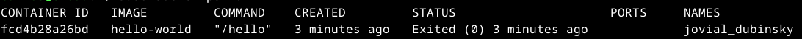
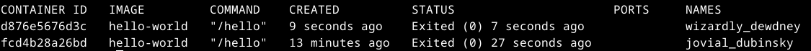

# Instalação e Configuração do Docker Engine no Debian

Docker e containers são conceitos relacionados à virtualização de aplicativos e ambientes de software.

Docker é uma plataforma de código aberto que permite automatizar o processo de empacotamento e implantação de aplicativos em contêineres. Um contêiner é uma unidade de software que contém tudo o que é necessário para executar um aplicativo, incluindo o código, as bibliotecas e as dependências, de forma isolada e portátil. O Docker facilita a criação e o gerenciamento de contêineres, permitindo que os aplicativos sejam executados de maneira consistente em diferentes ambientes.

Os contêineres oferecem uma abordagem leve e eficiente para a virtualização, pois compartilham o sistema operacional do host, mas isolam o ambiente de execução do aplicativo. Isso permite que os contêineres sejam executados de forma rápida e consistente em diferentes plataformas, independentemente do sistema operacional subjacente.

## Instalação do Docker Engine no Debian

Para começar a usar o Docker Engine no Debian, certifique-se de atender aos pré-requisitos e siga as etapas de instalação .

### Pré-requisitos

>[!IMPORTANT]
>
>Se você usar ufw ou firewalld para gerenciar configurações de firewall, esteja ciente de que ao expor portas de contêiner usando Docker, essas portas ignoram as regras de firewall. Para obter mais informações, consulte Docker e ufw .

#### Requisitos do sistema operacional

Para instalar o Docker Engine, você precisa da versão de 64 bits de uma destas versões do Debian:
 
* Debian Bookworm 12 (estável)
* Debian Bullseye 11 (oldstable)

Docker Engine para Debian é compatível com arquiteturas x86_64 (ou amd64), armhf, arm64 e ppc64le (ppc64el).

### Desinstale versões antigas

Antes de instalar o Docker Engine, você deve primeiro certificar-se de que todos os pacotes conflitantes foram desinstalados.

Os mantenedores da distribuição fornecem uma distribuição não oficial de pacotes Docker em seus repositórios. Você deve desinstalar esses pacotes antes de instalar a versão oficial do Docker Engine.

Os pacotes não oficiais para desinstalar são:

* docker.io
* docker-compose
* docker-doc
* podman-docker

Além disso, o Docker Engine depende de _containerd_ e _runc_. O Docker Engine agrupa essas dependências como um pacote: _**containerd.io**_. Se você instalou _containerd_ ou _runc_ anteriormente, desinstale-os para evitar conflitos com as versões incluídas no Docker Engine.

Execute o seguinte comando para desinstalar todos os pacotes conflitantes:

```console
for pkg in docker.io docker-doc docker-compose podman-docker containerd runc; do sudo apt remove $pkg; done
```
_apt_ pode informar que você não tem nenhum desses pacotes instalados.

Imagens, contêineres, volumes e redes armazenados _/var/lib/docker/_ não são removidos automaticamente quando você desinstala o Docker. Se você deseja começar com uma instalação limpa e prefere limpar todos os dados existentes, siga as etapas seguintes:

* Desinstale os pacotes Docker Engine, CLI, containerd e Docker Compose:

```console
sudo apt purge docker-ce docker-ce-cli containerd.io docker-buildx-plugin docker-compose-plugin docker-ce-rootless-extras
sudo apt autoremove
```

```console
sudo rm -rf /var/lib/docker
sudo rm -rf /var/lib/containerd
```

Com isso você deve ter excluir manualmente todos os arquivos de configuração editados.

## Métodos de instalação

Você pode instalar o Docker Engine de diferentes maneiras, dependendo das suas necessidades:

* Docker Engine vem junto com Docker Desktop para Linux. Esta é a maneira mais fácil e rápida de começar.

* Configure e instale o Docker Engine do repositório Apt do Docker.

* Instale-o manualmente e gerencie as atualizações manualmente.

* Use scripts de conveniência. Recomendado apenas para ambientes de teste e desenvolvimento.

Neste momento vamos abordar a instalação através de repositório Apt do Docker.

### Instale usando o repositório Apt

Antes de instalar o Docker Engine pela primeira vez em uma nova máquina host, você precisa configurar o repositório Docker Apt. Depois, você pode instalar e atualizar o Docker a partir do repositório.

#### Configure o repositório Apt do Docker.

```console
# Instale dependências necessárias:
sudo apt install curl

# Adicione a chave GPG oficial do Docker:
sudo apt update

sudo apt install ca-certificates curl gnupg

sudo install -m 0755 -d /etc/apt/keyrings

curl -fsSL https://download.docker.com/linux/debian/gpg | sudo gpg --dearmor -o /etc/apt/keyrings/docker.gpg

sudo chmod a+r /etc/apt/keyrings/docker.gpg
```

```console
# Adicione o repositório às fontes do Apt:
echo \
"deb [arch="$(dpkg --print-architecture)" signed-by=/etc/apt/keyrings/docker.gpg] https://download.docker.com/linux/debian \
"$(. /etc/os-release && echo "$VERSION_CODENAME")" stable" | \
sudo tee /etc/apt/sources.list.d/docker.list > /dev/null

sudo apt update
```

>[!IMPORTANT]
>
>Se você usa uma distribuição derivada, como Kali Linux, pode ser necessário substituir a parte deste comando que deve imprimir o codinome da versão:

```console
$(. /etc/os-release && echo "$VERSION_CODENAME")
```

De qualquer forma dê um cat no arquivo para ver como ficou:

```console
cat /etc/apt/sources.list.d/docker.list
```

Deve estar parecido com este:

```console
deb [arch=amd64 signed-by=/etc/apt/keyrings/docker.gpg] https://download.docker.com/linux/debian bookworm stable
```

No meu caso ficou com amd64, debian e bookworm por conta da versão que estou usando do Debian.

#### Instale os pacotes Docker.

##### Para a versão mais recente, execute:

```console
sudo apt install docker-ce docker-ce-cli containerd.io docker-buildx-plugin docker-compose-plugin
```

Verifique se a instalação foi bem-sucedida executando a hello-world imagem (exemplo mais abaixo):

##### Para uma versão específica, execute:

```console
# Liste as versões disponíveis:
apt-cache madison docker-ce | awk '{ print $3 }'

5:24.0.6-1~debian.12~bookworm
5:24.0.5-1~debian.12~bookworm
5:24.0.4-1~debian.12~bookworm
...
```

Selecione a versão desejada e instale:

```console
VERSION_STRING=5:24.0.6-1~debian.12~bookworm

sudo apt install docker-ce=$VERSION_STRING docker-ce-cli=$VERSION_STRING containerd.io docker-buildx-plugin docker-compose-plugin
```

Para testar se conseguimos a instalação execute:

```console
sudo docker run hello-world
```

Este comando baixa uma imagem de teste e a executa em um contêiner. Quando o contêiner é executado, ele imprime uma mensagem de confirmação e sai.

Deverá aparecer uma tela similar a esta:


Para listar os containers em execução, faça:

```console
sudo docker ps -a
```

Deverá aparecer uma tela como esta:



Observe o Status dele que está Exited (0), significa que não está mais em execução.

Ao se referir a este container, pode-se utilizar o ID dele no nosso caso fcd4b28a26bd ou o nome dele que no nosso caso é jovial_dubinsky.

Caso você execute novamenteo o comando run, terá 2 estâncias rodando ou paradas, faça:

```console
sudo docker run hello-world
```

e

```console
sudo docker ps -a
```



Observe que agora são 2 container.

Então o comando para rodar um container é start. O comando run cria e executa um novo contêiner a partir de uma imagem. O comando stop para um contêiner que estiver rodando. O comando images lista as imagens baixadas, que é diferente do comando ps que lista os contêiners. O comando rm remove um ou mais contêiners, enquanto o rmi remove uma ou mais imagens.

Para rodar ele novamente execute:

```console
sudo docker start jovial_dubinsky
```

Para exemplificar vamos remover os contêiners e depois a imagem.

```console
sudo docker ps -a
sudo docker rm jovial_dubinsky
sudo docker ps -a
sudo docker rm wizardly_dewdney
sudo docker ps -a
sudo docker images
sudo docker rmi hello-world
sudo docker images
```

Agora você instalou e iniciou o Docker Engine com sucesso.

#### Configure o docker para ser executado como usário normal.

>[!CAUTION]
>
>O grupo docker concede privilégios de nível raiz ao usuário. Para obter detalhes sobre como isso afeta a segurança do seu sistema, consulte o link [Docker Daemon Attack Surface](https://docs.docker.com/engine/security/#docker-daemon-attack-surface).

>[!IMPORTANT]
>
>Para executar o Docker sem privilégios de root, consulte o link [Executar o daemon do Docker como um usuário não root (modo sem root)](https://docs.docker.com/engine/security/rootless/).

>[!NOTE]
>
>Recebendo erros ao tentar executar sem root?
>O grupo docker de usuários existe, mas não contém usuários, por isso é necessário usar o sudo para executar comandos do Docker. Se você não quiser usar o comando sudo, crie um grupo chamado docker e adicione usuários a ele. Quando o daemon Docker é iniciado, ele cria um soquete Unix acessível aos membros do grupo docker. Em algumas distribuições Linux, o sistema cria automaticamente este grupo ao instalar o Docker Engine usando um gerenciador de pacotes. Nesse caso, não há necessidade de criar o grupo manualmente, em toda o caso execute o comando abaixo, caso o grupo já existe, o sistema informa:

```console
sudo groupadd docker
```

Para incluir o usuário atual no grupo docker, faça:

```console
sudo usermod -aG docker $USER
```

Saia e faça login novamente para que sua participação no grupo seja validada.

>[!NOTE]
>
>Se você estiver executando o Linux em uma máquina virtual, pode ser necessário reiniciar a máquina virtual para que as alterações tenham efeito.

Para testar se deu certo a inclusão do usuário no grupo docker, faça:

```console
docker run hello-world
```

Este comando baixa uma imagem de teste e a executa em um contêiner. Quando o contêiner é executado, ele imprime uma mensagem e sai.

Se você executou inicialmente comandos com o sudo Docker CLI antes de adicionar seu usuário ao grupo docker, poderá ver o seguinte erro:

```console
WARNING: Error loading config file: /home/user/.docker/config.json -
stat /home/user/.docker/config.json: permission denied
```

Este erro indica que as configurações de permissão do ~/.docker/ diretório estão incorretas, devido ao uso do comando sudo efetuado anteriormente.

Para corrigir esse problema, remova o ~/.docker/ diretório (ele é recriado automaticamente, mas todas as configurações personalizadas são perdidas) ou altere sua propriedade e permissões usando os seguintes comandos:

```console
sudo chown "$USER":"$USER" /home/"$USER"/.docker -R
sudo chmod g+rwx "$HOME/.docker" -R
```

### Configure o Docker para iniciar com systemd

Muitas distribuições modernas do Linux usam o systemd para gerenciar quais serviços são iniciados quando o sistema é inicializado. No Debian e Ubuntu, o serviço Docker inicia na inicialização por padrão. Para iniciar automaticamente o Docker e o containerd na inicialização de outras distribuições Linux usando systemd, execute os seguintes comandos:

```console
sudo systemctl enable docker.service
sudo systemctl enable containerd.service
```

Para interromper esse comportamento, use disable em vez do enable.

```console
sudo systemctl disable docker.service
sudo systemctl disable containerd.service
```

Se você precisar adicionar um proxy HTTP, definir um diretório ou partição diferente para os arquivos de tempo de execução do Docker ou fazer outras personalizações, consulte o link [personalizar as opções do daemon do Docker do systemd](https://docs.docker.com/config/daemon/systemd/).

### Configurar driver de log padrão

Docker fornece drivers de log para coletar e visualizar dados de log de todos os contêineres em execução em um host. O driver de log padrão json-file grava dados de log em arquivos formatados em JSON no sistema de arquivos host. Com o tempo, esses arquivos de log aumentam de tamanho, levando ao esgotamento potencial dos recursos do disco.

Para evitar problemas com o uso excessivo do disco para dados de log, considere uma das seguintes opções:

* Configure o driver de log json-file para ativar a [rotação de log](https://docs.docker.com/config/containers/logging/json-file/) .
* Use um [driver de log alternativo](https://docs.docker.com/config/containers/logging/configure/#configure-the-default-logging-driver), como o [driver de log "local"](https://docs.docker.com/config/containers/logging/local/), que executa a rotação de log por padrão.
* Use um driver de log que envie logs para um agregador de log remoto.

### Instalar a partir de um pacote

Se você não puder usar o comando "apt" que busca no repositório do Docker e instala o Docker Engine, poderá baixar o arquivo .deb da sua versão e instalá-lo manualmente. Você precisa baixar um novo arquivo sempre que quiser atualizar o Docker Engine.

* Vá para https://download.docker.com/linux/debian/dists/
* Selecione sua versão Debian na lista.
* Acesse pool/stable e selecione a arquitetura aplicável (amd64, armhf, arm64ou s390x).
* Faça download dos seguintes arquivos .deb para os pacotes Docker Engine, CLI, containerd e Docker Compose:

```console
containerd.io_<version>_<arch>.deb
docker-ce_<version>_<arch>.deb
docker-ce-cli_<version>_<arch>.deb
docker-buildx-plugin_<version>_<arch>.deb
docker-compose-plugin_<version>_<arch>.deb
```

Instale os pacotes .deb. Atualize os caminhos no exemplo a seguir para onde você baixou os pacotes do Docker.

```console
sudo dpkg -i ./containerd.io_<version>_<arch>.deb \
  ./docker-ce_<version>_<arch>.deb \
  ./docker-ce-cli_<version>_<arch>.deb \
  ./docker-buildx-plugin_<version>_<arch>.deb \
  ./docker-compose-plugin_<version>_<arch>.deb
```

O daemon Docker é iniciado automaticamente.

Verifique se a instalação do Docker Engine foi bem-sucedida executando a imagem hello-world:

```console
sudo service docker start
sudo docker run hello-world
```

### Instale usando o script de conveniência

Docker fornece um script conveniente em https://get.docker.com/ para instalar o Docker em ambientes de desenvolvimento de forma não interativa. O script de conveniência não é recomendado para ambientes de produção, mas é útil para criar um script de provisionamento adaptado às suas necessidades. Consulte também as etapas [de instalação usando o repositório](https://docs.docker.com/engine/install/debian/#install-using-the-repository) para aprender sobre as etapas de instalação para instalar usando o repositório de pacotes. O código-fonte do script é de código aberto e você pode encontrá-lo no [repositório do docker-install do GitHub](https://github.com/docker/docker-install).

Sempre examine os scripts baixados da Internet antes de executá-los localmente. Antes de instalar, familiarize-se com os possíveis riscos e limitações do script de conveniência:

* O script requer root ou privilégios sudo para ser executado.
* O script tenta detectar sua distribuição e versão do Linux e configurar seu sistema de gerenciamento de pacotes para você.
* O script não permite personalizar a maioria dos parâmetros de instalação.
* O script instala dependências e recomendações sem pedir confirmação. Isto pode instalar um grande número de pacotes, dependendo da configuração atual da sua máquina host.
* Por padrão, o script instala a versão estável mais recente do Docker, containerd e runc. Ao usar este script para provisionar uma máquina, isso pode resultar em atualizações inesperadas da versão principal do Docker. Sempre teste as atualizações em um ambiente de teste antes de implantá-las em seus sistemas de produção.
* O script não foi projetado para atualizar uma instalação existente do Docker. Ao usar o script para atualizar uma instalação existente, as dependências podem não ser atualizadas para a versão esperada, resultando em versões desatualizadas.

>[!TIP]: visualize as etapas do script antes de executar
>
>Você pode executar o script com a opção --dry-run para saber quais etapas o script executará quando invocado:
>
>```console
>curl -fsSL https://get.docker.com -o get-docker.sh
>sudo sh ./get-docker.sh --dry-run
>```

Este exemplo baixa o script de https://get.docker.com/ e executa-o para instalar a versão estável mais recente do Docker no Linux:

```console
curl -fsSL https://get.docker.com -o get-docker.sh
sudo sh get-docker.sh
```

Aqui está a tela de execução do comando acima:

```console
Executing docker install script, commit: 7cae5f8b0decc17d6571f9f52eb840fbc13b2737
<...>
```