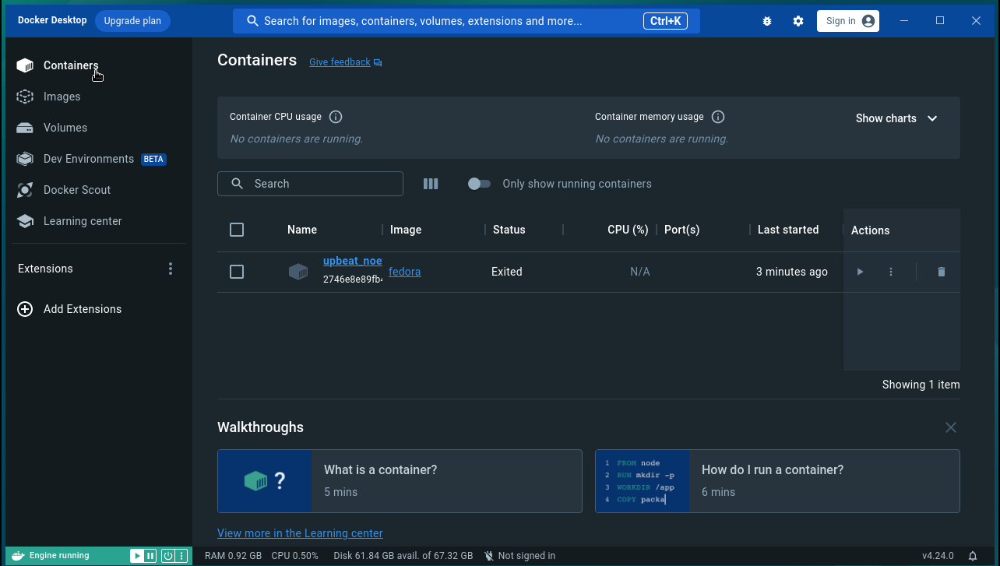
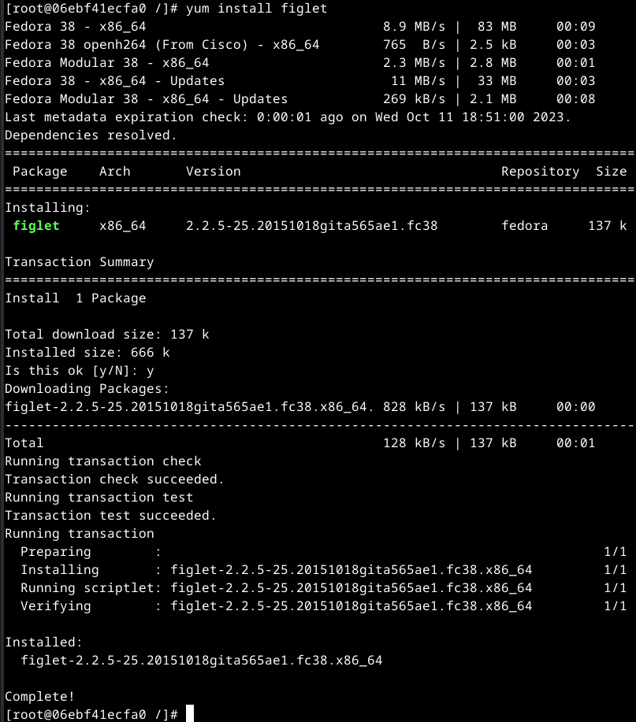
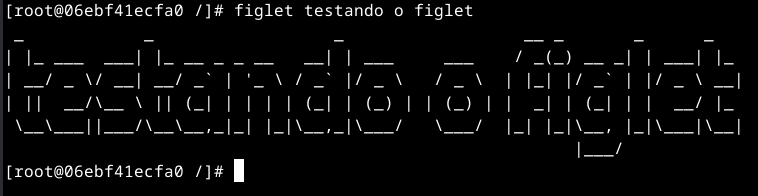
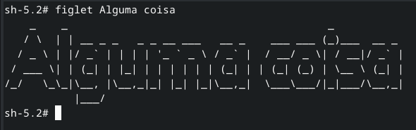

# Mais sobre docker

1. Entre no site do [docker](https://www.docker.com/).

2. Clique em [Sign In](https://login.docker.com/u/login/identifier?state=hKFo2SBvZVVGOXBvS19GWG1NOHQ2SjJ3OThUTGE1SFdncXk5UaFur3VuaXZlcnNhbC1sb2dpbqN0aWTZIGxZS2FXNkRJNGpGSndQQk1SOXcxXzlCbzhyX2dzbGx6o2NpZNkgbHZlOUdHbDhKdFNVcm5lUTFFVnVDMGxiakhkaTluYjk).

3. Digite seu login e senha e entre no [docker hub](https://hub.docker.com/).

4. Clique em Search Docker Hub e escreva Fedora e dê enter.

5. Escolha a opção abaixo:


6. Copie o comando e cole no seu terminal, para baixar a imagem para seu computador.


```console
docker pull fedora
```

7. Caso não tenha instalado ainda, vamos instalar o docker desktop, conforme [Aula5-2-Instalação-e-Configuração-Docker-Desktop](Aula5-2-Instalação-e-Configuração-Docker-Desktop.md), depois retornaremos a partir daqui.

8. Entre no docker desktop.

9. Digite no terminal o seguinte comando:

    ```console
    docker run fedora echo Olá Mundo
    ```

    Vai aparecer Olá Mundo no terminal.

    Agora volte para o docker desktop e clique no menu lateral na opção Containers. Você verá algo parecido com isso:

    

    Se clicarmos no nome do contêiner, neste caso upbeat_noe, veremos o log onde aparece o último comando que inserimos via terminal.

10. Voltamos ao terminal e vamos digitar outro comando:

    ```console
    docker run -i -t fedora
    ```

    Observe que nosso prompt mudou. Estamos dentro do dash do fedora. Agora vamos no docker desktop para ver denovo a opção Containers. Vamos ver agora que existem 2 container instânciados com base na imagem fedora. Um parado e outro em execução no dash. Volte ao terminal de digite echo Olá Mundo e depois volte no LOG do docker desktop e verá os resultados.

11. Agora de volta ao terminal vamos instalar um aplicativo no fedora. Fedora é um sistema operacional Linux baseado na distribuição Red Hat, então o comando para instalar aplicativos no fedora é o yum e não mais o apt.

    ```console
    yum install figlet
    ```

    Ele instala o pacote e demais dependências. Agora parecido com:

    

    Você também pode observar o LOG que trará as mesmas informações.

    Vamos testar o pacote que acabamos de instalar.

    ```console
    figlet testando o figlet
    ```

    Oberve o resultado:

    

    Como se pode ver funcionando perfeitamente. Agora possa sair deste terminal com o comando exit.

    Para voltar ao mesmo ponto posso simplesmente clicar na sub-opção Open in terminal, como na imagem abaixo:

    

    Teste novamente o comando figlet alguma coisa.

    

12. Crie o diretório ~/Documentos/Docker/figlet e entre nele e inclua uma arquivo chamado Dockerfile com o seguinte conteúdo:

    ```console
    mkdir -pv ~/Documentos/Docker/figlet
    cd ~/Documentos/Docker/figlet
    vi Dockerfile
    ```

    ```docker
    FROM fedora
    RUN yum install -y figlet
    ```

    Vamos iniciar uma compilação de nosso novo código:

    ```console
    docker build -t figlet .
    ```

    

    Agora vamos rodar nossa aplicação.

    ```console
    docker run -it figlet
    ```
    
    Estando dentro do fedora vamos executar nossa aplicação.

    ```console
    figlet teste
    ```

## Comandos úteis do Docker.

### Para limpar todas as imagens, contêineres, volumes e redes não utilizadas ou pendentes

O Docker fornece um único comando que irá limpar quaisquer recursos - imagens, contêineres, volumes, e redes - que estão pendentes (não associados a um contêiner):

```console
docker system prune
```

Para remover adicionalmente quaisquer contêineres e todas as imagens não utilizadas (não apenas imagens pendentes), adicione a opção -a ao comando:

```console
docker system prune -a
```

### Remover todas as imagens

Todas as imagens Docker em um sistema podem ser listadas adicionando -a ao comando docker images. Assim que tiver certeza de que você deseja excluir todas elas, você pode adicionar a sinalização -q para passar o ID da Imagem para o docker rmi:

Listar as imagens:
```console
docker images -a
```

Remover todas as imagens:

```console
docker rmi $(docker images -a -q)
```

## Todos os comandos do docker

Segue a lista de comandos docker e sua utilidade:

Uso: docker [OPÇÕES] COMANDO

```
Comandos Comuns
  run         Crie e execute um novo contêiner a partir de uma imagem
  exec        Execute um comando em um contêiner em execução
  ps          Listar contêineres
  build       Construa uma imagem a partir de um Dockerfile
  pull        Baixar uma imagem de um servidor de registro
  push        Enviar uma imagem para um servidor de registro
  images      Listar imagens
  login       Faz o login em um servidor de registro
  logout      Faz o logout de um servidor de registro
  search      Search Docker Hub for images
  version     Mostrar as informações da versão do Docker
  info        Exibir informações de todo o sistema

Comandos de gerenciamento:
  builder     Gerenciar compilações
  buildx*     Docker Buildx (Docker Inc., v0.11.2-desktop.5)
  compose*    Docker Compose (Docker Inc., v2.22.0-desktop.2)
  container   Gerenciar contêineres
  context     Gerenciar contextos
  dev*        Ambientes de desenvolvimento Docker (Docker Inc., v0.1.0)
  extension*  Gerencia extensões Docker (Docker Inc., v0.2.20)
  image       Gerenciar imagens
  init*       Cria arquivos iniciais relacionados ao Docker para o seu projeto (Docker Inc., v0.1.0-beta.8)
  manifest    Gerenciar manifestos de imagens e listas de manifestos do Docker
  network     Gerenciar redes
  plugin      Gerenciar plug-ins
  sbom*       Visualize a lista de materiais de software (SBOM) baseada em pacote para obter uma imagem (Anchore Inc., 0.6.0)
  scan*       Verificação do Docker (Docker Inc., v0.26.0)
  scout*      O Docker Scout analisa suas imagens para ajudá-lo a entender suas dependências e vulnerabilidades potenciais. (Docker Inc., v1.0.7)
  system      Gerenciar Docker
  trust       Gerenciar a confiança em imagens Docker
  volume      Gerenciar volumes

Swarm Commands:
  swarm       O modo Swarm é um recurso do Docker que fornece funcionalidades de orquestração de contêiner, incluindo clustering nativo de hosts do Docker e agendamento de cargas de trabalho de contêineres.

Commands:
  attach      Acessar dentro do container e trabalhar a partir dele
  commit      Cria uma nova imagem a partir das alterações de um contêiner
  cp          Copia arquivos ou diretórios do container para o host
  create      Crie um novo contêiner
  diff        Inspecione alterações em arquivos ou diretórios no sistema de arquivos de um contêiner
  events      Obtenha eventos em tempo real do servidor
  export      Exporte o sistema de arquivos de um contêiner como um arquivo tar
  history     Exibe o histórico de comandos que foram executados dentro do container
  import      Importar o conteúdo de um arquivo .tar para criar uma imagem do sistema de arquivos
  inspect     Retornar informações de baixo nível sobre objetos Docker
  kill        Mate um ou mais contêineres em execução
  load        Carregar uma imagem de um arquivo tar ou STDIN
  logs        Buscar os logs de um contêiner
  pause       Pause todos os processos em um ou mais contêineres
  port        Listar mapeamentos de portas ou um mapeamento específico para o contêiner
  rename      Renomear um contêiner
  restart     Reinicie um ou mais contêineres
  rm          Remova um ou mais contêineres
  rmi         Remover uma ou mais imagens
  save        Salve uma ou mais imagens em um arquivo tar (transmitido para STDOUT por padrão)
  start       Inicie um ou mais contêineres parados
  stats       Exibir uma transmissão ao vivo de estatísticas de uso de recursos de contêineres
  stop        Pare um ou mais contêineres em execução
  tag         Crie uma tag TARGET_IMAGE que se refira a SOURCE_IMAGE
  top         Exibir os processos em execução de um contêiner
  unpause     Retome todos os processos em um ou mais contêineres
  update      Atualizar configuração de um ou mais contêineres
  wait        Bloqueie até que um ou mais contêineres parem e imprima seus códigos de saída

Opções globais:
```

| Nome do comando | Tipo | Padrão | Descrição |
|-----------------|------|--------|-----------|
|--config | string | ~/.docker | Localização dos arquivos de configuração do cliente |
| -c,--context | string | | Nome do contexto a ser usado para conectar-se ao daemon (substitui DOCKER_HOST env var e contexto padrão definido por docker context use) |
| -D,--debug | | | Habilitar modo de depuração |
| -H, --host | list | |Soquete daemon para conectar |
| -l,--log-level | string | info | Defina o nível de registro ( debug, info, warn, error, fatal) |
| --tls | | | Utilize TLS; implícito por --tlsverify |
| --tlscacert | string | ~/.docker/ca.pem | Certificados de confiança assinados apenas por esta CA |
| --tlscert | string | ~/.docker/cert.pem | Caminho para o arquivo de certificado TLS |
| --tlskey | string | ~/.docker/key.pem | Caminho para o arquivo de chave TLS |
| --tlsverify | | | Use TLS e verifique o controle remoto |
| -v, --version | | | Imprimir informações da versão e sair |

Execute 'docker COMMAND --help' para obter mais informações sobre um comando.

Para obter mais ajuda sobre como usar o Docker, acesse [https://docs.docker.com/go/guides/](https://docs.docker.com/go/guides/)

Obs.: Para listar os comandos disponíveis, execute docker sem parâmetros ou execute docker help:

## Variáveis ​​ambientais

A seguinte lista de variáveis ​​de ambiente é suportada pela linha de comando do docker:

| Variável | Descrição |
|----------|-----------|
| DOCKER_API_VERSION | Substitua a versão negociada da API a ser usada para depuração (por exemplo 1.19) |
| DOCKER_CERT_PATH | Localização das suas chaves de autenticação. Esta variável é usada tanto pela dockerCLI quanto pelo [dockerd daemon](https://docs.docker.com/engine/reference/commandline/dockerd/) |
| DOCKER_CONFIG | A localização dos arquivos de configuração do cliente. |
| DOCKER_CONTENT_TRUST_SERVER | A URL do servidor Notary a ser usado. O padrão é o mesmo URL do registro. |
| DOCKER_CONTENT_TRUST | Quando definido, o Docker usa um notário para assinar e verificar imagens. Equivale a --disable-content-trust=false construir, criar, puxar, empurrar, executar. |
| DOCKER_CONTEXT | Nome do docker context ser usado (substitui DOCKER_HOST env var e contexto padrão definido por docker context use) |
| DOCKER_DEFAULT_PLATFORM | Plataforma padrão para comandos que levam a opção --platform |
| DOCKER_HIDE_LEGACY_COMMANDS | Quando definido, o Docker oculta comandos de nível superior "herdados" (como docker rm, e docker pull) na saída do docker help e apenas comandos de gerenciamento por tipo de objeto (por exemplo, docker container) são impressos. Isso pode se tornar o padrão em uma versão futura. |
| DOCKER_HOST | Soquete daemon ao qual se conectar. |
| DOCKER_TLS | Habilite o TLS para conexões feitas pela dockerCLI (equivalente à opção --tls de linha de comando). Defina um valor não vazio para ativar o TLS. Observe que o TLS será ativado automaticamente se qualquer uma das outras opções de TLS estiver definida. |
| DOCKER_TLS_VERIFY | Quando definido, o Docker usa TLS e verifica o controle remoto. Esta variável é usada tanto pela dockerCLI quanto pelo [dockerd daemon](https://docs.docker.com/engine/reference/commandline/dockerd/) |
| BUILDKIT_PROGRESS | Defina o tipo de saída de progresso ( auto, plain, tty) ao [construir](https://docs.docker.com/engine/reference/commandline/build/) com o [back-end do BuildKit](https://docs.docker.com/build/buildkit/). Use plain para mostrar a saída do contêiner (padrão auto). |

Como o Docker é desenvolvido usando Go, você também pode usar quaisquer variáveis ​​de ambiente usadas pelo tempo de execução Go. Em particular, você pode achar estes úteis:

| Variável | Descrição |
|----------|-----------|
| HTTP_PROXY | URL proxy para solicitações HTTP, a menos que seja substituído por NoProxy. |
| HTTPS_PROXY | URL proxy para solicitações HTTPS, a menos que seja substituído por NoProxy. |
| NO_PROXY | Valores separados por vírgula que especificam hosts que devem ser excluídos do proxy. |

Veja [a especificação Go](https://pkg.go.dev/golang.org/x/net/http/httpproxy#Config) para obter detalhes sobre essas variáveis.

## Arquivos de configuração

Por padrão, a linha de comando do Docker armazena seus arquivos de configuração em um diretório chamado .docker dentro do seu diretório $HOME.

Docker gerencia a maioria dos arquivos no diretório de configuração e você não deve modificá-los. No entanto, você pode modificar o arquivo config.json para controlar determinados aspectos de como o comando docker se comporta.

Você pode modificar o comportamento do comando docker usando variáveis ​​de ambiente ou opções de linha de comando. Você também pode usar opções do config.json para modificar alguns dos mesmos comportamentos. Se uma variável de ambiente e a opção --config forem definidos, o sinalizador terá precedência sobre a variável de ambiente. As opções de linha de comando substituem as variáveis ​​de ambiente e as variáveis ​​de ambiente substituem as propriedades especificadas em um arquivo config.json.

## Altere o diretório .docker

Para especificar um diretório diferente, use a variável de ambiente DOCKER_CONFIG ou a opção --config de linha de comando. Se ambos forem especificados, a opção --config substituirá a variável de ambiente DOCKER_CONFIG. O exemplo abaixo substitui o comando docker ps usando um arquivo config.json localizado no diretório ~/testconfigs/.

```console
docker --config ~/testconfigs/ ps
```

Este sinalizador se aplica apenas a qualquer comando que esteja sendo executado. Para configuração persistente, você pode definir a variável de ambiente DOCKER_CONFIG em seu shell (por exemplo, ~/.profile ou ~/.bashrc). O exemplo abaixo define o novo diretório como HOME/newdir/.docker.

```console
echo export DOCKER_CONFIG=$HOME/newdir/.docker > ~/.profile
```

## Propriedades do arquivo de configuração CLI do Docker (config.json)

Use a configuração da CLI do Docker para personalizar as configurações da dockerCLI. O arquivo de configuração usa formatação JSON e propriedades:

Por padrão, o arquivo de configuração é armazenado no formato ~/.docker/config.json. Consulte a seção alterar o diretório .docker para usar um local diferente.

>[!NOTE]
>
>O arquivo de configuração e outros arquivos dentro do diretório ~/.docker de configuração podem conter informações confidenciais, como informações de autenticação para proxies ou, dependendo do seu armazenamento de credenciais, credenciais para seus registros de imagem. Revise o conteúdo do seu arquivo de configuração antes de compartilhá-lo com outras pessoas e evite submeter o arquivo ao controle de versão.

## Personalize o formato de saída padrão para comandos

Esses campos permitem personalizar o formato de saída padrão para alguns comandos se nenhuma opção --format for fornecida.

| Propriedade | Descrição |
|-------------|-----------|
| configFormat | Formato padrão personalizado para a saída do docker config ls. Consulte a seção de [formato de saída na docker documentação do config ls](https://docs.docker.com/engine/reference/commandline/config_ls/#format) para obter uma lista de diretivas de formatação suportadas. |
| imagesFormat | Formato padrão personalizado para saída dos comandos docker images/docker image ls. Consulte a seção de [formato de saída na documentação do docker images](https://docs.docker.com/engine/reference/commandline/images/#format) para obter uma lista de diretivas de formatação suportadas.|
| 	nodesFormat	 | 	Formato padrão personalizado para a saída do docker node ls. Consulte a seção de [formatação na documentação do docker node ls](https://docs.docker.com/engine/reference/commandline/node_ls/#format) para obter uma lista de diretivas de formatação suportadas.	 |
| 	pluginsFormat	 | 	Formato padrão personalizado para a saída do docker plugin ls. Consulte a seção de [formatação na documentação do docker plugin ls](https://docs.docker.com/engine/reference/commandline/plugin_ls/#format) para obter uma lista de diretivas de formatação suportadas.	 |
| 	psFormat	 | 	Formato padrão personalizado para saída do comando docker ps/docker container ps. Consulte a seção de [formatação na documentação docker ps](https://docs.docker.com/engine/reference/commandline/ps/#format) para obter uma lista de diretivas de formatação suportadas.	 |
| 	secretFormat	 | 	Formato padrão personalizado para a saída do comando docker secret ls. Consulte a seção de [formato de saída na documentação do docker secret ls](https://docs.docker.com/engine/reference/commandline/secret_ls/#format) para obter uma lista de diretivas de formatação suportadas.	 |
| 	serviceInspectFormat	 | 	Formato padrão personalizado para a saída do comando docker service inspect. Consulte a seção de [formatação na documentação do docker service inspect](https://docs.docker.com/engine/reference/commandline/service_inspect/#format) para obter uma lista de diretivas de formatação suportadas.	 |
| 	servicesFormat	 | 	Formato padrão personalizado para a saída do comando docker service ls. Consulte a seção de [formatação na documentação do docker service ls](https://docs.docker.com/engine/reference/commandline/service_ls/#format) para obter uma lista de diretivas de formatação suportadas.	 |
| 	statsFormat	 | 	Formato padrão personalizado para a saída do comando docker stats. Consulte a seção de [formatação na documentação do docker stats](https://docs.docker.com/engine/reference/commandline/stats/#format) para obter uma lista de diretivas de formatação suportadas.	 |

## Cabeçalhos HTTP personalizados

A propriedade HttpHeaders especifica um conjunto de cabeçalhos para incluir em todas as mensagens enviadas do cliente Docker para o daemon. O Docker não tenta interpretar ou compreender esses cabeçalhos; simplesmente os coloca nas mensagens. O Docker não permite que esses cabeçalhos alterem os cabeçalhos que ele define para si mesmo.

## Opções de armazenamento de credenciais

A propriedade credsStore especifica um binário externo para servir como armazenamento de credenciais padrão. Quando esta propriedade for definida, docker login tentará armazenar credenciais no binário especificado pelo docker-credential-<value> a qual está visível em $PATH. Se esta propriedade não for configurada, as credenciais serão armazenadas na propriedade da configuração auths. Para obter mais informações, consulte a seção [armazenamentos de credenciais na documentação do docker login](https://docs.docker.com/engine/reference/commandline/login/#credential-stores).

A propriedade credHelpers especifica um conjunto de auxiliares de credenciais para usar preferencialmente credsStore ao auths armazenar e recuperar credenciais para registros específicos. Se esta propriedade estiver configurada, o binário docker-credential-<value> será usado ao armazenar ou recuperar credenciais para um registro específico. Para obter mais informações, consulte a seção [auxiliares de credenciais na documentação do docker login](https://docs.docker.com/engine/reference/commandline/login/#credential-helpers).

## Configuração automática de proxy para contêineres

A propriedade proxies especifica variáveis ​​de ambiente de proxy a serem definidas automaticamente em contêineres e definidas como --build-arg em contêineres usados ​​durante o docker build. Um conjunto "default" de proxies pode ser configurado e será usado para qualquer daemon docker ao qual o cliente se conecta, ou uma configuração por host (daemon docker), por exemplo, "https://docker-daemon1.example.com". As seguintes propriedades podem ser definidas para cada ambiente:

| 	Propriedade	 | 	Descrição	 |
|----------------|-------------|
| httpProxy	| Valor padrão de HTTP_PROXY e http_proxy para contêineres e assim por diante --build-arg docker build |
| httpsProxy | Valor padrão de HTTPS_PROXY e https_proxy para contêineres e assim por diante --build-arg docker build |
| ftpProxy | Valor padrão de FTP_PROXY e ftp_proxy para contêineres e assim por diante --build-arg docker build |
| noProxy | Valor padrão de NO_PROXY e no_proxy para contêineres e assim por diante --build-arg docker build |
| allProxy | Valor padrão de ALL_PROXY e all_proxy para contêineres e assim por diante --build-arg docker build |

Essas configurações são usadas para definir configurações de proxy somente para contêineres e não como configurações de proxy para a dockerCLI ou o dockerd daemon. Consulte as [variáveis ​​de ambiente](https://docs.docker.com/engine/reference/commandline/cli/#environment-variables) e o [proxy HTTP/HTTPS](https://docs.docker.com/config/daemon/systemd/#httphttps-proxy) para definir configurações de proxy para o cli e daemon.

>[!NOTE]
>
>As configurações de proxy podem conter informações confidenciais (por exemplo, se o proxy exigir autenticação). As variáveis ​​de ambiente são armazenadas como texto simples na configuração do contêiner e, como tal, podem ser inspecionadas por meio da API remota ou confirmadas em uma imagem ao usar o docker commit.
