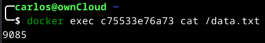

# Persistir no banco de dados

Caso você não tenha percebido, sua lista de tarefas fica vazia toda vez que você inicia o contêiner. Por que é isso? Nesta parte, você verá como o contêiner está funcionando.

## O sistema de arquivos do contêiner

Quando um contêiner é executado, ele usa as diversas camadas de uma imagem para seu sistema de arquivos. Cada contêiner também recebe seu próprio "espaço temporário" para criar/atualizar/remover arquivos. Quaisquer alterações não serão vistas em outro contêiner, mesmo que estejam usando a mesma imagem.

## Veja isso na prática

Para ver isso em ação, você iniciará dois contêineres e criará um arquivo em cada um. O que você verá é que os arquivos criados em um contêiner não estão disponíveis em outro.

1. Inicie um contêiner ubuntu que criará um arquivo nomeado /data.txt com um número aleatório entre 1 e 10.000.

    ```console
    docker run -d ubuntu bash -c "shuf -i 1-10000 -n 1 -o /data.txt && tail -f /dev/null"
    ```

    Caso você esteja curioso sobre o comando, você está iniciando um shell bash e invocando dois comandos (por que você tem o &&). A primeira parte escolhe um único número aleatório e o grava /data.txt. O segundo comando é simplesmente observar um arquivo para manter o contêiner funcionando.

2. Valide se você pode ver a saída acessando o terminal no contêiner. Para fazer isso, você pode usar a CLI ou a interface gráfica do Docker Desktop.

    Na linha de comando, use o comando docker exec para acessar o contêiner. Você precisa obter o ID do contêiner (use o comando docker ps para obtê-lo). No seu terminal Mac ou Linux, ou no prompt de comando do Windows ou PowerShell, obtenha o conteúdo com o seguinte comando.

    ```console
    docker ps
    docker exec <container-id> cat /data.txt
    ```

    

    Você deverá ver um número aleatório.

    

3. Agora, inicie outro contêiner ubuntu (a mesma imagem) e você verá que não tem o mesmo arquivo. No seu terminal Mac ou Linux, ou no prompt de comando do Windows ou PowerShell, obtenha o conteúdo com o seguinte comando.

    ```console
    docker run -it ubuntu ls /
    ```

    Neste caso, o comando lista os arquivos no diretório raiz do contêiner. Olha, não há nenhum arquivo data.txt aí! Isso ocorre porque ele foi gravado no espaço de trabalho apenas para o primeiro contêiner.

4. Vá em frente e remova o primeiro contêiner usando o comando docker rm -f <container-id>.

## Volumes de contêineres

No experimento anterior, você viu que cada contêiner inicia a partir da definição da imagem sempre que é iniciado. Embora os contêineres possam criar, atualizar e excluir arquivos, essas alterações são perdidas quando você remove o contêiner e o Docker isola todas as alterações nesse contêiner. Com volumes, você pode mudar tudo isso.

Os volumes fornecem a capacidade de conectar caminhos de sistema de arquivos específicos do contêiner de volta à máquina host. Se você montar um diretório no contêiner, as alterações nesse diretório também serão vistas na máquina host. Se você montar o mesmo diretório nas reinicializações do contêiner, verá os mesmos arquivos.

Existem dois tipos principais de volumes. Eventualmente, você usará ambos, mas começará com montagens de volume.

## Persistir os dados de tarefas

Por padrão, o aplicativo de tarefas armazena seus dados em um banco de dados SQLite /etc/todos/todo.db no sistema de arquivos do contêiner. Se você não está familiarizado com SQLite, não se preocupe! É simplesmente um banco de dados relacional que armazena todos os dados em um único arquivo. Embora não seja o melhor para aplicativos de grande escala, funciona para pequenas demonstrações. Você aprenderá como mudar isso para um mecanismo de banco de dados diferente posteriormente.

Como o banco de dados é um arquivo único, se você puder persistir esse arquivo no host e disponibilizá-lo para o próximo contêiner, ele poderá continuar de onde o último parou. Ao criar um volume e anexá-lo (geralmente chamado de "montagem") ao diretório onde você armazenou os dados, você pode persistir os dados. À medida que seu contêiner grava no arquivo todo.db, ele persistirá os dados no host no volume.

Conforme mencionado, você usará uma montagem de volume. Pense em uma montagem de volume como um balde opaco de dados. Docker gerencia totalmente o volume, incluindo o local de armazenamento em disco. Você só precisa lembrar o nome do volume.

### Crie um volume e inicie o contêiner

Você pode criar o volume e iniciar o contêiner usando a CLI ou a interface gráfica do Docker Desktop.

1. Crie um volume usando o comando docker volume create.

    ```console
    docker volume create todo-db
    ```

2. Pare e remova o contêiner do aplicativo de tarefas novamente com docker rm -f <id>, pois ele ainda está em execução sem usar o volume persistente.

3. Inicie o contêiner do aplicativo de tarefas, mas adicione a opção --mount para especificar uma montagem de volume. Dê um nome ao volume e monte-o /etc/todos no contêiner, que captura todos os arquivos criados no caminho. No seu terminal Mac ou Linux, ou no prompt de comando do Windows ou PowerShell, execute o seguinte comando:

    ```console
    docker run -dp 0.0.0.0:3000:3000 --mount type=volume,src=todo-db,target=/etc/todos crpbbs/getting-started
    ```

### Verifique se os dados persistem

1. Assim que o contêiner for iniciado, abra o aplicativo e adicione alguns itens à sua lista de tarefas.

    

2. Pare e remova o contêiner do aplicativo de tarefas pendentes. Use Docker Desktop ou docker ps para obter o ID e depois docker rm -f <id> para removê-lo. Substitua abaixo o <CONTAINER ID> pelo seu ID.

    ```console
    docker ps
    docker stop <CONTAINER ID>
    docker rm -f <CONTAINER ID>
    ```

3. Inicie um novo contêiner usando as etapas anteriores.

    ```console
    docker run -dp 0.0.0.0:3000:3000 --mount type=volume,src=todo-db,target=/etc/todos crpbbs/getting-started
    ```

4. Abra seu navegador. Você deverá ver seus itens ainda em sua lista.

5. Vá em frente e remova o contêiner quando terminar de verificar sua lista.

    ```console
    docker ps
    docker stop <CONTAINER ID>
    docker rm -f <CONTAINER ID>
    docker images
    docker rmi <IMAGE ID>
    ```

Agora você aprendeu como persistir dados.

### Mergulhe no volume

Muitas pessoas perguntam frequentemente “Onde o Docker está armazenando meus dados quando uso um volume?” Se você quiser saber, pode usar o comando docker volume inspect.

```console
docker volume inspect todo-db
```


A localização do Mountpoint é a localização real dos dados no disco. Observe que na maioria das máquinas, você precisará ter acesso root para acessar este diretório a partir do host. Então para ver o arquivo digite:

```console
sudo ls /var/lib/docker/volumes/todo-db/_data
```