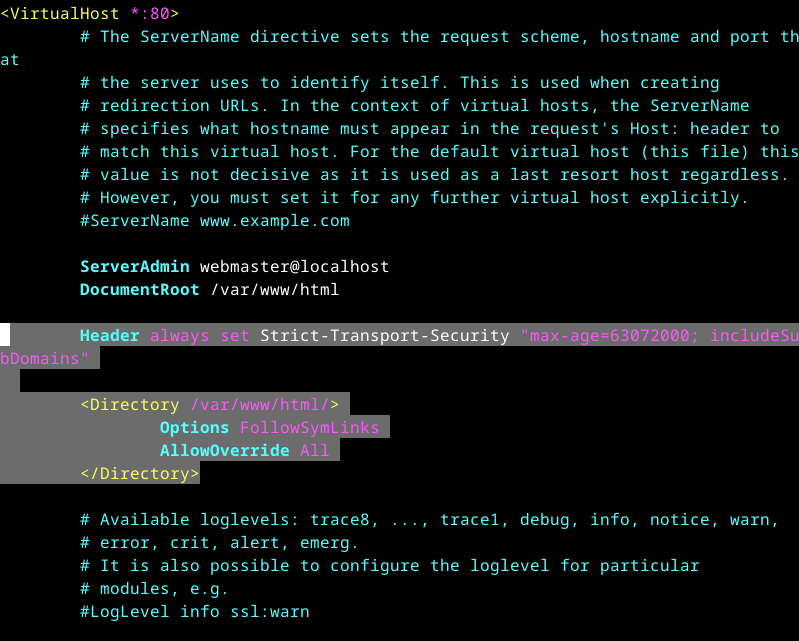
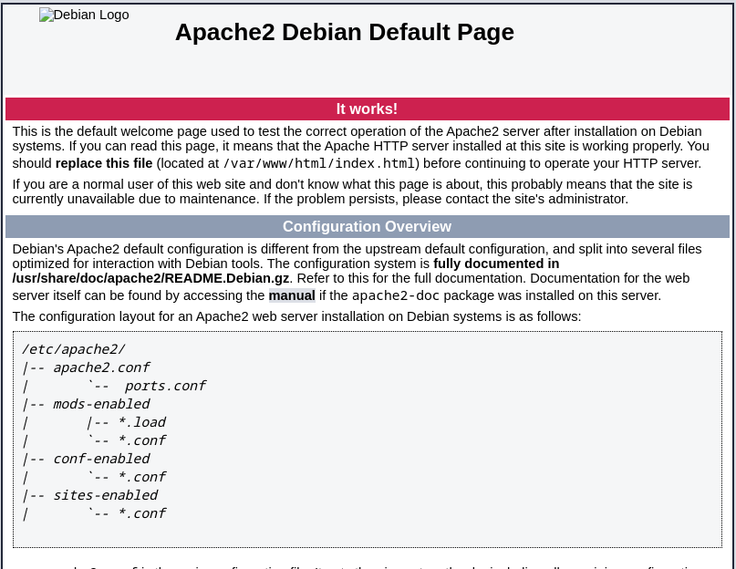
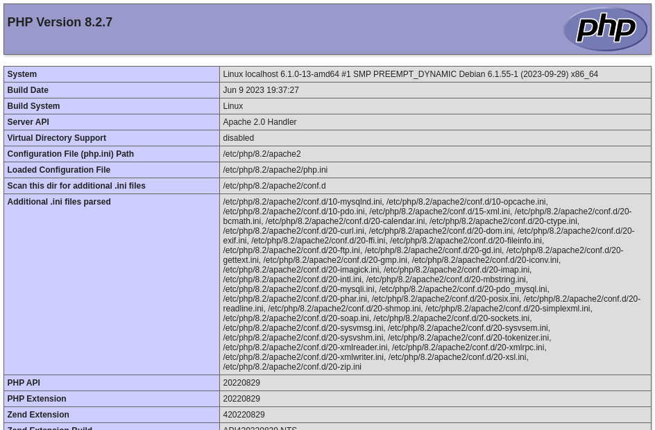
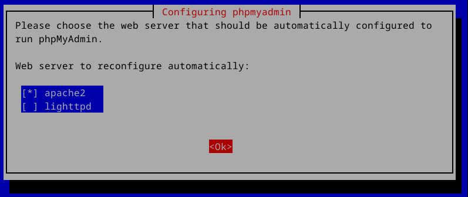
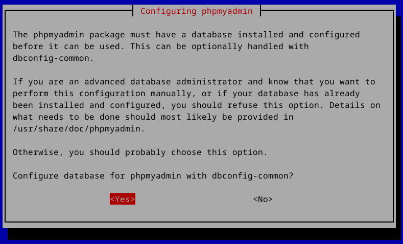
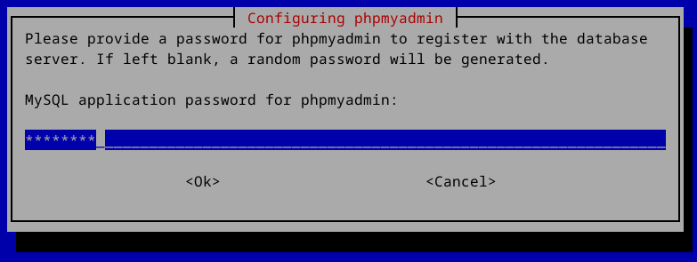
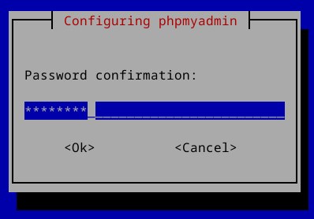
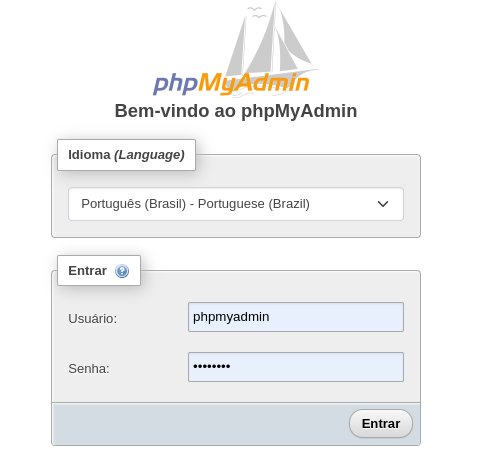
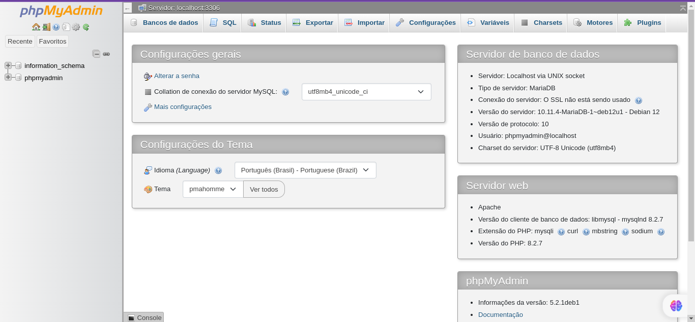

# Como criar um Servidor LAMP com PhpMyAdmin no Debian 12 Bookworm

Apache, PHP e MySQL combinados criam uma pilha de desenvolvimento web básica, mas popular, conhecida como LAMP (Linux, Apache, MySQL, PHP). Essa pilha de código aberto é amplamente usada para construir aplicativos da web e sites baseados em PHP.

O phpMyAdmin é uma ferramenta de software livre escrita em PHP, que permite a administração e gerenciamento de bancos de dados MySQL através de uma interface web. Ele fornece uma maneira fácil e conveniente de criar, editar, excluir e gerenciar bancos de dados, tabelas, colunas, registros e usuários.

Acesse seu bash, e atualize seu repositório.

```console
sudo apt update
sudo apt upgrade
```

## Instalação do Apache2

O Apache2 é um servidor web de código aberto e um dos servidores web mais populares do mundo. Ele foi desenvolvido pela Apache Software Foundation e é amplamente utilizado para hospedar sites e aplicativos da web. O Apache2 suporta vários recursos e funcionalidades, como suporte a múltiplos sites, suporte a SSL/TLS, autenticação de usuários, redirecionamentos, balanceamento de carga, entre outros. Ele é conhecido por sua estabilidade, segurança e flexibilidade, sendo amplamente utilizado em servidores Linux.

1. Instalando o apache2

    ```console
    sudo apt install apache2 apache2-utils
    ```

    Após a instação, habilitamos o mod_rewrite do Apache que é muito utilizado. Este é um módulo que utiliza um mecanismo baseado em regras de reescrita. (phpipa, wordpress todos usam), e o mod_headers, este módulo fornece diretivas para controlar e modificar os cabeçalhos de solicitação e resposta HTTP. Comando para habilita-lo:

2. Configurando detalhes

    ```console
    sudo a2enmod rewrite
    sudo a2enmod headers
    sudo systemctl restart apache2
    ```

    A página que vimos ao abri o ip do nosso servidor no navegador fica no diretório /var/www/html, isso está sendo informado no arquivo default do apache que fica em /etc/apache2/sites-enabled/000-default.conf, e para que nosso mod_rewrite e headers funcione corretamente será necessário adicionar alguma linhas.

    O HTTP Strict Transport Security ou HSTS (RFC 6797) é um novo padrão de segurança SSL aprovado recentemente pelo IETF. Ele traz diversas melhorias para o SSL como forçar a utilização do HTTPS impedindo que sites sejam acessados usando o protocolo HTTP ou que partes do código de um site que está usando HTTPS seja executado em servidores usando o HTTP entre outras.

    ```console
    sudo vi /etc/apache2/sites-enabled/000-default.conf
    ```

    Adicione abaixo de “DocumentRoot /var/www/html” o seguinte:

    ```
        Header always set Strict-Transport-Security "max-age=63072000; includeSubDomains"
    
        <Directory /var/www/html/>
                Options FollowSymLinks
                AllowOverride All
        </Directory>
    ```

    Ou pode-se executar o comando abaixo para incluir o texto automaticamente:

    ```console
    sudo awk 'NR==14 {print "\tHeader always set Strict-Transport-Security \"max-age=63072000; includeSubDomains\"\n\n\t<Directory /var/www/html/>\n\t\tOptions FollowSymLinks\n\t\tAllowOverride All\n\t</Directory>\n"} 1' /etc/apache2/sites-enabled/000-default.conf.bak > /etc/apache2/sites-enabled/000-default.conf
    ```

    A aparência deverá ser esta:

    

    Para você aprender mais como o apache funciona recomendo: [Como ter diversos sub/domínios no mesmo servidor](https://blog.remontti.com.br/3464)

    Por segurança remova a assinatura do apache e reinicie o apache2 para que tenha efeito as nossas alterações.

    ```console
    sudo sed -i 's/ServerTokens OS/ServerTokens Prod/' /etc/apache2/conf-available/security.conf

    sudo sed -i 's/ServerSignature On/ServerSignature Off/' /etc/apache2/conf-available/security.conf

    sudo systemctl restart apache2
    ```

    Abra o navegador e digite: http://COLOQUE_SEU_IP_AQUI_OU_localhost

    

## Instalação do PHP 8.2

PHP (Hypertext Preprocessor) é uma linguagem de programação de código aberto, muito utilizada para desenvolvimento web. É uma linguagem de script do lado do servidor, o que significa que o código PHP é executado no servidor web antes de ser enviado para o navegador do usuário.

1. Instalação do PHP e algumas extensões:

    Para instalação do PHP vou incluir algumas extensões que são as mais utilizada, mas se preferir você pode optar em não instalar, as necessárias são libapache2-mod-php php php-mysql php-cli.

    ```console
    sudo apt install php libapache2-mod-php libmagickcore-dev
    sudo apt install php-{common,mysql,xml,xmlrpc,curl,gd,imagick,cli,dev,imap,mbstring,opcache,soap,zip,intl,pear,gmp,bcmath,json,bz2,apcu}
    ```

    É necessário reiniciar o apache para que o php tenha efeito.

    ```console
    sudo systemctl restart apache2
    ```

    Consultado informações de versão:

    ```console
    php --version
    ```

    ```
    PHP 8.2.7 (cli) (built: Jun  9 2023 19:37:27) (NTS)
    Copyright (c) The PHP Group
    Zend Engine v4.2.7, Copyright (c) Zend Technologies
        with Zend OPcache v8.2.7, Copyright (c), by Zend Technologies
    ```
    
    Você pode criar um arquivo php com a função phpinfo() para mostrar todas as informações.

    ```console
    sudo vi /var/www/html/phpinfo.php
    ```

    Coloque o conteúdo abaixo no arquivo.

    ```php
    <?php

    phpinfo();

    ?>
    ```

    Abra o navegador e digite: http://COLOQUE_SEU_IP_AQUI_OU_localhost/phpinfo.php

    

## Instalação do MariaDB 10.11 + phpMyAdmin 5

MariaDB é um sistema de gerenciamento de banco de dados relacional de código aberto. Ele foi criado como um fork do MySQL, após a aquisição do MySQL pela Oracle Corporation. O MariaDB é compatível com o MySQL e oferece recursos aprimorados, desempenho melhorado e maior estabilidade.

phpMyAdmin, por outro lado, é uma ferramenta de administração de banco de dados baseada na web, escrita em PHP. Ela permite que os usuários gerenciem bancos de dados MySQL ou MariaDB através de uma interface gráfica amigável. Com o phpMyAdmin, os usuários podem criar, modificar e excluir bancos de dados, tabelas, campos, índices e executar consultas SQL. É uma ferramenta popular e amplamente utilizada para gerenciar bancos de dados MySQL ou MariaDB.

1. Instalando MariaDB e phpMyAdmin

    ```console
    sudo apt install mariadb-server mariadb-client phpmyadmin
    ```

    Por padrão o pacote MaraiDB no Debian usa unix_socket para autenticar o login do usuário, o que basicamente significa que você pode usar o nome de usuário e a senha do sistema operacional para efetuar login no console do MariaDB. Assim, você pode logar diretamente sem fornecer a senha root do MariaDB. Mais a frente vou ensinar como definir uma senha, não farei agora pois se você alterar nesse momento ao instalar o phpMyAdmin terá um erro.

    Selecione Apache2

    

    Responda Yes/Sim

    

    Informe a senha para o banco de dados do phpmyadmin. Esta senha será do usuário phpmyadmin.
    

    Repita a senha

    

    Para acessar o phpMyadmin abra o navegador e digite: http://COLOQUE_SEU_IP_AQUI_OU_localhost/phpmyadmin/
    
    Usuário: phpmyadmin

    Senha: a mesma que acabou de digitar na instalação.

    

    Essa é a tela inicial do phpMyAdmin

    

2. Definindo senha para o root do mariaDB

    Para aumentar a segurança vamos definir uma senha para o usuário root do MariDB, não esqueça de alterar ALTERE_ESTA_SENHA pela sua senha.

    ```console
    sudo mariadb -u root
    ```

    Dentro do MariaDB digite os seguintes comandos:

    ```
    USE mysql;
    ALTER USER 'root'@'localhost' IDENTIFIED BY 'ALTERE_ESTA_SENHA';
    FLUSH PRIVILEGES;
    EXIT;
    ```

    Apague seus rastros, em /root/.mysql_history temos um histórico com todos os comandos dado no terminal do MariaDB, então não é legal deixar lá em texto puro a senha que setamos!

    Primeiro faça:
    ```console
    sudo su
    ```
    Depois faça:
    ```console
    > /root/.mysql_history
    exit
    ```
    Ou faça:
    ```console
    sudo truncate -s 0 /root/.mysql_history
    ```

## Vamos criptografar

1. Criando certificado grátis para seus sub/domínios.

    ```console
    sudo apt install certbot python3-certbot-apache
    ```

2. Para gerar o certificado use o comando:

    ```console
    sudo certbot
    ```

    Não esqueça de colocar no seu cron para ele renovar o certificado, pois a cada 90 ele expira. Neste exemplo todo dia primeiro tento renovar.

    ```console
    certbot -q renew
    ```

    Para testar a certificação coloque seu domínio no endereço [https://www.cdn77.com/tls-test](https://www.cdn77.com/tls-test).

