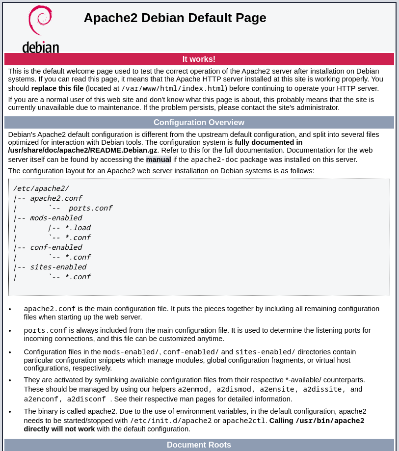
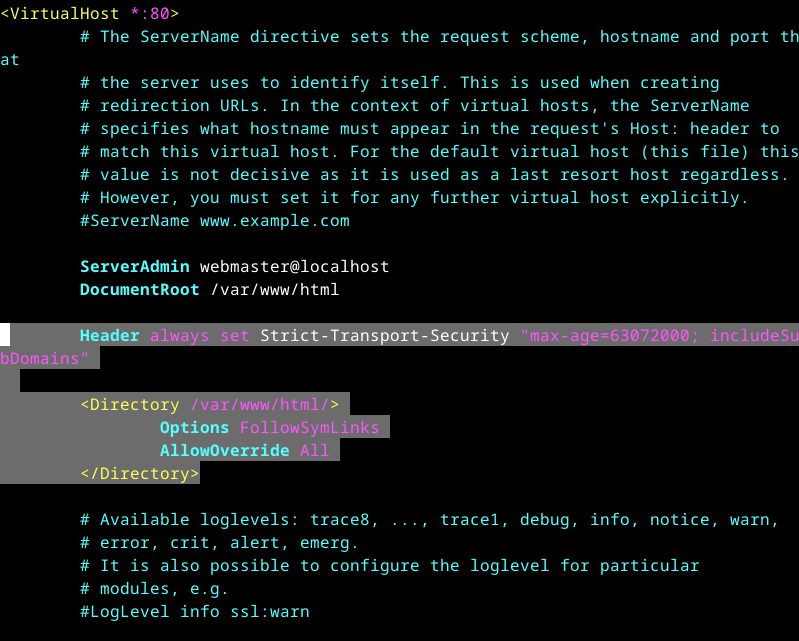
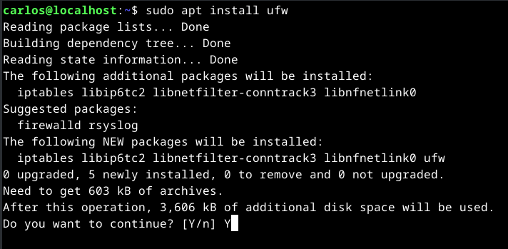
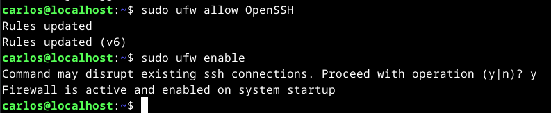
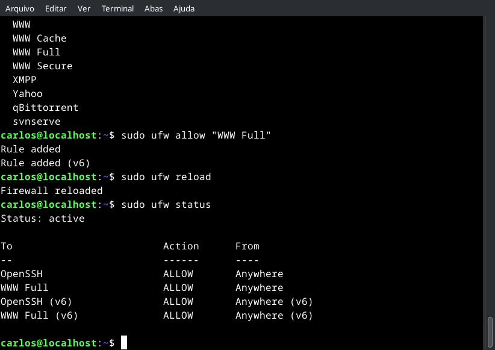
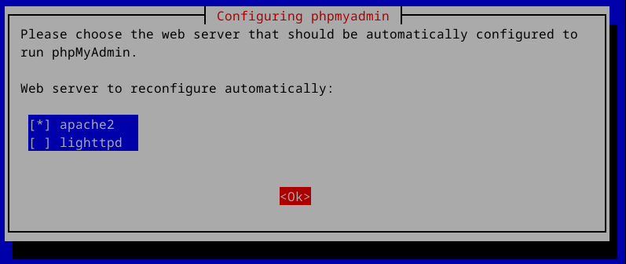
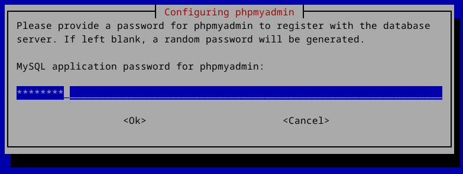
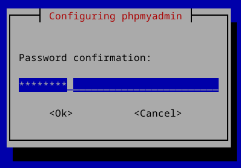
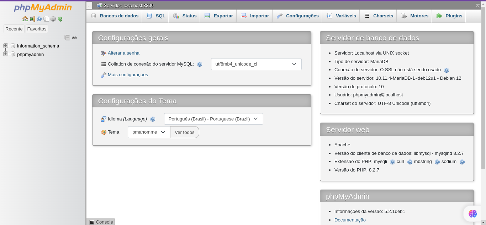

# Como instalar WordPress no Debian 12

WordPress é um sistema de gerenciamento de conteúdo (CMS) popular usado para criar e gerenciar sites. É uma plataforma de código aberto escrita em PHP e combinada com um banco de dados MySQL ou MariaDB. O WordPress oferece uma interface amigável e uma ampla variedade de temas, plug-ins e opções de personalização, tornando-o acessível a usuários com diversos níveis de conhecimento técnico.

## Pré-requisitos

* Um servidor Debian 12 com pelo menos 4 GB de memória e 2 CPUs.
* Um usuário não root com privilégios de administrador.
* Um nome de domínio apontado para o endereço IP do servidor.

## Instalando o servidor web Apache2

Na primeira etapa, você instalará o servidor web Apache2 que será usado para executar o WordPress.

Primeiro, atualize o índice do seu pacote Debian através do comando apt update abaixo. Quando terminar, você obterá as informações mais recentes do pacote que permitem instalar a versão mais recente dos pacotes.

```console
sudo apt update
sudo apt upgrade
```

Agora digite o seguinte comando apt install para instalar o servidor web Apache. Insira y/s para confirmar quando solicitado e pressione ENTER para prosseguir com a instalação.

```console
sudo apt install apache2 apache2-utils
```


Após a instação, habilitamos o mod_rewrite do Apache que é muito utilizado. Este é um módulo que utiliza um mecanismo baseado em regras de reescrita. (phpipa, wordpress todos usam), e o mod_headers, este módulo fornece diretivas para controlar e modificar os cabeçalhos de solicitação e resposta HTTP. Comando para habilita-lo:

```console
sudo a2enmod rewrite
sudo a2enmod headers
sudo systemctl restart apache2
```

Agora execute os comandos systemctl abaixo para verificar o status do serviço apche2.

```console
sudo systemctl is-enabled apache2
sudo systemctl status apache2
```

A saída habilitada deve indicar que o serviço Apache2 será iniciado automaticamente na inicialização do sistema. E o status ativo (em execução) confirma que o serviço Apache2 está em execução.


Para você aprender mais como o apache funciona recomendo: [Como ter diversos sub/domínios no mesmo servidor](https://blog.remontti.com.br/3464).

Por segurança remova a assinatura do apache e reinicie o apache2 para que tenha efeito as nossas alterações.

```console
sudo sed -i 's/ServerTokens OS/ServerTokens Prod/' /etc/apache2/conf-available/security.conf

sudo sed -i 's/ServerSignature On/ServerSignature Off/' /etc/apache2/conf-available/security.conf

sudo systemctl restart apache2
```

Já pode-se acessar no servidor apache pelo http://localhost ou http://nome_do_servidor_na_rede.



A página que vimos ao abrir o ip do nosso servidor no navegador fica no diretório /var/www/html, isso está sendo informado no arquivo default do apache que fica em /etc/apache2/sites-enabled/000-default.conf, e para que nosso mod_rewrite e headers funcione corretamente será necessário adicionar alguma linhas.

O HTTP Strict Transport Security ou HSTS (RFC 6797) é um novo padrão de segurança SSL aprovado recentemente pelo IETF. Ele traz diversas melhorias para o SSL como forçar a utilização do HTTPS impedindo que sites sejam acessados usando o protocolo HTTP ou que partes do código de um site que está usando HTTPS seja executado em servidores usando o HTTP entre outras.

```console
sudo vi /etc/apache2/sites-enabled/000-default.conf
```

Adicione abaixo de “DocumentRoot /var/www/html” o seguinte:

```console
    Header always set Strict-Transport-Security "max-age=63072000; includeSubDomains"

    <Directory /var/www/html/>
        Options FollowSymLinks
        AllowOverride All
    </Directory>
```

Ou pode-se executar o comando abaixo para incluir o texto automaticamente:

```console
sudo su

cp /etc/apache2/sites-enabled/000-default.conf /etc/apache2/sites-enabled/000-default.conf.bak

awk 'NR==14 {print "\tHeader always set Strict-Transport-Security \"max-age=63072000; includeSubDomains\"\n\n\t<Directory /var/www/html/>\n\t\tOptions FollowSymLinks\n\t\tAllowOverride All\n\t</Directory>\n"} 1' /etc/apache2/sites-enabled/000-default.conf.bak > /etc/apache2/sites-enabled/000-default.conf

exit
```

Ou pode-se fazer da seguinte forma:

```console
sudo cp /etc/apache2/sites-enabled/000-default.conf /etc/apache2/sites-enabled/000-default.conf.bak
sudo awk 'NR==14 {print "\tHeader always set Strict-Transport-Security \"max-age=63072000; includeSubDomains\"\n\n\t<Directory /var/www/html/>\n\t\tOptions FollowSymLinks\n\t\tAllowOverride All\n\t</Directory>\n"} 1' /etc/apache2/sites-enabled/000-default.conf > 000-default.conf
sudo chown root:root 000-default.conf
sudo mv 000-default.conf /etc/apache2/sites-enabled/000-default.conf
```

A aparência deverá ser esta:



## Instalando o UFW

Após a instalação do Apache2, você instalará o UFW (Uncomplicated Firewall) e abrirá portas para OpenSSH, HTTP e HTTPS. Você configurará o UFW como firewall padrão em seu servidor Debian.

Instale o pacote ufw em seu servidor Debian através do comando apt install abaixo. Insira y para confirmar a instalação e pressione ENTER para continuar.

```console
sudo apt install ufw
```



Após a instalação do ufw, execute os comandos ufw abaixo para permitir o serviço ssh e habilitar o ufw.

```console
sudo ufw allow OpenSSH
sudo ufw enable
```

Insira y quando solicitado a iniciar e ativar o serviço ufw. Se for bem-sucedido, você deverá obter uma saída " O Firewall está ativo e ativado na inicialização do sistema ".



Com o ufw em execução, você deve adicionar portas HTTP e HTTPS que o servidor web Apache2 usará.

Execute o comando ufw abaixo para obter a lista de perfis de aplicativos disponíveis no ufw. Você deverá ver perfis como OpenSSH para serviço ssh e WWW Full para servidor web Apache2, ambos protocolos HTTP e HTTPS.

```console
sudo ufw app list
```

Agora execute o seguinte comando para adicionar e ativar o perfil WWW Full e recarregar o ufw para aplicar as alterações.

```console
sudo ufw allow "WWW Full"
sudo ufw reload
```

Por último, execute o comando ufw status abaixo para verificar as regras habilitadas no ufw. Certifique-se de ter o perfil WWW Full habilitado, o que significa que as portas HTTP e HTTPS estão abertas.

```console
sudo ufw status
```



## Installing PHP 8.2

O Debian 12 Bookwork mais recente vem com pacotes PHP 8.2 por padrão, que é a versão PHP recomendada para instalação do Nextcloud. Agora, você instalará os pacotes PHP 8.2 e configurará o PHP para a instalação do Nextcloud. Você também habilitará o PHP Opcache que será usado como cache de memória para Nextcloud.

Execute o comando apt install abaixo para instalar pacotes PHP em seu sistema Debian. O comando instalará o PHP e algumas extensões necessárias ao Nextcloud, como GD, MySQL, Imagick, pear e apcu. Verifique a página de requisitos do servidor Nextcloud para obter a lista completa de pacotes que você precisa.

```console
sudo apt install php libapache2-mod-php libmagickcore-dev
sudo apt install php-{common,mysql,xml,xmlrpc,curl,gd,imagick,cli,dev,imap,mbstring,opcache,soap,zip,intl,pear,gmp,bcmath,json,bz2,apcu,redis,snmp,mysqli,fpm,mysqlnd}
```

Insira y/s para confirmar a instalação e pressione ENTER para continuar.


Após a instalação do PHP, verifique a versão do PHP e as extensões PHP habilitadas usando o comando abaixo.

```console
php --version
php -m
```

Você deverá ver que o PHP 8.2 está instalado com extensões habilitadas, como GD, MySQL, Imagick, xml e zip.


Em seguida, execute o comando do editor vim abaixo para abrir o arquivo de configuração PHP /etc/php/8.2/apache2/php.ini .

```console
sudo cp /etc/php/8.2/apache2/php.ini /etc/php/8.2/apache2/php.ini.bak
sudo vi /etc/php/8.2/apache2/php.ini
```

Remova o comentário do parâmetro date.timezone e insira o fuso horário adequado para PHP.

```console
date.timezone = America/Sao_Paulo
```

Aumente o valor padrão dos parâmetros memory_limit, upload_max_filesize, post_max_size e max_execution_time . Altere o valor conforme necessário.

```console
memory_limit = 512M
upload_max_filesize = 1024M
post_max_size = 600M
max_execution_time = 300
```

Habilite file_uploads e allow_url_fopen alterando o valor padrão para On .

```console
file_uploads = On
allow_url_fopen = On
```

Desative os parâmetros display_errors e output_buffering alterando o valor padrão para Off .

```console
display_errors = Off
output_buffering = Off
```

Remova o comentário do parâmetro zend_extension e altere o valor para opcache. Isso habilitará o PHP OPcache, que é necessário para Nextcloud.

```console
zend_extension=opcache
```

Adicione as seguintes linhas à seção [opcache] ou localize e altere estas variáveis, descomentando as mesmsas. A configuração OPCache é recomendada pela Nextcloud.

```console
opcache.enable=1
opcache.interned_strings_buffer=18
opcache.max_accelerated_files=10000
opcache.memory_consumption=128
opcache.save_comments=1
opcache.revalidate_freq=1
```

Salve o arquivo e feche o editor quando terminar.

Ou pode-se utilizar os comandos abaixo para realizar a troca de forma automática.

```console
sudo cp /etc/php/8.2/apache2/php.ini /etc/php/8.2/apache2/php.ini.bak
sudo sed -i 's/;date.timezone =/date.timezone = America\/Sao_Paulo/' /etc/php/8.2/apache2/php.ini
sudo sed -i 's/memory_limit = 128M/memory_limit = 512M/' /etc/php/8.2/apache2/php.ini
sudo sed -i 's/upload_max_filesize = 2M/upload_max_filesize = 1024M/' /etc/php/8.2/apache2/php.ini
sudo sed -i 's/post_max_size = 8M/post_max_size = 600M/' /etc/php/8.2/apache2/php.ini
sudo sed -i 's/max_execution_time = 30/max_execution_time = 300/' /etc/php/8.2/apache2/php.ini
sudo sed -i 's/output_buffering = 4096/output_buffering = Off/' /etc/php/8.2/apache2/php.ini
sudo sed -i 's/;zend_extension=opcache/zend_extension=opcache/' /etc/php/8.2/apache2/php.ini
sudo sed -i 's/;opcache.enable=1/opcache.enable=1/' /etc/php/8.2/apache2/php.ini
sudo sed -i 's/;opcache.interned_strings_buffer=8/opcache.interned_strings_buffer=18/' /etc/php/8.2/apache2/php.ini
sudo sed -i 's/;opcache.max_accelerated_files=10000/opcache.max_accelerated_files=10000/' /etc/php/8.2/apache2/php.ini
sudo sed -i 's/;opcache.memory_consumption=128/opcache.memory_consumption=128/' /etc/php/8.2/apache2/php.ini
sudo sed -i 's/;opcache.save_comments=1/opcache.save_comments=1/' /etc/php/8.2/apache2/php.ini
sudo sed -i 's/;opcache.revalidate_freq=2/opcache.revalidate_freq=1/' /etc/php/8.2/apache2/php.ini
```

Por último, digite o comando systemctl abaixo para reiniciar o serviço Apache2. Cada vez que você fizer alterações na configuração do PHP, reinicie o serviço Apache2 para aplicar as alterações feitas.

```console
sudo systemctl restart apache2
```

Neste ponto podemos criar uma arquivo no diretório /var/www/html da seguinte forma:

```console
sudo vi /var/www/html/phpinfo.php
```

Coloque este conteúdo no arquivo:

```console
<?php

phpinfo();

?>
```

Já pode-se acessar no servidor pelo http://localhost/phpinfo.php ou http://nome_do_servidor_na_rede/phpinfo.php para ver como está a configuração do seu PHP.

Vamos ter algo parecido com:


## Instalando o Servidor MariaDB

Após instalar o servidor web Apache2 e PHP 8.2, você instalará o servidor MariaDB que será usado como banco de dados para Nextcloud e configurará a senha root do MariaDB por meio do utilitário mariadb-secure-installation.

Instale o servidor MariaDB através do comando apt install abaixo. Insira y quando solicitado e pressione ENTER para prosseguir com a instalação

```console
sudo apt install mariadb-server mariadb-client
```


Depois que o MariaDB estiver instalado, insira os seguintes comandos systemctl para verificar o serviço mariadb.

```console
sudo systemctl is-enabled mariadb
sudo systemctl status mariadb
```

A saída habilitada indica que o serviço mariadb será executado automaticamente na inicialização do sistema. E a saída ativa (em execução) deve indicar que o serviço mariadb está em execução.


Agora que o servidor MariaDB está em execução, você deve proteger a instalação do MariaDB, e isso pode ser feito através do utilitário mariadb-secure-installation . O comando mariadb-secure-installation ajuda a configurar a senha root e a autenticação do MariaDB e ajuda a remover o teste de banco de dados padrão do usuário anônimo.

Execute o comando mariadb-secure-installation para proteger seu servidor MariaDB.

```console
sudo mariadb-secure-installation
```

Durante o processo, você deve inserir Y para concordar e aplicar a configuração ao MariaDB, ou inserir n para discordar e deixar a configuração como padrão. Abaixo estão algumas configurações do MariaDB que serão solicitadas:

* Pressione ENTER quando for solicitada a senha root do MariaDB.
* Insira Y quando questionado sobre o método de autenticação unix_socket.
* Insira Y para configurar uma nova senha para o usuário root do MariaDB. Em seguida, insira a nova senha e repita.
* Insira Y para remover o usuário anônimo padrão do MariaDB.
* Em seguida, insira Y novamente para desabilitar o login remoto para o usuário root do MariaDB.
* Insira Y para remover o teste de banco de dados padrão do MariaDB.
* Por último, insira Y novamente para recarregar os privilégios da tabela e aplicar as alterações.

Com isso, o servidor MariaDB está instalado e protegido.

Conforme abaixo:

```console
NOTE: RUNNING ALL PARTS OF THIS SCRIPT IS RECOMMENDED FOR ALL MariaDB
      SERVERS IN PRODUCTION USE!  PLEASE READ EACH STEP CAREFULLY!

In order to log into MariaDB to secure it, we'll need the current
password for the root user. If you've just installed MariaDB, and
haven't set the root password yet, you should just press enter here.

Enter current password for root (enter for none): (SOMENTE PRESSIONE ENTER SEM NADA)
OK, successfully used password, moving on...

Setting the root password or using the unix_socket ensures that nobody
can log into the MariaDB root user without the proper authorisation.

You already have your root account protected, so you can safely answer 'n'.

Switch to unix_socket authentication [Y/n] Y
 ... skipping.

You already have your root account protected, so you can safely answer 'n'.

Change the root password? [Y/n] Y
New password: 
Re-enter new password: 
Password updated successfully!
Reloading privilege tables..
 ... Success!


By default, a MariaDB installation has an anonymous user, allowing anyone
to log into MariaDB without having to have a user account created for
them.  This is intended only for testing, and to make the installation
go a bit smoother.  You should remove them before moving into a
production environment.

Remove anonymous users? [Y/n] Y
 ... Success!

Normally, root should only be allowed to connect from 'localhost'.  This
ensures that someone cannot guess at the root password from the network.

Disallow root login remotely? [Y/n] Y
 ... Success!

By default, MariaDB comes with a database named 'test' that anyone can
access.  This is also intended only for testing, and should be removed
before moving into a production environment.

Remove test database and access to it? [Y/n] Y
 - Dropping test database...
 ... Success!
 - Removing privileges on test database...
 ... Success!

Reloading the privilege tables will ensure that all changes made so far
will take effect immediately.

Reload privilege tables now? [Y/n] Y
 ... Success!

Cleaning up...

All done!  If you've completed all of the above steps, your MariaDB
installation should now be secure.

Thanks for using MariaDB!
```

## Criando Banco de Dados e Usuário

Após instalar o servidor MariaDB, agora você criará um novo banco de dados e usuário para o WordPress. Para conseguir isso, você deve fazer login no servidor MariaDB através do cliente mariadb.

Faça login no servidor MariaDB usando o comando do cliente mariadb abaixo. Insira a senha root do MariaDB quando solicitado.

```console
sudo mariadb -u root -p
```

Uma vez logado no MariaDB, execute as seguintes consultas para criar um novo banco de dados Mariadb e usuário para WordPress. Neste exemplo, você criará um novo banco de dados wordpress_db e o usuário wordpress_user com a senha StrongPassword. Certifique-se de alterar a senha StrongPassword por uma nova senha.

```console
CREATE DATABASE wordpress_db;
CREATE USER wordpress_user@localhost IDENTIFIED BY 'StrongPassword';
GRANT ALL PRIVILEGES ON wordpress_db.* TO wordpress_user@localhost;
FLUSH PRIVILEGES;
```


Ainda dentro do mariadb e por último, execute a consulta a seguir para garantir que o usuário nextclouduser possa acessar o banco de dados nextcloud_db .

```console
SHOW GRANTS FOR wordpress_user@localhost;
```

Se tudo correr bem, você deverá ver que o usuário wordpress_user tem privilégios para o banco de dados wordpress_db .


Digite quit para sair do servidor MariaDB e conclua esta seção.

```console
quit
```

Pode-se criar a base de dados também utilizando o script abaixo:

```console
sudo echo "CREATE DATABASE wordpress_db;
CREATE USER wordpress_user@localhost IDENTIFIED BY 'StrongPassword';
GRANT ALL PRIVILEGES ON wordpress_db.* TO wordpress_user@localhost;
FLUSH PRIVILEGES;
SHOW GRANTS FOR wordpress_user@localhost;
quit" > db-wordpress.sql
sudo chown root:root db-wordpress.sql
sudo mariadb -u root -pStrongPassword < db-wordpress.sql > db-wordpress.tab
sudo cat db-wordpress.tab
sudo rm -rf db-wordpress.sql
sudo rm -rf db-wordpress.tab
```

## Instalando phpMyAdmin

Caso queira pode-se instalar o PhpMyAdmin. Não é obrigatório, caso não queira, basta pular esta estapa.

O phpMyAdmin é uma ferramenta de administração de banco de dados baseada na web, escrita em PHP. Ela permite que os usuários gerenciem bancos de dados MySQL ou MariaDB através de uma interface gráfica amigável. Com o phpMyAdmin, os usuários podem criar, modificar e excluir bancos de dados, tabelas, campos, índices e executar consultas SQL. É uma ferramenta popular e amplamente utilizada para gerenciar bancos de dados MySQL ou MariaDB.

```console
sudo apt install phpmyadmin
```

Selecione Apache2



Responda Yes/Sim


Informe a senha para o banco de dados do phpmyadmin. Esta senha será do usuário phpmyadmin.



Repita a senha



Para acessar o phpMyadmin abra o navegador e digite:  http://localhost/phpmyadmin ou http://nome_do_servidor_na_rede/phpmyadmin/

Usuário: phpmyadmin

Senha: a mesma que acabou de digitar na instalação.


Essa é a tela inicial do phpMyAdmin



Apague seus rastros, em /root/.mysql_history temos um histórico com todos os comandos dado no terminal do MariaDB, então não é legal deixar lá em texto puro a senha que setamos!

Primeiro faça:

```console
sudo su
```

Depois faça:

```console
> /root/.mysql_history
exit
```

Ou faça apenas:

```console
sudo truncate -s 0 /root/.mysql_history
```

## Baixando o código-fonte do WordPress

Neste ponto, todos os pacotes de software para executar o WordPress estão instalados. Agora você fará o download da versão mais recente do código-fonte do WordPress e a instalará. Verifique a página de download do WordPress antes de começar para obter informações sobre a versão mais recente do WordPress.

Antes de baixar o código-fonte do WordPress, execute o comando apt install abaixo para instalar o curl e o descompactador unzip.

```console
sudo apt install curl unzip
```


Vá para o diretório /var/www e baixe o código-fonte do WordPress por meio do comando curl abaixo. Visite a página de download do WordPress para obter a versão mais recente do WordPress.

```console
cd /var/www/html
sudo wget https://wordpress.org/latest.zip
```


Quando baixei a última versão era a wordpress-6.3.2, mas baixei a latest.zip mesmo.

Agora extraia o arquivo latest.zip por meio do comando unzip e, em seguida, altere a propriedade do diretório wordpress para www-data .

```console
sudo unzip latest.zip
sudo chown -R www-data:www-data wordpress
cd wordpress
sudo find . -type d -exec chmod 755 {} \;
sudo find . -type f -exec chmod 644 {} \;
```

Com isso, você deve notar que o diretório raiz do documento para instalação do WordPress é o diretório /var/www/html/wordpress. E o servidor web Apache2 pode acessar o código-fonte do wordpress por meio do usuário www-data .

Agora, abra o arquivo wp-config.php com seu editor favorito e insira as credenciais do banco de dados que você criou na etapa anterior.

```console
sudo cp wp-config-sample.php wp-config.php 
sudo vi wp-config.php
```

Deve ser algo semelhante a isto:


## Configurando o host virtual Apache2

Após baixar o código-fonte do WordPress, você deve criar a nova configuração do host virtual Apache2 que será usada para executar o WordPress. Certifique-se de ter o nome de domínio apontado para o endereço IP do servidor Debian para a instalação do WordPress.

Crie uma nova configuração de host virtual Apache2 /etc/apache2/sites-available/wordpress.conf usando o comando abaixo.

```console
sudo vi /etc/apache2/sites-available/wordpress.conf
```

Altere o nome de domínio no parâmetro ServerName com seu domínio e o caminho completo do log para os parâmetros ErrorLog e CustomLog.

```console
<VirtualHost *:80>
    ServerAdmin admin@wordpress.linuxlab.blog.br
    ServerName wordpress.linuxlab.blog.br
    DocumentRoot /var/www/html/wordpress/

    Alias /wordpress "/var/www/html/wordpress/"

    # log files
    ErrorLog /var/log/apache2/files.wordpress.linuxlab.blog.br-error.log
    CustomLog /var/log/apache2/files.wordpress.linuxlab.blog.br-access.log combined

    <Directory /var/www/html/wordpress/>
        Options +FollowSymlinks
        AllowOverride All

        <IfModule mod_dav.c>
            Dav off
        </IfModule>

        SetEnv HOME /var/www/html/wordpress
        SetEnv HTTP_HOME /var/www/html/wordpress
    </Directory>
</VirtualHost>
```

Quando terminar, salve o arquivo e saia do editor.

Em seguida, execute o comando a2ensite abaixo para habilitar a configuração do host virtual wordpress.conf. Em seguida, verifique a configuração geral do Apache2 por meio do comando apachectl abaixo.

```console
sudo a2enmod rewrite
sudo a2ensite wordpress.conf
sudo apachectl configtest
```


Você deverá ver a saída Sintaxe OK se tiver configurações corretas e adequadas do Apache.

Agora insira o seguinte comando systemctl para reiniciar o serviço Apache2 e aplicar a configuração do host virtual WordPress.

```console
sudo systemctl restart apache2
```

Após a reinicialização do Apache2, sua instalação do WordPress deverá estar acessível por meio de um protocolo HTTP inseguro.

http://linuxlab.blog.br/wordpress

Visite o seu nome de domínio WordPress e você deverá obter a página de instalação como esta:

Selecione seu idioma e clique no botão Continuar.


Forneça as informações solicitadas e clique no botão Instalar WordPress.


Assim que a instalação for concluída. Você deverá ver a seguinte tela:


## Protegendo WordPress com certificados SSL/TLS

Para adicionar uma camada de segurança adicional ao seu WordPress, você configurará HTTPS na configuração do host virtual Apache2 via Certbot. O Certbot é uma ferramenta de linha de comando para gerar certificados SSL/TLS gratuitos do Letsencrypt e vem com um plugin adicional que permite configurar HTTPS automaticamente para vários servidores web.

Execute o comando apt install abaixo para instalar o plugin Certbot e Certbot Apache. Insira y/s, quando solicitada a confirmação, e pressione ENTER para continuar.

```console
sudo apt install certbot python3-certbot-apache
```


Agora execute o comando certbot abaixo para gerar certificados SSL/TLS para seu nome de domínio WordPress e configurar automaticamente HTTPS dentro do host virtual Apache2. Certifique-se de alterar o nome de domínio e o endereço de e-mail no comando a seguir.

```console
sudo certbot --apache --agree-tos --redirect --hsts --staple-ocsp --email crpbbs@yahoo.com.br -d wordpress.linuxlab.blog.br
```

Após executar este comando você recebe uma mensagem. Eu respondi a mensagem que não, porque a pergunta é sobre eles enviarem e-mails para você sobre o trabalho deles.

```console
Saving debug log to /var/log/letsencrypt/letsencrypt.log

- - - - - - - - - - - - - - - - - - - - - - - - - - - - - - - - - - - - - - - -
Would you be willing, once your first certificate is successfully issued, to
share your email address with the Electronic Frontier Foundation, a founding
partner of the Let's Encrypt project and the non-profit organization that
develops Certbot? We'd like to send you email about our work encrypting the web,
EFF news, campaigns, and ways to support digital freedom.
- - - - - - - - - - - - - - - - - - - - - - - - - - - - - - - - - - - - - - - -
(Y)es/(N)o: N
Account registered.
Requesting a certificate for wordpress.linuxlab.blog.br

Successfully received certificate.
Certificate is saved at: /etc/letsencrypt/live/wordpress.linuxlab.blog.br/fullchain.pem
Key is saved at:         /etc/letsencrypt/live/wordpress.linuxlab.blog.br/privkey.pem
This certificate expires on 2023-12-30.
These files will be updated when the certificate renews.
Certbot has set up a scheduled task to automatically renew this certificate in the background.

Deploying certificate
Successfully deployed certificate for wordpress.linuxlab.blog.br to /etc/apache2/sites-available/wordpress-le-ssl.conf
Congratulations! You have successfully enabled HTTPS on https://wordpress.linuxlab.blog.br

- - - - - - - - - - - - - - - - - - - - - - - - - - - - - - - - - - - - - - - -
If you like Certbot, please consider supporting our work by:
 * Donating to ISRG / Let's Encrypt:   https://letsencrypt.org/donate
 * Donating to EFF:                    https://eff.org/donate-le
- - - - - - - - - - - - - - - - - - - - - - - - - - - - - - - - - - - - - - - -
```

Assim que o processo for concluído, o nome de domínio WordPress deve ser configurado com HTTPS, que é gerenciado pelo plugin Certbot Apache. E os certificados SSL/TLS estão localizados no diretório /etc/letsencrypt/live/domain-name.com/ .

## Instalando WordPress

Inicie seu navegador da web e visite o nome de domínio de sua instalação WordPress (no meu caso: http://linuxlab.blog.br/wordpress). Você deverá ser redirecionado automaticamente para uma conexão HTTPS segura e será solicitado a entrar com o nome e senha do administrador criado na etapa anterior.

Insira o novo usuário administrador e senha para seu WordPress.


Em seguida, clique em Acessar. Você verá o menu principal do WordPress.


# Conclusão

Está tudo pronto! Você concluiu a instalação do WordPress em seu sistema Debian. Você instalou WordPress com servidor web Apache2, PHP 8.2 e o servidor de banco de dados MariaDB. Você também protegeu seu WordPress com UFW (Uncomplicated Firewall) e certificados SSL/TLS via Certbot e Letsencrypt.

Com toda essa configuração, agora você pode usar o WordPress para criar suas páginas da web ou seu blog. Boa sorte