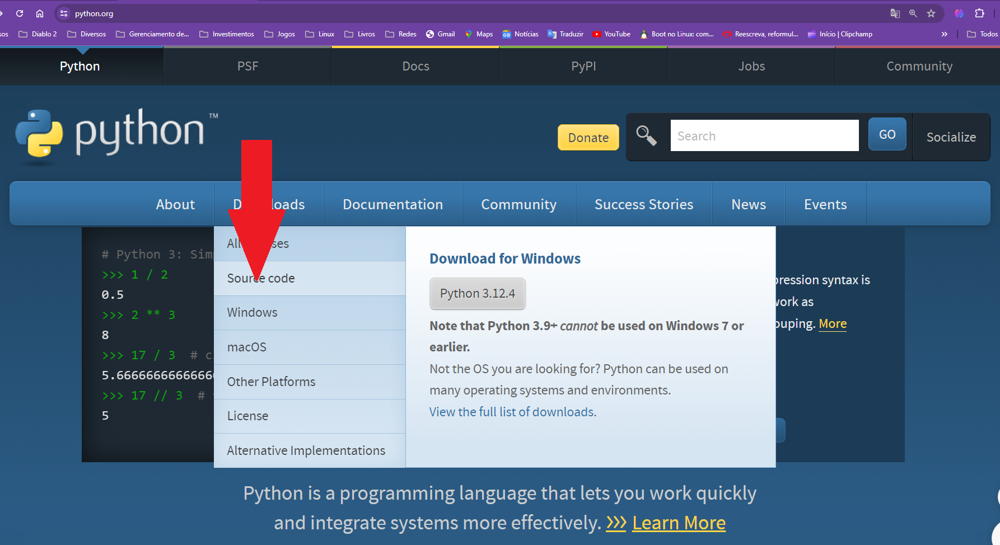
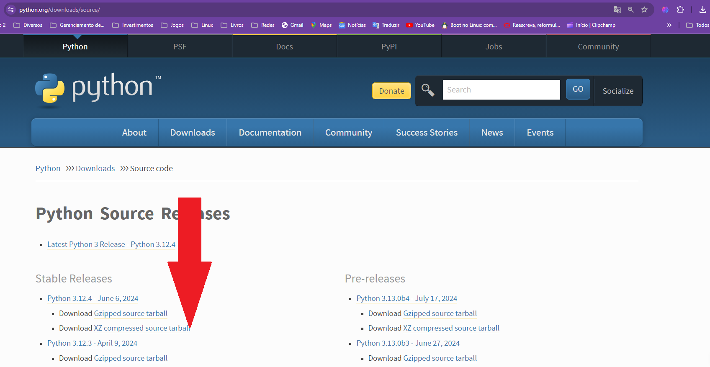

# Instalação da Última Versão do Python no Debian

## Instalação do Python no Debian

Instalar o Python no Linux pode parecer desafiador para quem está acostumado com instaladores gráficos e processos baseados em cliques. No entanto, o procedimento é relativamente simples e oferece uma ótima chance para se familiarizar com o terminal Linux. Neste guia, você aprenderá a instalar o Python no Linux a partir do código-fonte, assegurando que você obtenha a versão mais recente e configurada conforme suas preferências.

### Baixando e Extraindo o Código-Fonte

O primeiro passo para instalar o Python no Linux é obter o código-fonte a partir do site oficial. Vá até [python.org](https://www.python.org/) e, na seção de downloads, selecione a opção "Python Source". O arquivo baixado virá compactado, portanto, você precisará descompactá-lo para acessar seu conteúdo.





>[!IMPORTANT]
>Importante. Este tutorial apresenta os comandos para instalar a versão 3.12.4 do Python. Se você deseja instalar uma versão diferente, basta substituir o número da versão 3.12.4 por aquele que você deseja em todos os comandos.

Para descompactar o arquivo, abra o terminal na pasta de Downloads e utilize o seguinte comando (não se esqueça de ajustar o comando conforme o número da versão do Python):

```bash
sudo apt update
sudo apt install xz-utils
tar -xvJf Python-3.12.4.tar.xz
```

Após a extração, entre na pasta resultante com o comando:

```bash
cd Python-3.12.4
```

### Instalando as Dependências para Compilação

Antes de iniciar a compilação do Python, é necessário instalar algumas dependências. Para sistemas baseados em Ubuntu e suas variantes, você pode usar o seguinte comando para instalar todos os pacotes necessários:

```bash
sudo apt-get install build-essential gdb lcov pkg-config \
libbz2-dev libffi-dev libgdbm-dev libgdbm-compat-dev liblzma-dev \
libncurses5-dev libreadline6-dev libsqlite3-dev libssl-dev \
lzma lzma-dev tk-dev uuid-dev zlib1g-dev
```

Para obter mais informações sobre essas dependências e instruções para instalá-las em outras distribuições Linux, consulte o [Guia do Desenvolvedor Python](https://devguide.python.org/getting-started/setup-building/#install-dependencies).

### Instalando Dependências no Debian

Em sistemas baseados em Debian, você pode instalar as dependências necessárias para o Python usando o comando `apt`. 

Primeiro, assegure-se de que os pacotes de origem estão habilitados na sua lista de fontes. Para fazer isso, adicione a URL dos pacotes de origem, juntamente com o nome da distribuição e o nome do componente, ao arquivo `/etc/apt/sources.list`. Por exemplo, para o Debian 12.6.0, adicione a seguinte linha:

```plaintext
deb-src http://deb.debian.org/debian/ bookworm main
```

Como alternativa, você pode descomentar as linhas `deb-src` no arquivo de configuração com um editor de texto, como o nano:

```bash
sudo nano /etc/apt/sources.list
```

Para outras distribuições, como Ubuntu, ajuste a URL e os nomes de acordo com a sua versão específica.

Depois de atualizar sua lista de fontes, execute o comando para atualizar o índice dos pacotes:

```bash
sudo apt-get update
```

Em seguida, você pode instalar as dependências de compilação usando:

```bash
sudo apt-get build-dep python3
sudo apt-get install pkg-config
```

Para construir todos os módulos opcionais, instale os seguintes pacotes e suas dependências:

```bash
sudo apt-get install build-essential gdb lcov pkg-config \
      libbz2-dev libffi-dev libgdbm-dev libgdbm-compat-dev liblzma-dev \
      libncurses5-dev libreadline-dev libsqlite3-dev libssl-dev \
      lzma lzma-dev tk-dev uuid-dev zlib1g-dev
```

### Compilando e Instalando o Python

Com as dependências necessárias instaladas, você está pronto para compilar o Python. Primeiro, configure o processo de compilação com o comando:

```bash
sudo ./configure
```

Se você deseja uma versão com todas as otimizações estáveis ​​ativas (PGO, etc),
execute:

```bash
sudo ./configure --enable-optimizations
```

Após a configuração, inicie a compilação utilizando o máximo de processadores disponíveis no seu computador com:

```bash
sudo make -j "$(nproc)"
```

Depois, você pode escolher entre duas opções de instalação:

- **`sudo make install`**: Este comando instala o Python e substitui o comando `python3` do sistema.
- **`sudo make altinstall`**: Este comando instala o Python sem substituir o comando `python3` do sistema, permitindo que a nova versão seja acessada através do comando `python3.xx`, onde `xx` é o número da versão instalada.

Selecione a opção que melhor atende às suas necessidades e execute o comando apropriado.

Eu escolhi sudo make install

```bash
sudo make install
```

### Verificando a Instalação

Para confirmar se o Python foi instalado corretamente, use o comando `which` seguido pela versão do Python que você instalou:

```bash
which python3.12.4
```

Se o comando retornar o caminho para o Python, isso indica que a instalação foi realizada com sucesso.

Para acessar o console do Python, execute o comando:

```bash
python3.12.4
```

Isso abrirá o console do Python no terminal, onde você poderá digitar e testar comandos.

### Instalando Dependências com pip

O Python vem com o gerenciador de pacotes `pip`, que facilita a instalação de bibliotecas adicionais. Para instalar uma biblioteca, como o Pandas, utilize um dos seguintes comandos:

```bash
python3.12.4 -m pip install pandas
```

ou, alternativamente:

```bash
pip3.12.4 install pandas
```

Após a instalação, verifique se a biblioteca foi instalada corretamente importando-a no console do Python e executando o seguinte código:

```python
import pandas
print(pandas.__version__)
```

### Conclusão

Parabéns! Você agora tem o Python instalado em seu sistema Linux. Este processo não só garante que você esteja usando a versão mais recente do Python, mas também proporciona um maior controle sobre a instalação e oferece uma oportunidade para aprofundar seu conhecimento sobre o funcionamento do seu sistema operacional.

Lembre-se, a prática constante é a chave para a maestria, então explore e experimente as possibilidades que o Python e o Linux têm a oferecer.
