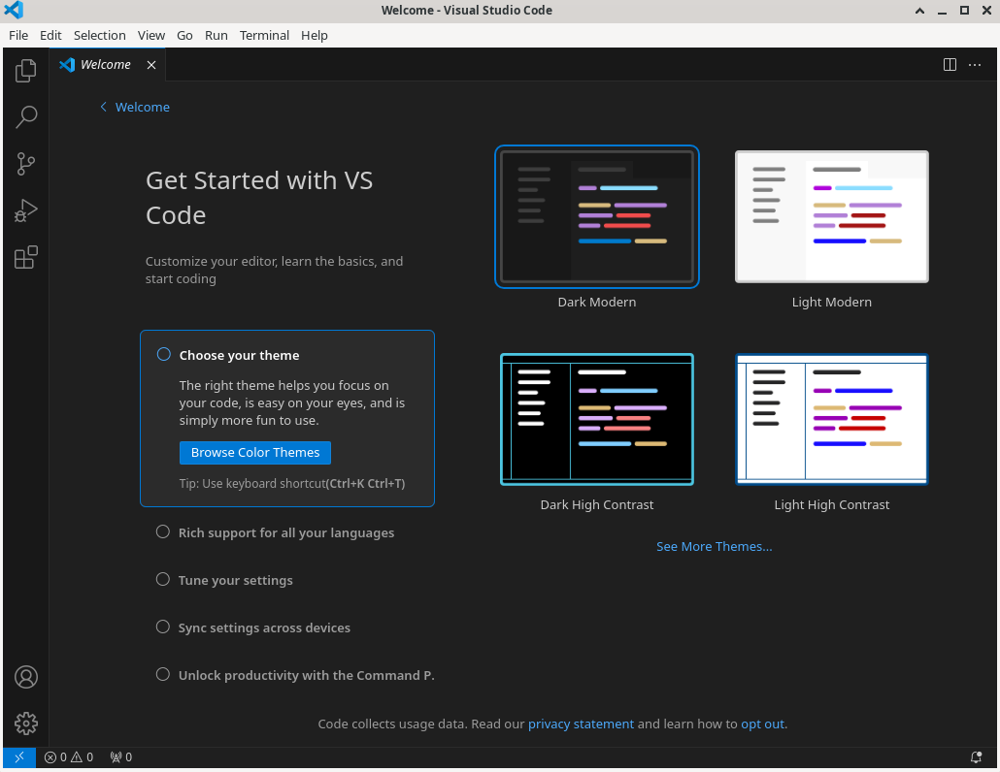

# Como instalar o Visual Studio Code no Debian

O Visual Studio Code é um editor de código-fonte desenvolvido pela Microsoft. Embora seja leve, é extremamente robusto e gratuito, disponível para Linux, macOS e Windows, tanto para uso pessoal quanto comercial. Ele oferece suporte nativo para JavaScript, TypeScript e Node.js, além de um vasto ecossistema de extensões para diversas outras linguagens e ambientes de execução, incluindo C++, C#, Java, Python, PHP, Go e .NET.

Com integração com o controle de versão Git e funcionalidades poderosas com o GitHub, o VS Code inclui um depurador embutido e a conclusão de código inteligente por meio do IntelliSense e do IntelliCode, impulsionado por inteligência artificial. O Visual Studio Code Marketplace conta com mais de 30.000 extensões e temas, permitindo que os usuários personalizem as funcionalidades e a aparência do editor conforme suas necessidades, preferências e estilo.

Para explorar todos os recursos do Visual Studio Code, acesse o [site oficial clicando aqui.](https://code.visualstudio.com/)

## Instalando o Visual Studio Code no Debian Manualmente

Antes de iniciar a instalação do VS Code, verifique se seu computador atende aos requisitos necessários. Recomendo também atualizar o sistema para evitar problemas com dependências de pacotes. Para isso, abra um terminal e execute:

```sh
sudo apt update && sudo apt upgrade
sudo apt install curl
sudo apt install software-properties-common apt-transport-https wget gpg
```

Em seguida, importe a chave de assinatura GPG da Microsoft com o comando abaixo:

```sh
wget -qO- https://packages.microsoft.com/keys/microsoft.asc | gpg --dearmor > packages.microsoft.gpg
sudo install -D -o root -g root -m 644 packages.microsoft.gpg /usr/share/keyrings/packages.microsoft.gpg
```

Depois, adicione o repositório oficial do VS Code ao seu sistema com o seguinte comando:

```sh
sudo sh -c 'echo "deb [arch=amd64,arm64,armhf signed-by=/usr/share/keyrings/packages.microsoft.gpg] https://packages.microsoft.com/repos/code stable main" > /etc/apt/sources.list.d/vscode.list'
```

Atualize o cache dos repositórios com:

```sh
sudo apt update
```

Finalmente, instale a versão mais recente do Visual Studio Code executando um dos comandos abaixo, conforme a versão desejada:

Para instalar o Visual Studio Code, use:

```sh
sudo apt install code
```

Para instalar o Visual Studio Code Insiders, use:

```sh
sudo apt install code-insiders
```

Após a instalação, você pode abrir o Visual Studio Code procurando o atalho no menu de aplicativos do seu ambiente gráfico ou simplesmente digitando `code` no terminal.



## Conclusão

Com a instalação concluída, você está pronto para iniciar sua jornada de codificação com o Visual Studio Code, explorando todo o potencial dos seus projetos e aprimorando seu fluxo de trabalho de desenvolvimento.
