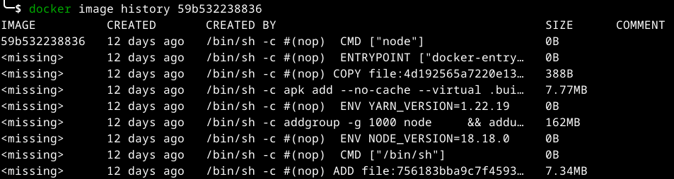
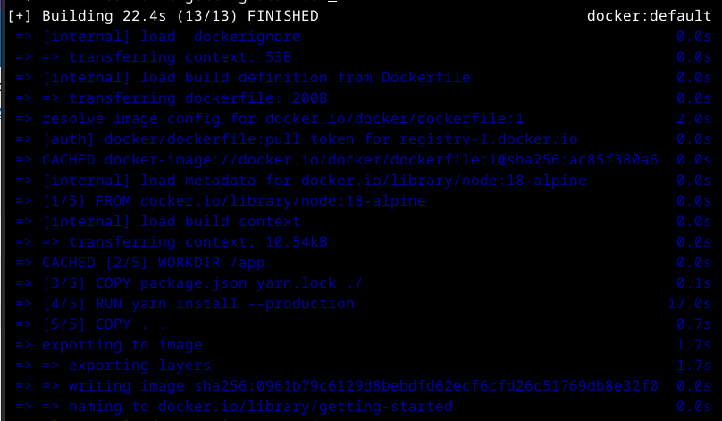
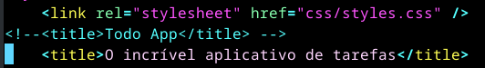
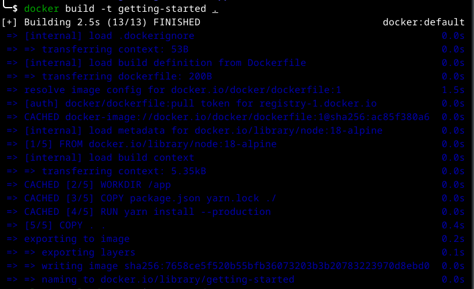

# Melhores práticas de construção de imagem

## Camadas de imagem

Usando o comando docker image history, você pode ver o comando que foi usado para criar cada camada dentro de uma imagem.

1. Use o comando docker image history para ver as camadas na imagem node:18-alpine que você criou. Observe ela através do comando docker ps -a. Pode-se também utilizar o ID existente que é obtido no comando docker images.

    ```console
    docker image history node:18-alpine
    ```

    Você deve obter uma saída semelhante à seguinte.

    

    Cada uma das linhas representa uma camada da imagem. A exibição aqui mostra a base na parte inferior com a camada mais recente na parte superior. Usando isso, você também pode ver rapidamente o tamanho de cada camada, ajudando a diagnosticar imagens grandes.

2. Você notará que várias linhas estão truncadas. Se você adicionar a opção --no-trunc, obterá a saída completa.

    ```console
    docker image history --no-trunc node:18-alpine
    ```

## Cache de camada

Agora que você viu as camadas em ação, há uma lição importante a aprender para ajudar a diminuir o tempo de construção das imagens de contêiner. Depois que uma camada é alterada, todas as camadas posteriores também devem ser recriadas.

Observe o Dockerfile a seguir que você criou para o aplicativo de introdução.

```console
# syntax=docker/dockerfile:1
FROM node:18-alpine
WORKDIR /app
COPY . .
RUN yarn install --production
CMD ["node", "src/index.js"]
```

Voltando à saída do histórico de imagens, você verá que cada comando no Dockerfile se torna uma nova camada na imagem. Você deve se lembrar que quando fez uma alteração na imagem, as dependências do Yarn tiveram que ser reinstaladas. Não faz muito sentido enviar as mesmas dependências toda vez que você cria.

Para consertar isso, você precisa reestruturar seu Dockerfile para ajudar a suportar o cache das dependências. Para aplicativos baseados em Node, essas dependências são definidas no arquivo package.json. Você pode copiar apenas esse arquivo primeiro, instalar as dependências e depois copiar todo o resto. Então, você só recria as dependências do Yarn se houver uma alteração no arquivo package.json.

1. Atualize o Dockerfile para copiar primeiro package.json, instale as dependências e depois copie todo o resto.

    ```console
    # syntax=docker/dockerfile:1
    FROM node:18-alpine
    WORKDIR /app
    COPY package.json yarn.lock ./
    RUN yarn install --production
    COPY . .
    CMD ["node", "src/index.js"]
    ```

2. Crie um arquivo nomeado .dockerignore na mesma pasta do Dockerfile com o seguinte conteúdo.

    ```console
    cd ~/getting-started-app
    vi .dockerignore
    ```
    
    Inclua no arquivo a palavra node_modules, salve e saia do arquivo.

    ```console
    node_modules
    ```

    Este arquivo .dockerignore é uma maneira fácil de copiar seletivamente apenas arquivos relevantes de imagem. Você pode ler mais sobre isso [aqui](https://docs.docker.com/engine/reference/builder/#dockerignore-file). Neste caso, a pasta node_modules deve ser omitida na segunda etapa do COPY, caso contrário poderá sobrescrever os arquivos que foram criados pelo comando na etapa RUN. Para obter mais detalhes sobre por que isso é recomendado para aplicativos Node.js e outras práticas recomendadas, dê uma olhada no guia sobre [Dockerização de um aplicativo da web Node.js](https://nodejs.org/en/docs/guides/nodejs-docker-webapp/).

3. Construa uma nova imagem usando docker build.

    ```console
    docker build -t getting-started .
    ```
    Você deverá ver uma saída como a seguinte.

    

4. Agora, faça uma alteração no arquivo src/static/index.html. Por exemplo, altere ```<title>``` para "O incrível aplicativo de tarefas".

    ```console
    cd ~/getting-started-app
    vi src/static/index.html
    ```

    

5. Construa a imagem do Docker agora usando docker build -t getting-started . novamente. Desta vez, sua saída deverá ser um pouco diferente.

    ```console
    docker build -t getting-started .
    ```

    

    Primeiramente, você deve notar que a construção foi muito mais rápida. E você verá que várias etapas estão usando camadas armazenadas em cache anteriormente. Enviar e extrair esta imagem e atualizá-la também será muito mais rápido.

## Construções em vários estágios

As compilações de vários estágios são uma ferramenta incrivelmente poderosa para ajudar a usar vários estágios para criar uma imagem. Existem várias vantagens para eles:

* Separe as dependências de tempo de construção das dependências de tempo de execução
* Reduza o tamanho geral da imagem enviando apenas o que seu aplicativo precisa para ser executado

### Exemplo Maven/Tomcat

Ao construir aplicativos baseados em Java, você precisa de um JDK para compilar o código-fonte no bytecode Java. No entanto, esse JDK não é necessário na produção. Além disso, você pode usar ferramentas como Maven ou Gradle para ajudar a construir o aplicativo. Eles também não são necessários na sua imagem final. Ajuda com construções em vários estágios.

```console
# syntax=docker/dockerfile:1
FROM maven AS build
WORKDIR /app
COPY . .
RUN mvn package

FROM tomcat
COPY --from=build /app/target/file.war /usr/local/tomcat/webapps 
```

### Exemplo de reação

Ao construir aplicativos React, você precisa de um ambiente Node para compilar o código JS (normalmente JSX), folhas de estilo SASS e muito mais em HTML estático, JS e CSS. Se você não estiver fazendo renderização no lado do servidor, nem mesmo precisará de um ambiente Node para sua construção de produção. Você pode enviar os recursos estáticos em um contêiner nginx estático.

```console
# syntax=docker/dockerfile:1
FROM node:18 AS build
WORKDIR /app
COPY package* yarn.lock ./
RUN yarn install
COPY public ./public
COPY src ./src
RUN yarn run build

FROM nginx:alpine
COPY --from=build /app/build /usr/share/nginx/html
```

No exemplo anterior do Dockerfile, ele usa a imagem node:18 para executar a construção (maximizando o cache da camada) e, em seguida, copia a saída em um contêiner nginx.
