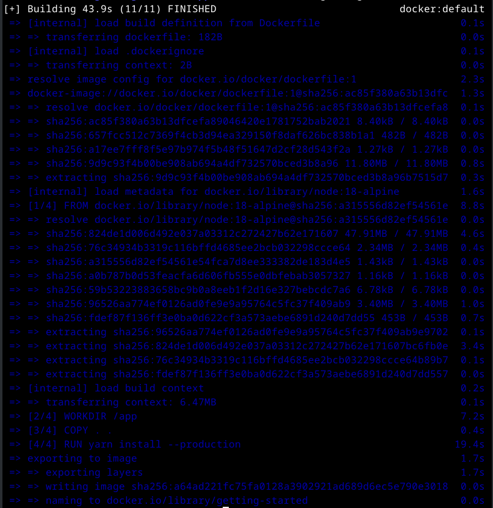
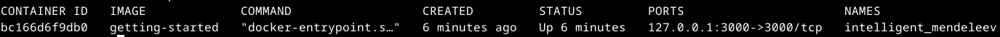
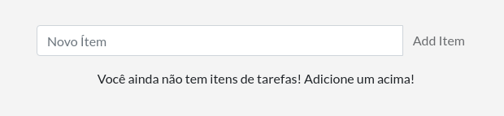
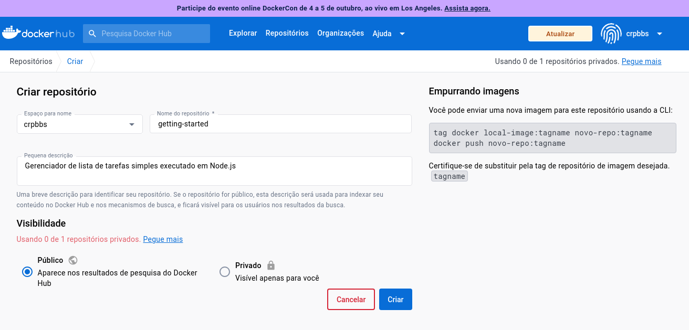
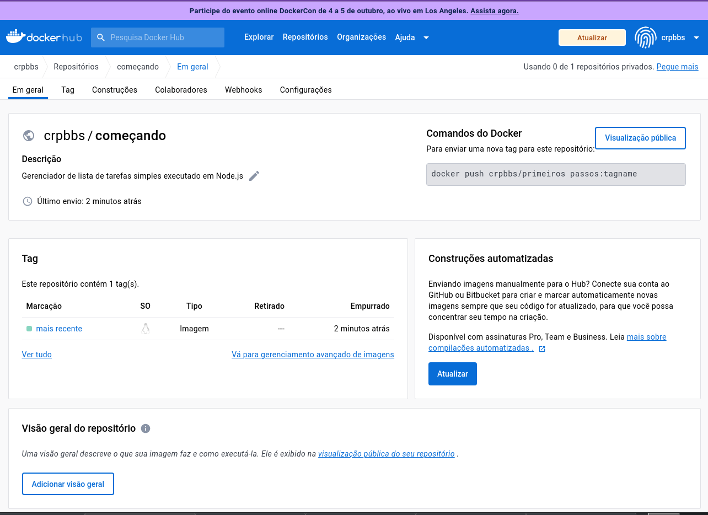
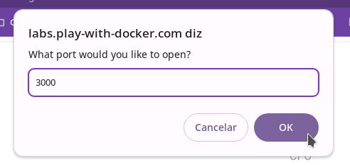
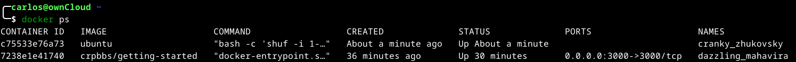
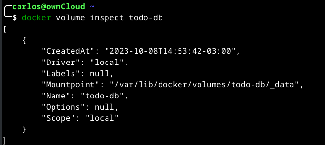

# Melhores práticas de construção de imagem

No restante deste guia, você trabalhará com um gerenciador de lista de tarefas simples executado em Node.js. Se você não está familiarizado com o Node.js, não se preocupe. Este guia não requer nenhuma experiência anterior com JavaScript.

## Baixe o aplicativo

Antes de poder executar o aplicativo, você precisa colocar o código-fonte do aplicativo em sua máquina.

* Clone o repositório do aplicativo de primeiros passos usando o seguinte comando:

```console
git clone https://github.com/docker/getting-started-app.git
```


* Visualize o conteúdo do repositório clonado.

```console
sudo apt install tree
tree getting-started-app
```

* Você deverá ver os seguintes arquivos e subdiretórios.

```console
<...>
└── getting-started-app
    ├── package.json
    ├── README.md
    ├── spec
    │   ├── persistence
    │   │   └── sqlite.spec.js
    │   └── routes
    │       ├── addItem.spec.js
<...>
```

## Construa a imagem do aplicativo

Para construir a imagem, você precisará usar um Dockerfile. Um Dockerfile é simplesmente um arquivo baseado em texto sem extensão de arquivo que contém um script de instruções. Docker usa esse script para construir uma imagem de contêiner.

No diretório getting-started-app, no mesmo local do arquivo package.json, crie um arquivo chamado Dockerfile. Você pode usar os comandos a seguir para criar um Dockerfile baseado em seu sistema operacional.

No terminal, execute os seguintes comandos.

Certifique-se de estar no diretório getting-started-app.

```console
cd ~/getting-started-app
```

Crie um arquivo vazio chamado Dockerfile.

```console
touch Dockerfile
```

Usando um editor de texto ou editor de código, adicione o seguinte conteúdo ao Dockerfile:

```console
vi Dockerfile
```
Copie o texto abaixo e coloque no Dockerfile.

```console
# syntax=docker/dockerfile:1

FROM node:18-alpine
WORKDIR /app
COPY . .
RUN yarn install --production
CMD ["node", "src/index.js"]
EXPOSE 3000
```

Construa a imagem usando os seguintes comandos:

No terminal, certifique-se de estar no diretório getting-started-app.

```console
cd ~/getting-started-app
```

Construa a imagem.

```console
docker build -t getting-started .
```

Deverá aparecer uma tela como esta:




O comando docker build usa o Dockerfile para construir uma nova imagem. Você deve ter notado que o Docker baixou muitas “camadas”. Isso ocorre porque você instruiu o construtor que deseja iniciar a partir da imagem node:18-alpine. Mas, como você não tinha isso na sua máquina, o Docker precisou baixar a imagem.

Depois que o Docker baixou a imagem, as instruções do Dockerfile foram copiadas em seu aplicativo e usadas (yarn) para instalar as dependências do seu aplicativo. A diretiva CMD especifica o comando padrão a ser executado ao iniciar um contêiner a partir desta imagem.

Finalmente, a opão -t marca sua imagem. Pense nisso como um nome legível para a imagem final. Como você nomeou a imagem getting-started, você pode consultá-la ao executar um contêiner.

O ponto final no comando docker build informa ao Docker que ele deve procurar Dockerfile no diretório atual.

## Iniciar um contêiner do aplicativo que você criou.

Agora que você tem uma imagem, pode executar o aplicativo em um contêiner usando o comando docker run.

* Execute seu contêiner usando o comando docker run e especifique o nome da imagem que você acabou de criar:

```console
docker run -dp 127.0.0.1:3000:3000 getting-started
```

A opção -d (abreviação de --detach) executa o contêiner em segundo plano. A opção -p (abreviação de --publish) cria um mapeamento de porta entre o host e o contêiner. A opção -p assume um valor de string no formato HOST:CONTAINER, onde HOST é o endereço no host e CONTAINER é a porta no contêiner. O comando publica a porta 3000 do contêiner em 127.0.0.1:3000 (localhost:3000) no host. Sem o mapeamento de portas, você não conseguiria acessar o aplicativo do host.

Após alguns segundos, abra seu navegador em http://localhost:3000. Você deverá ver seu aplicativo.

Adicione um ou dois itens e veja se funciona conforme o esperado. Você pode marcar itens como concluídos e removê-los. Seu frontend está armazenando itens no backend com sucesso.

Neste ponto, você tem um gerenciador de lista de tarefas em execução com alguns itens.

Se você der uma olhada rápida em seus contêineres, verá pelo menos um contêiner em execução que usa a imagem getting-started e a porta 3000. Para ver seus contêineres, você pode usar a CLI ou a interface gráfica do Docker Desktop.

Execute o comando docker ps em um terminal para listar seus contêineres.

```console
docker ps -a
```

Você verá uma saída como esta:



## Atualizar o aplicativo

Anteriormente você colocou em contêiner um aplicativo de tarefas pendentes. Nesta parte, você atualizará o aplicativo e a imagem. Você também aprenderá como parar e remover um contêiner.

### Atualizar o código-fonte

Nas etapas a seguir, você alterará o "texto vazio" quando não tiver nenhum item da lista de tarefas para "Você ainda não tem itens de tarefas! Adicione um acima!"

* No arquivo src/static/js/app.js, atualize a linha 56 para usar o novo texto vazio. Abra o arquivo com vi, como abaixo:

```console
vi ~/getting-started-app/src/static/js/app.js
```

* Troque a linha conforme abaixo:

```console
- <p className="text-center">No items yet! Add one above!</p>
+ <p className="text-center">Você ainda não tem itens de tarefas! Adicione um acima!</p>
```


>[!INFO]
>
>Caso queira é possível alterar no arquivo app.js, para colocar alguns dados traduzidos para o português.

* Construa sua versão atualizada da imagem, usando o comando docker build.

```console
cd ~/getting-started-app
docker build -t getting-started .
```

* Inicie um novo contêiner usando o código atualizado.

```console
docker run -dp 127.0.0.1:3000:3000 getting-started
```

Você provavelmente viu um erro como este:


O erro ocorreu porque você não consegue iniciar o novo contêiner enquanto o contêiner antigo ainda está em execução. A razão é que o contêiner antigo já está usando a porta 3000 do host e apenas um processo na máquina (contêineres incluídos) pode escutar uma porta específica. Para corrigir isso, você precisa remover o contêiner antigo.

### Remova o contêiner antigo

Para remover um contêiner, primeiro você precisa pará-lo. Depois de parar, você pode removê-lo. Você pode remover o contêiner antigo usando a CLI ou a interface gráfica do Docker Desktop. Escolha a opção com a qual você se sente mais confortável.

#### Remova um contêiner usando a CLI

* Obtenha o ID do contêiner usando o comando docker ps.

```console
docker ps
```

O meu apresentou a seguinte tela:


* Use o comando docker stop para parar o contêiner. Substitua <the-container-id> pelo ID de docker ps.
* Terei que aplicar o comando docker stop utilizando a variável CONTAINER ID ou a variável NAMES. Qualquer dos 2 comandos funciona bem.

```console
docker stop <the-container-id>
```

Exemplo:

```console
docker stop fcfb86021c59
```
ou
```console
docker stop gracious_torvalds
```

* Depois que o contêiner for interrompido, você poderá removê-lo usando o comando docker rm. Pode-se usar o ID ou o NAME

```python
docker rm <the-container-id>
```

No meu caso:

```console
docker rm fcfb86021c59
```

>[!NOTE]
>
>Você pode parar e remover um contêiner em um único comando adicionando a opção force ao comando docker rm. Por exemplo:

```console
docker rm -f <the-container-id>
```

Aproveite para ver se por acaso não tem outras instâncias do mesmo aplicativo já criado, com o comando, e caso tenha elimine todas:

```console
docker ps -a
```

### Inicie o contêiner com base no aplicativo atualizado

Agora, inicie seu aplicativo atualizado usando o comando docker run.

```console
docker run -dp 127.0.0.1:3000:3000 getting-started
```

* Atualize seu navegador em http://localhost:3000 e você deverá ver seu texto de ajuda atualizado.

Caso tenha uma rede interna, obtenha seu IP e ao invês de utilizar 127.0.0.1, utilize o IP da sua máquina:

Exemplo:

Para saber digite:

```python
ip a | grep inet
```


No meu caso o IP da máquina que está rodando esse contêiner é o 192.168.122.137.

```console
docker run -dp COLOQUE-SEU-IP-AQUI:3000:3000 getting-started
```

Então no meu caso fica assim:

```console
docker run -dp 192.168.122.137:3000:3000 getting-started
```

Ao acessar nosso contêiner pelo navegador: http://192.168.122.137:3000, vaos obter a seguinte tela:



Caso pare o contêiner com o comando stop, ou reinicie sua máquina o mesmo ficará desligado, então para iniciá-lo novamente utilize o comando start.

```console
docker ps -a
```

Para obter o CONTAINER ID

```console
docker start <CONTAINER ID>
```

## Compartilhe o aplicativo com outras pessoas

Agora que você construiu uma imagem, você pode compartilhá-la. Para compartilhar imagens Docker, você deve usar um registro Docker. O registro padrão é Docker Hub e é de onde vieram todas as imagens que você usou.

>[!NOTE] ID do Docker
>
>Um Docker ID permite acessar o Docker Hub, que é a maior biblioteca e comunidade do mundo para imagens de contêiner. Crie um ID Docker de graça se você não tiver um.

### Crie um repositório

Para enviar uma imagem, primeiro você precisa criar um repositório no Docker Hub.

* [Inscrever-se](https://www.docker.com/pricing/?utm_source=docker&utm_medium=webreferral&utm_campaign=docs_driven_upgrade&_gl=1*1yt731y*_ga*MTg3NDE2MDQ0Ni4xNjkyNTY5OTM5*_ga_XJWPQMJYHQ*MTY5Njc3OTE4NS4yMi4xLjE2OTY3Nzk1MDcuNjAuMC4w) ou faça [login no Docker Hub](https://login.docker.com/u/login/identifier?state=hKFo2SAtcWFqMnNncll6RENqRU5xRHhYU1J2ZTV2VkZXVEROcaFur3VuaXZlcnNhbC1sb2dpbqN0aWTZIEhnUDZLU2lvMEFwN2dpVGtXekxMZXEzbjhJeExabmhjo2NpZNkgbHZlOUdHbDhKdFNVcm5lUTFFVnVDMGxiakhkaTluYjk).

* Selecione o botão Criar Repositório .
* Para o nome do repositório, use getting-started. Certifique-se de que a Visibilidade seja Public.
* Coloque alguma descrição para saber do que se trata esta imagem.
* Selecione Criar .

Na imagem a seguir, você pode ver um exemplo de comando do Docker do Docker Hub. Este comando será enviado para este repositório.



### Envie a imagem

* Na linha de comando, execute o comando docker push que você vê no Docker Hub. Observe que seu comando terá seu ID Docker, não "docker".

```console
docker push docker/getting-started
```

* Você obterá uma mensagem de erro como esta:

```console
Using default tag: latest
The push refers to repository [docker.io/docker/getting-started]
An image does not exist locally with the tag: docker/getting-started
```

    Por que falhou? O comando push estava procurando uma imagem chamada docker/getting-started, mas não encontrou nenhuma. Se você executar o comando docker image ls, também não verá nenhum.

    Para corrigir isso, você precisa marcar a imagem existente que você construiu para dar outro nome.

* Faça login no Docker Hub usando o comando docker login -u YOUR-USER-NAME. Troque o YOUR-USER-NAME pelo seu username.

```console
docker login -u YOUR-USER-NAME
```

* Use o comando docker tag para dar um novo nome para a imagem getting-started. Substitua YOUR-USER-NAME pelo seu ID do Docker.

```console
docker tag getting-started YOUR-USER-NAME/getting-started
```

* Agora execute o docker pushcomando novamente. Se estiver copiando o valor do Docker Hub, você pode descartar a tagnameparte, pois não adicionou uma tag ao nome da imagem. Se você não especificar uma tag, o Docker usará uma tag chamada latest.

* Agora execute o comando docker push novamente. Se estiver copiando o valor do Docker Hub, você pode descartar a parte do tagname, pois não adicionou uma tag ao nome da imagem. Se você não especificar uma tag, o Docker usará uma tag chamada latest.

```console
docker push YOUR-USER-NAME/getting-started
```

No meu caso obtive o seguinte resultado:




### Execute a imagem em uma nova instância

Agora que sua imagem foi criada e inserida em um registro, tente executar seu aplicativo em uma instância totalmente nova que nunca viu essa imagem de contêiner. Para fazer isso, você usará o Play with Docker.

>[!NOTE]
>
>Play with Docker usa a plataforma amd64. Se estiver usando um Mac baseado em ARM com Apple Silicon, você precisará reconstruir a imagem para ser compatível com o Play with Docker e enviar a nova imagem para o seu repositório.
>
>Para construir uma imagem para a plataforma AMD64, use a opção --platform.
>
>```console
>docker build --platform linux/amd64 -t YOUR-USER-NAME/getting-started .
>```
>
>Docker buildx também oferece suporte à construção de imagens multiplataforma. Para saber mais, consulte [Imagens multiplataforma](https://docs.docker.com/build/building/multi-platform/).

* Abra seu navegador e clique no seguinte link: [brincar com Docker](https://labs.play-with-docker.com/?_gl=1*1vkjrk*_ga*MTg3NDE2MDQ0Ni4xNjkyNTY5OTM5*_ga_XJWPQMJYHQ*MTY5Njc3OTE4NS4yMi4xLjE2OTY3ODE5NjEuNjAuMC4w).

* Selecione Login e selecione docker na lista suspensa.

* Faça login com sua conta Docker Hub e selecione Iniciar .

* Selecione a opção ADICIONAR NOVA INSTÂNCIA na barra lateral esquerda. Após alguns segundos, uma janela de terminal é aberta no seu navegador.


* No terminal, inicie seu aplicativo recém-enviado.

```console
docker run -dp 0.0.0.0:3000:3000 YOUR-USER-NAME/getting-started
```


>[!TIP]
>
>Você deve ter notado que este comando vincula o mapeamento da porta a um endereço IP diferente. Os comandos anteriores do docker run publicaram portas 127.0.0.1:3000 no host. Desta vez, você está usando 0.0.0.0.
>
>A vinculação 127.0.0.1 expõe apenas as portas de um contêiner à interface de loopback. A ligação a 0.0.0.0, entretanto, expõe a porta do contêiner em todas as interfaces do host, tornando-a disponível para o mundo externo.
>
>Para obter mais informações sobre como funciona o mapeamento de portas, [consulte Rede](https://docs.docker.com/network/#published-ports).

* Selecione OPEN PORT e quanto abrir a janela coloque 3000 e clique em OK.




>[!INFO]
>
>Caso tenha baixado a imagem em outro computador que tenha o docker instalado e que esteja na mesma rede, poderá testar com o IP da máquina local no navegador de outra máquina.

## Persistir o banco de dados

Caso você não tenha percebido, sua lista de tarefas fica vazia toda vez que você inicia o contêiner. Por que é isso? Nesta parte, você verá como o contêiner está funcionando.

### O sistema de arquivos do contêiner

Quando um contêiner é executado, ele usa as diversas camadas de uma imagem para seu sistema de arquivos. Cada contêiner também recebe seu próprio "espaço temporário" para criar/atualizar/remover arquivos. Quaisquer alterações não serão vistas em outro contêiner, mesmo que estejam usando a mesma imagem.

### Veja isso na prática

Para ver isso em ação, você iniciará dois contêineres e criará um arquivo em cada um. O que você verá é que os arquivos criados em um contêiner não estão disponíveis em outro.

* Inicie um contêiner ubuntu que criará um arquivo nomeado /data.txt com um número aleatório entre 1 e 10.000.

```console
docker run -d ubuntu bash -c "shuf -i 1-10000 -n 1 -o /data.txt && tail -f /dev/null"
```

    Caso você esteja curioso sobre o comando, você está iniciando um shell bash e invocando dois comandos (por que você tem o &&). A primeira parte escolhe um único número aleatório e o grava /data.txt. O segundo comando é simplesmente observar um arquivo para manter o contêiner funcionando.

* Valide se você pode ver a saída acessando o terminal no contêiner. Para fazer isso, você pode usar a CLI ou a interface gráfica do Docker Desktop.

    Na linha de comando, use o comando docker exec para acessar o contêiner. Você precisa obter o ID do contêiner (use o comando docker ps para obtê-lo). No seu terminal Mac ou Linux, ou no prompt de comando do Windows ou PowerShell, obtenha o conteúdo com o seguinte comando.

```console
docker ps
docker exec <container-id> cat /data.txt
```



    Você deverá ver um número aleatório.


* Agora, inicie outro contêiner ubuntu (a mesma imagem) e você verá que não tem o mesmo arquivo. No seu terminal Mac ou Linux, ou no prompt de comando do Windows ou PowerShell, obtenha o conteúdo com o seguinte comando.

```console
docker run -it ubuntu ls /
```

    Neste caso, o comando lista os arquivos no diretório raiz do contêiner. Olha, não há nenhum arquivo data.txt aí! Isso ocorre porque ele foi gravado no espaço de trabalho apenas para o primeiro contêiner.

* Vá em frente e remova o primeiro contêiner usando o comando docker rm -f <container-id>.

### Volumes de contêineres

No experimento anterior, você viu que cada contêiner inicia a partir da definição da imagem sempre que é iniciado. Embora os contêineres possam criar, atualizar e excluir arquivos, essas alterações são perdidas quando você remove o contêiner e o Docker isola todas as alterações nesse contêiner. Com volumes, você pode mudar tudo isso.

Os volumes fornecem a capacidade de conectar caminhos de sistema de arquivos específicos do contêiner de volta à máquina host. Se você montar um diretório no contêiner, as alterações nesse diretório também serão vistas na máquina host. Se você montar o mesmo diretório nas reinicializações do contêiner, verá os mesmos arquivos.

Existem dois tipos principais de volumes. Eventualmente, você usará ambos, mas começará com montagens de volume.

### Persistir os dados de tarefas

Por padrão, o aplicativo de tarefas armazena seus dados em um banco de dados SQLite /etc/todos/todo.db no sistema de arquivos do contêiner. Se você não está familiarizado com SQLite, não se preocupe! É simplesmente um banco de dados relacional que armazena todos os dados em um único arquivo. Embora não seja o melhor para aplicativos de grande escala, funciona para pequenas demonstrações. Você aprenderá como mudar isso para um mecanismo de banco de dados diferente posteriormente.

Como o banco de dados é um arquivo único, se você puder persistir esse arquivo no host e disponibilizá-lo para o próximo contêiner, ele poderá continuar de onde o último parou. Ao criar um volume e anexá-lo (geralmente chamado de "montagem") ao diretório onde você armazenou os dados, você pode persistir os dados. À medida que seu contêiner grava no arquivo todo.db, ele persistirá os dados no host no volume.

Conforme mencionado, você usará uma montagem de volume. Pense em uma montagem de volume como um balde opaco de dados. Docker gerencia totalmente o volume, incluindo o local de armazenamento em disco. Você só precisa lembrar o nome do volume.

#### Crie um volume e inicie o contêiner

Você pode criar o volume e iniciar o contêiner usando a CLI ou a interface gráfica do Docker Desktop.

* Crie um volume usando o comando docker volume create.

    ```console
    docker volume create todo-db
    ```

* Pare e remova o contêiner do aplicativo de tarefas novamente com docker rm -f <id>, pois ele ainda está em execução sem usar o volume persistente.

* Inicie o contêiner do aplicativo de tarefas, mas adicione a opção --mount para especificar uma montagem de volume. Dê um nome ao volume e monte-o /etc/todos no contêiner, que captura todos os arquivos criados no caminho. No seu terminal Mac ou Linux, ou no prompt de comando do Windows ou PowerShell, execute o seguinte comando:

```console
docker run -dp 0.0.0.0:3000:3000 --mount type=volume,src=todo-db,target=/etc/todos crpbbs/getting-started
```

#### Verifique se os dados persistem

* Assim que o contêiner for iniciado, abra o aplicativo e adicione alguns itens à sua lista de tarefas.


* Pare e remova o contêiner do aplicativo de tarefas pendentes. Use Docker Desktop ou docker ps para obter o ID e depois docker rm -f <id> para removê-lo. Substitua abaixo o <CONTAINER ID> pelo seu ID.

    ```console
    docker ps
    docker stop <CONTAINER ID>
    docker rm -f <CONTAINER ID>
    ```

* Inicie um novo contêiner usando as etapas anteriores.

    ```console
    docker run -dp 0.0.0.0:3000:3000 --mount type=volume,src=todo-db,target=/etc/todos crpbbs/getting-started
    ```

* Abra seu navegador. Você deverá ver seus itens ainda em sua lista.

* Vá em frente e remova o contêiner quando terminar de verificar sua lista.

    ```console
    docker ps
    docker stop <CONTAINER ID>
    docker rm -f <CONTAINER ID>
    docker images
    docker rmi <IMAGE ID>
    ```

Agora você aprendeu como persistir dados.

#### Mergulhe no volume

Muitas pessoas perguntam frequentemente “Onde o Docker está armazenando meus dados quando uso um volume?” Se você quiser saber, pode usar o comando docker volume inspect.

```console
docker volume inspect todo-db
```



A localização do Mountpoint é a localização real dos dados no disco. Observe que na maioria das máquinas, você precisará ter acesso root para acessar este diretório a partir do host. Então para ver o arquivo digite:

```console
sudo ls /var/lib/docker/volumes/todo-db/_data
```