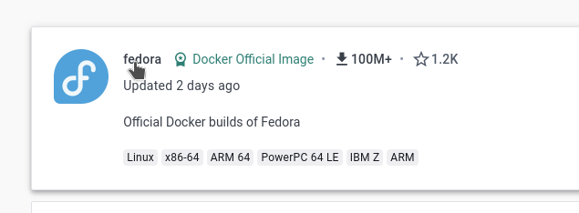
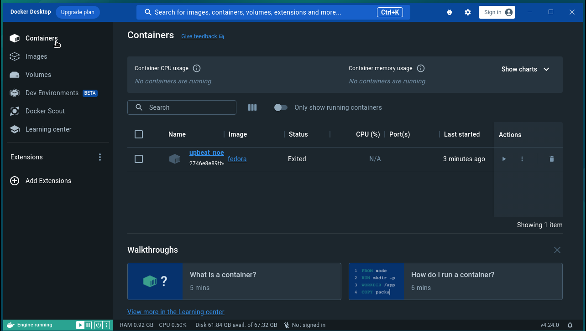
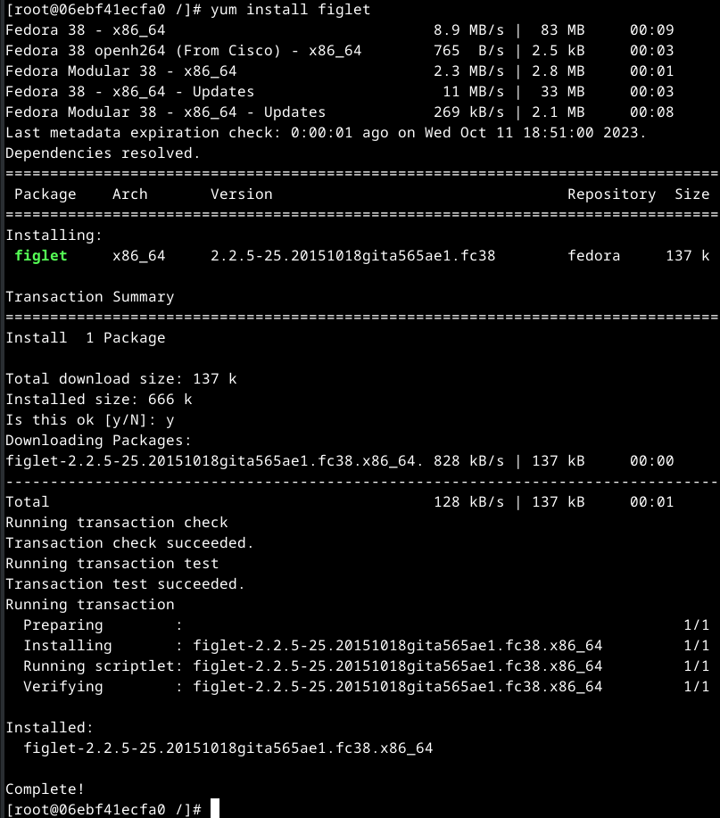
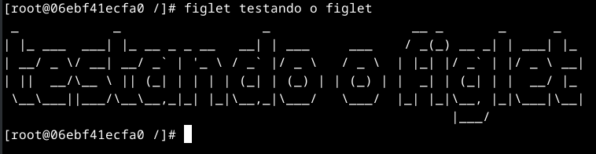
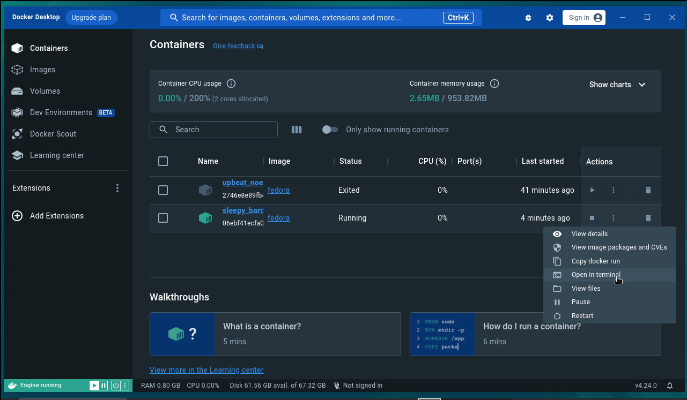
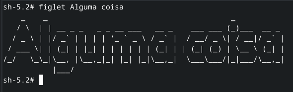
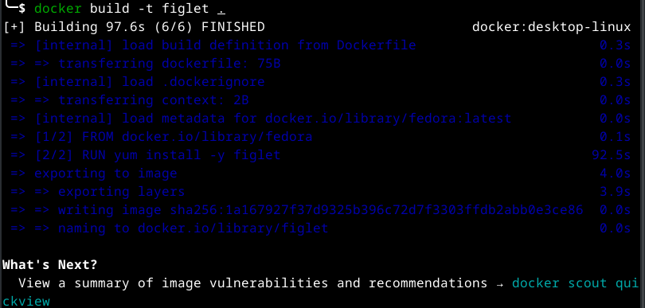

# Mais sobre docker

1. Entre no site do [docker](https://www.docker.com/).

2. Clique em [Sign In](https://login.docker.com/u/login/identifier?state=hKFo2SBvZVVGOXBvS19GWG1NOHQ2SjJ3OThUTGE1SFdncXk5UaFur3VuaXZlcnNhbC1sb2dpbqN0aWTZIGxZS2FXNkRJNGpGSndQQk1SOXcxXzlCbzhyX2dzbGx6o2NpZNkgbHZlOUdHbDhKdFNVcm5lUTFFVnVDMGxiakhkaTluYjk).

3. Digite seu login e senha e entre no [docker hub](https://hub.docker.com/).

4. Clique em Search Docker Hub e escreva Fedora e dê enter.

5. Escolha a opção abaixo:



6. Copie o comando e cole no seu terminal, para baixar a imagem para seu computador.


```console
docker pull fedora
```

7. Caso não tenha instalado ainda, vamos instalar o docker desktop, conforme [Aula5-2-Instalação-e-Configuração-Docker-Desktop](Aula5-2-Instalação-e-Configuração-Docker-Desktop.md), depois retornaremos a partir daqui.

8. Entre no docker desktop.

9. Digite no terminal o seguinte comando:

    ```console
    docker run fedora echo Olá Mundo
    ```

    Vai aparecer Olá Mundo no terminal.

    Agora volte para o docker desktop e clique no menu lateral na opção Containers. Você verá algo parecido com isso:

    

    Se clicarmos no nome do contêiner, neste caso upbeat_noe, veremos o log onde aparece o último comando que inserimos via terminal.

10. Voltamos ao terminal e vamos digitar outro comando:

    ```console
    docker run -i -t fedora
    ```

    Observe que nosso prompt mudou. Estamos dentro do dash do fedora. Agora vamos no docker desktop para ver denovo a opção Containers. Vamos ver agora que existem 2 container instânciados com base na imagem fedora. Um parado e outro em execução no dash. Volte ao terminal de digite echo Olá Mundo e depois volte no LOG do docker desktop e verá os resultados.

11. Agora de volta ao terminal vamos instalar um aplicativo no fedora. Fedora é um sistema operacional Linux baseado na distribuição Red Hat, então o comando para instalar aplicativos no fedora é o yum e não mais o apt.

    ```console
    yum install figlet
    ```

    Ele instala o pacote e demais dependências. Agora parecido com:

    

    Você também pode observar o LOG que trará as mesmas informações.

    Vamos testar o pacote que acabamos de instalar.

    ```console
    figlet testando o figlet
    ```

    Oberve o resultado:

    

    Como se pode ver funcionando perfeitamente. Agora possa sair deste terminal com o comando exit.

    Para voltar ao mesmo ponto posso simplesmente clicar na sub-opção Open in terminal, como na imagem abaixo:

    

    Teste novamente o comando figlet alguma coisa.

    

12. Crie o diretório ~/Documentos/Docker/figlet e entre nele e inclua uma arquivo chamado Dockerfile com o seguinte conteúdo:

    ```console
    mkdir ~/Documentos/Docker/figlet
    cd ~/Documentos/Docker/figlet
    vi Dockerfile
    ```

    ```docker
    FROM fedora
    RUN yum install -y figlet
    ```

    Vamos iniciar uma compilação de nosso novo código:

    ```console
    docker build -t figlet .
    ```

    

    Agora vamos rodar nossa aplicação.

    ```console
    docker run -it figlet
    figlet teste
    ```
