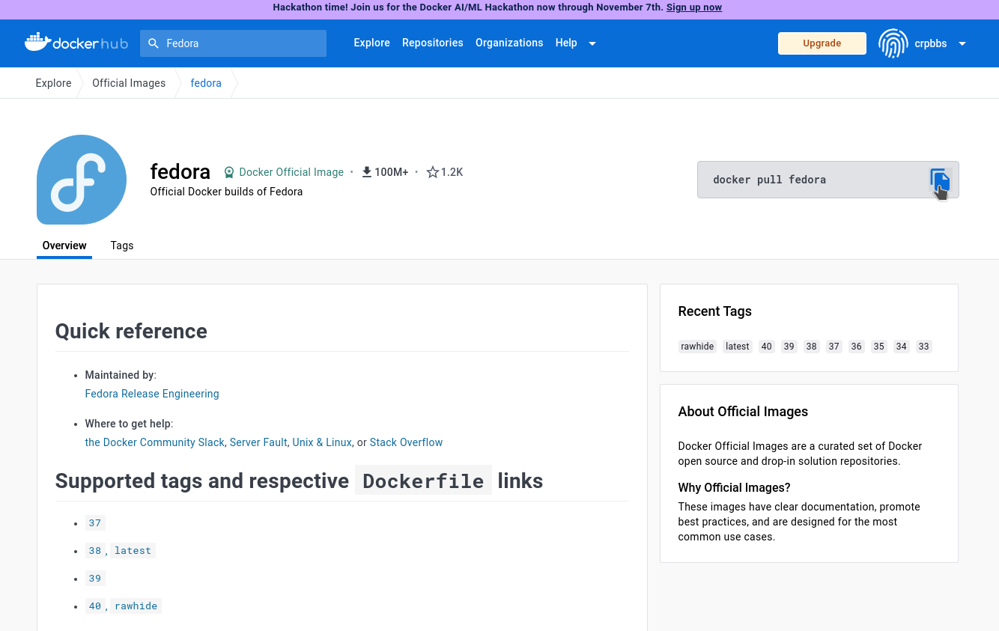

# Mais sobre docker

1. Entre no site do [docker](https://www.docker.com/).

2. Clique em [Sign In](https://login.docker.com/u/login/identifier?state=hKFo2SBvZVVGOXBvS19GWG1NOHQ2SjJ3OThUTGE1SFdncXk5UaFur3VuaXZlcnNhbC1sb2dpbqN0aWTZIGxZS2FXNkRJNGpGSndQQk1SOXcxXzlCbzhyX2dzbGx6o2NpZNkgbHZlOUdHbDhKdFNVcm5lUTFFVnVDMGxiakhkaTluYjk).

3. Digite seu login e senha e entre no [docker hub](https://hub.docker.com/).

4. Clique em Search Docker Hub e escreva Fedora e dê enter.

5. Escolha a opção abaixo:


6. Copie o comando e cole no seu terminal, para baixar a imagem para seu computador.



```console
docker pull fedora
```
