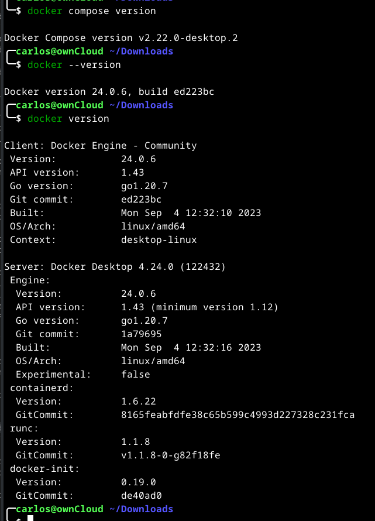

# Instalação e Configuração do Docker Desktop no Debian

>[!IMPORTANT]
>
>O Docker Desktop no Linux executa uma máquina virtual (VM) que cria e usa um contexto docker personalizado, desktop-linux na inicialização.
>
>Isso significa que imagens e contêineres implantados no Linux Docker Engine (antes da instalação) não estão disponíveis no Docker Desktop para Linux.
>
>Para obter mais informações, consulte [Qual é a diferença entre o Docker Desktop para Linux e o Docker Engine](https://docs.docker.com/desktop/faqs/linuxfaqs/#what-is-the-difference-between-docker-desktop-for-linux-and-docker-engine).

## Plataformas suportadas

O Docker fornece pacotes .deb e.rpm das seguintes distribuições e arquiteturas Linux:

* Plataforma	x86_64/amd64
* Ubuntu	✅
* Debian	✅
* Fedora	✅
* Arch - Um pacote experimental está disponível para distribuições baseadas em Arch . Docker não testou ou verificou a instalação.

Docker suporta Docker Desktop na versão LTS atual das distribuições mencionadas acima e na versão mais recente. À medida que novas versões são disponibilizadas, o Docker deixa de oferecer suporte à versão mais antiga e passa a oferecer suporte à versão mais recente.

## Requisitos de sistema

Para instalar o Docker Desktop com êxito, seu host Linux deve atender aos seguintes requisitos gerais:

* Kernel de 64 bits e suporte de CPU para virtualização.
* Suporte para virtualização KVM. Siga as instruções de suporte à virtualização KVM para verificar se os módulos do kernel KVM estão habilitados e como fornecer acesso ao dispositivo KVM.
* QEMU deve ser versão 5.2 ou posterior. Recomendamos atualizar para a versão mais recente.
* sistema de inicialização systemd.
* Ambiente Gnome, KDE ou MATE Desktop.
* Para muitas distribuições Linux, o ambiente Gnome não oferece suporte a ícones de bandeja. Para adicionar suporte para ícones da bandeja, você precisa instalar uma extensão Gnome. Por exemplo, [AppIndicator](https://extensions.gnome.org/extension/615/appindicator-support/).
* Pelo menos 4 GB de RAM.
* Habilite a configuração do mapeamento de ID em namespaces de usuário, consulte [Compartilhamento de arquivos](https://docs.docker.com/desktop/faqs/linuxfaqs/#how-do-i-enable-file-sharing).
* Recomendado: [Inicialize pass](https://docs.docker.com/desktop/get-started/#credentials-management-for-linux-users) para gerenciamento de credenciais.

Docker Desktop para Linux executa uma máquina virtual (VM). Para obter mais informações sobre o motivo, consulte [Por que o Docker Desktop para Linux executa uma VM](https://docs.docker.com/desktop/faqs/linuxfaqs/#why-does-docker-desktop-for-linux-run-a-vm).

>[!NOTE]
>
>O Docker não fornece suporte para execução do Docker Desktop em cenários de virtualização aninhados. Recomendamos que você execute o Docker Desktop for Linux nativamente em distribuições suportadas.

## Suporte para virtualização KVM

Docker Desktop executa uma VM que requer suporte KVM.

O módulo kvm deverá carregar automaticamente se o host tiver suporte para virtualização. 

Para carregar o módulo manualmente, execute:

```console
sudo modprobe kvm
```

Dependendo do processador da máquina host, o módulo correspondente deve ser carregado:

```console
sudo modprobe kvm_intel  # processador Intel
```

ou

```console
sudo modprobe kvm_amd    # processador AMD
```

Para verificar se os módulos KVM estão habilitados, execute:

```console
lsmod | grep kvm
```

Deverá aparecer a seguinte tela:

```console
kvm_intel             380928  0
kvm                  1146880  1 kvm_intel
irqbypass              16384  1 kvm
```

## Configurar permissões de usuário do dispositivo KVM

Para verificar a propriedade de /dev/kvm, execute:

```console
ls -al /dev/kvm
```

Adicione seu usuário ao grupo kvm para acessar o dispositivo kvm:

```console
sudo usermod -aG kvm $USER
```

Saia e entre novamente para que sua associação ao grupo seja validado.

## Etapas de instalação

>[!CAUTION] Termos do Docker Desktop
>
>O uso comercial do Docker Desktop em empresas maiores (mais de 250 funcionários OU mais de US$ 10 milhões em receita anual) requer uma assinatura paga.

## Desinstale a visualização técnica ou a versão beta do Docker Desktop para Linux. faça:

```console
sudo apt remove docker-desktop
```

Para uma limpeza completa, remova os arquivos de configuração e de dados em $HOME/.docker/desktop, o link simbólico em /usr/local/bin/com.docker.cli e limpe os arquivos de serviço restantes do systemd.

```console
rm -r $HOME/.docker/desktop
sudo rm /usr/local/bin/com.docker.cli
sudo apt purge docker-desktop
```

>[!NOTE]
>
>Se você instalou a visualização técnica ou versão beta do Docker Desktop para Linux, será necessário remover todos os arquivos que foram gerados por esses pacotes (por exemplo, , ~/.config/systemd/user/docker-desktop.service) ~/.local/share/systemd/user/docker-desktop.service.

Para um ambiente Gnome Desktop, você também deve instalar as extensões AppIndicator e KStatusNotifierItem [Gnome](https://extensions.gnome.org/extension/615/appindicator-support/).

Para ambientes não Gnome Desktop, gnome-terminal deve ser instalado:

```console
sudo apt install gnome-terminal
```

## Instalação do Docker-Desktop

* Configure o repositório Apt do Docker. Como abaixo:

```console
# Instale dependências necessárias:
sudo apt install curl

# Adicione a chave GPG oficial do Docker:
sudo apt update

sudo apt install ca-certificates curl gnupg

sudo install -m 0755 -d /etc/apt/keyrings

curl -fsSL https://download.docker.com/linux/debian/gpg | sudo gpg --dearmor -o /etc/apt/keyrings/docker.gpg

sudo chmod a+r /etc/apt/keyrings/docker.gpg
```

```console
# Adicione o repositório às fontes do Apt:
echo \
"deb [arch="$(dpkg --print-architecture)" signed-by=/etc/apt/keyrings/docker.gpg] https://download.docker.com/linux/debian \
"$(. /etc/os-release && echo "$VERSION_CODENAME")" stable" | \
sudo tee /etc/apt/sources.list.d/docker.list > /dev/null

sudo apt update
```

* Baixe o pacote DEB mais recente, através do link https://desktop.docker.com/linux/main/amd64/docker-desktop-4.24.0-amd64.deb. Para saber qual é a última versão verifique no link https://docs.docker.com/desktop/release-notes/

* Instale o pacote com apt da seguinte forma:

```console
wget https://desktop.docker.com/linux/main/amd64/docker-desktop-4.24.0-amd64.deb
sudo apt-get update
sudo apt-get install ./docker-desktop-4.24.0-amd64.deb
```

>[!NOTE]
>
>Ao final do processo de instalação, o apt exibe um erro devido à instalação de um pacote baixado. Você pode ignorar esta mensagem de erro.
>
>```console
>N: Download is performed unsandboxed as root, as file '/home/user/Downloads/>docker-desktop.deb' couldn't be accessed by user '_apt'. - pkgAcquire::Run (13: >Permission denied)
>```

Existem algumas etapas de configuração pós-instalação realizadas por meio do script pós-instalação contido no pacote deb.

O script pós-instalação:

* Define a capacidade do binário do Docker Desktop para mapear portas privilegiadas e definir limites de recursos.
* Adiciona um nome DNS para Kubernetes ao /etc/hosts.
* Cria um link simbólico de /usr/local/bin/com.docker.cli para /usr/bin/docker. Isso ocorre porque a CLI clássica do Docker está instalada em /usr/bin/docker. O instalador do Docker Desktop também instala um binário Docker CLI que inclui recursos de integração em nuvem e é essencialmente um wrapper para o Compose CLI, em /usr/local/bin/com.docker.cli. O link simbólico garante que o wrapper possa acessar a CLI clássica do Docker.

## Antes de iniciar o Docker Desktop

### Faça login no Docker Desktop

Docker recomenda que você autentique usando a opção Sign in no canto superior direito do Docker Dashboard.

Uma vez conectado, você pode acessar os repositórios do Docker Hub diretamente do Docker Desktop.

Os usuários autenticados também obtêm um limite de taxa de pull mais alto em comparação aos usuários anônimos. Por exemplo, se você estiver autenticado, receberá 200 pulls por período de 6 horas, em comparação com 100 pulls por período de 6 horas por endereço IP para usuários anônimos. Para obter mais informações, consulte [Limite de taxa de download](https://docs.docker.com/docker-hub/download-rate-limit/).

Em grandes empresas onde o acesso administrativo é restrito, os administradores podem [configurar o registro.json para impor a entrada](https://docs.docker.com/docker-hub/configure-sign-in/). Forçar a autenticação dos desenvolvedores por meio do Docker Desktop também permite que os administradores melhorem a postura de segurança de sua organização para o desenvolvimento em contêineres, aproveitando as vantagens do [Hardened Desktop](https://docs.docker.com/desktop/hardened-desktop/).

>[!IMPORTANT]
>
>O Docker Desktop desconecta você automaticamente após 90 dias ou 30 dias de inatividade.

### Gerenciamento de credenciais para usuários Linux

Docker Desktop depende de pass para armazenar credenciais em arquivos criptografados por gpg2. Antes de fazer login no Docker Hub a partir do Docker Dashboard ou do menu Docker, você deve inicializar o pass. Docker Desktop exibe um aviso se você não tiver inicializado o pass.

Você pode inicializar o pass usando uma chave gpg. Para gerar uma chave gpg, execute:

```console
gpg --generate-key
```

A seguir está um exemplo semelhante ao que você vê ao executar o comando anterior:


```
gpg (GnuPG) 2.2.40; Copyright (C) 2022 g10 Code GmbH
This is free software: you are free to change and redistribute it.
There is NO WARRANTY, to the extent permitted by law.

Note: Use "gpg --full-generate-key" for a full featured key generation dialog.

GnuPG needs to construct a user ID to identify your key.

Nome completo: Carlos Roberto Poletto
Endereço de correio eletrónico: crpbbs@yahoo.com.br
Você selecionou este identificador de utilizador:
    "Carlos Roberto Poletto <crpbbs@yahoo.com.br>"

Change (N)ame, (E)mail, or (O)kay/(Q)uit? O
Precisamos gerar muitos bytes aleatórios. É uma boa ideia realizar outra
actividade (escrever no teclado, mover o rato, usar os discos) durante a
geração dos números primos; isso dá ao gerador de números aleatórios
uma hipótese maior de ganhar entropia suficiente.
gpg: /home/carlos/.gnupg/trustdb.gpg: base de dados de confiança criada
gpg: directory '/home/carlos/.gnupg/openpgp-revocs.d' created
gpg: revocation certificate stored as '/home/carlos/.gnupg/openpgp-revocs.d/F2E6189B84BE9AD4DB5606F7D54A90AC3FFC0B46.rev'
chaves pública e privada criadas e assinadas.

pub   rsa3072 2023-10-11 [SC] [expires: 2025-10-10]
      F2E6189B84BE9AD4DB5606F7D54A90AC3FFC0B46
uid                      Carlos Roberto Poletto <crpbbs@yahoo.com.br>
sub   rsa3072 2023-10-11 [E] [expires: 2025-10-10]
```

Para inicializar pass, execute o seguinte comando usando a chave pública gerada no comando anterior:

```console
pass init <your_generated_gpg-id_public_key>
```

No meu caso ficou assim:

```console
pass init F2E6189B84BE9AD4DB5606F7D54A90AC3FFC0B46
```

A seguir está um exemplo semelhante ao que você vê ao executar o comando anterior:

```console
mkdir: foi criado o diretório '/home/carlos/.password-store/'
Password store initialized for F2E6189B84BE9AD4DB5606F7D54A90AC3FFC0B46
```

Depois de inicializar pass, você pode fazer login no Docker Dashboard e extrair suas imagens privadas. Quando o Docker CLI ou o Docker Desktop usam credenciais, um prompt do usuário pode aparecer solicitando a senha que você definiu durante a geração da chave gpg.

```console
docker pull molly/privateimage
Using default tag: latest
latest: Pulling from molly/privateimage
3b9cc81c3203: Pull complete 
Digest: sha256:3c6b73ce467f04d4897d7a7439782721fd28ec9bf62ea2ad9e81a5fb7fb3ff96
Status: Downloaded newer image for molly/privateimage:latest
docker.io/molly/privateimage:latest
```

## Inicie o Docker Desktop

Para iniciar o Docker Desktop para Linux, pesquise Docker Desktop no menu Aplicativos e abra-o. Isso inicia o ícone do menu Docker e abre o Docker Dashboard, relatando o status do Docker Desktop.

Alternativamente, abra um terminal e execute:

```console
systemctl --user start docker-desktop # Para iniciar
systemctl --user enable docker-desktop # Para iniciar junto com o boot
```

Para parar use:

```console
systemctl --user stop docker-desktop # Para parar
```

Quando o Docker Desktop é iniciado, ele cria um contexto dedicado que a CLI do Docker pode usar como destino e o define como o contexto atual em uso. Isso evita conflito com um Docker Engine local que pode estar em execução no host Linux e usando o contexto padrão. Ao desligar, o Docker Desktop redefine o contexto atual para o anterior.

O instalador do Docker Desktop atualiza o Docker Compose e os binários da CLI do Docker no host. Ele instala o Docker Compose V2 e oferece aos usuários a opção de vinculá-lo como docker-compose no painel Configurações. O Docker Desktop instala o novo binário Docker CLI que inclui recursos de integração em nuvem /usr/local/bin/com.docker.cli e cria um link simbólico para o Docker CLI clássico em /usr/local/bin.

Depois de instalar o Docker Desktop com sucesso, você pode verificar as versões desses binários executando os seguintes comandos:

```console
docker compose version
docker --version
docker version
```

Você terá algo parecido com isso:



Entre no aplicativo criado pelo Menu->Desenvolvimento->Docker Desktop. Faça login no docker desktop. Caso não tenha login criado utilize a opção Sign up, caso já tenha login utilize a opção Sign in, ou clique em Continue without sigining in (Continuar sem fazer login).

A primeira tela que aparece é esta:


Clque em Accept para aceitar os termos de subscrição.


Para permitir que o Docker Desktop seja iniciado no login, no menu Docker, selecione Configurações > Geral > Iniciar Docker Desktop ao fazer login .

Alternativamente, abra um terminal e execute:

```console
systemctl --user enable docker-desktop
```

Para interromper o Docker Desktop, selecione o ícone do menu Docker para abrir o menu Docker e selecione Quit Docker Desktop .

Alternativamente, abra um terminal e execute:

```console
ystemctl --user stop docker-desktop
```

Como já tenho conta e já fiz minhas credeciais do pass, conecto através do Login in e a primeira tela que aparece é esta:


Neste primeiro login o sistema faz uma pesquisa. Responda conforme lhe agrade:

Conte-nos sobre o trabalho que você faz. Isso nos ajuda a tornar o Docker melhor para pessoas como você.

Este é o docker desktop em execução:


## Atualizar o Docker Desktop

Assim que uma nova versão do Docker Desktop for lançada, a UI do Docker mostrará uma notificação. Você precisa baixar o novo pacote sempre que quiser atualizar o Docker Desktop e executar:

```console
sudo apt-get install ./docker-desktop-<version>-<arch>.deb
```