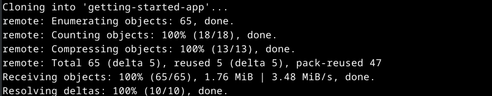
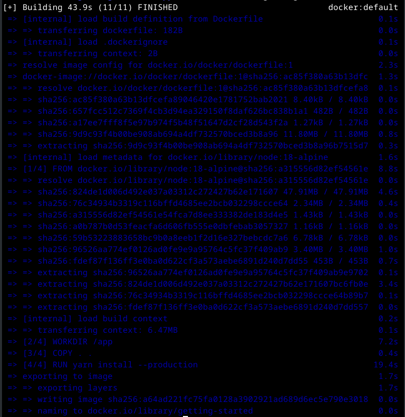
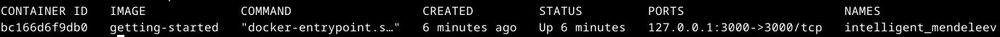

# Criação e uso de um Contêiner

No restante deste guia, você trabalhará com um gerenciador de lista de tarefas simples executado em Node.js. Se você não está familiarizado com o Node.js, não se preocupe. Este guia não requer nenhuma experiência anterior com JavaScript.

## Baixe o aplicativo

Antes de poder executar o aplicativo, você precisa colocar o código-fonte do aplicativo em sua máquina.

* Clone o repositório do aplicativo de primeiros passos usando o seguinte comando:

```console
git clone https://github.com/docker/getting-started-app.git
```



* Visualize o conteúdo do repositório clonado.

```console
sudo apt install tree
tree getting-started-app
```

* Você deverá ver os seguintes arquivos e subdiretórios.

```console
<...>
└── getting-started-app
    ├── package.json
    ├── README.md
    ├── spec
    │   ├── persistence
    │   │   └── sqlite.spec.js
    │   └── routes
    │       ├── addItem.spec.js
<...>
```

## Construa a imagem do aplicativo

Para construir a imagem, você precisará usar um Dockerfile. Um Dockerfile é simplesmente um arquivo baseado em texto sem extensão de arquivo que contém um script de instruções. Docker usa esse script para construir uma imagem de contêiner.

No diretório getting-started-app, no mesmo local do arquivo package.json, crie um arquivo chamado Dockerfile. Você pode usar os comandos a seguir para criar um Dockerfile baseado em seu sistema operacional.

No terminal, execute os seguintes comandos.

Certifique-se de estar no diretório getting-started-app.

```console
cd ~/getting-started-app
```

Crie um arquivo vazio chamado Dockerfile.

```console
touch Dockerfile
```

Usando um editor de texto ou editor de código, adicione o seguinte conteúdo ao Dockerfile:

```console
vi Dockerfile
```
Copie o texto abaixo e coloque no Dockerfile.

```console
# syntax=docker/dockerfile:1

FROM node:18-alpine
WORKDIR /app
COPY . .
RUN yarn install --production
CMD ["node", "src/index.js"]
EXPOSE 3000
```

Construa a imagem usando os seguintes comandos:

No terminal, certifique-se de estar no diretório getting-started-app.

```console
cd ~/getting-started-app
```

Construa a imagem.

```console
docker build -t getting-started .
```

Deverá aparecer uma tela como esta:




O comando docker build usa o Dockerfile para construir uma nova imagem. Você deve ter notado que o Docker baixou muitas “camadas”. Isso ocorre porque você instruiu o construtor que deseja iniciar a partir da imagem node:18-alpine. Mas, como você não tinha isso na sua máquina, o Docker precisou baixar a imagem.

Depois que o Docker baixou a imagem, as instruções do Dockerfile foram copiadas em seu aplicativo e usadas (yarn) para instalar as dependências do seu aplicativo. A diretiva CMD especifica o comando padrão a ser executado ao iniciar um contêiner a partir desta imagem.

Finalmente, a opão -t marca sua imagem. Pense nisso como um nome legível para a imagem final. Como você nomeou a imagem getting-started, você pode consultá-la ao executar um contêiner.

O ponto final no comando docker build informa ao Docker que ele deve procurar Dockerfile no diretório atual.

## Iniciar um contêiner do aplicativo que você criou.

Agora que você tem uma imagem, pode executar o aplicativo em um contêiner usando o comando docker run.

* Execute seu contêiner usando o comando docker run e especifique o nome da imagem que você acabou de criar:

```console
docker run -dp 127.0.0.1:3000:3000 getting-started
```

A opção -d (abreviação de --detach) executa o contêiner em segundo plano. A opção -p (abreviação de --publish) cria um mapeamento de porta entre o host e o contêiner. A opção -p assume um valor de string no formato HOST:CONTAINER, onde HOST é o endereço no host e CONTAINER é a porta no contêiner. O comando publica a porta 3000 do contêiner em 127.0.0.1:3000 (localhost:3000) no host. Sem o mapeamento de portas, você não conseguiria acessar o aplicativo do host.

Após alguns segundos, abra seu navegador em http://localhost:3000. Você deverá ver seu aplicativo.

Adicione um ou dois itens e veja se funciona conforme o esperado. Você pode marcar itens como concluídos e removê-los. Seu frontend está armazenando itens no backend com sucesso.

Neste ponto, você tem um gerenciador de lista de tarefas em execução com alguns itens.

Se você der uma olhada rápida em seus contêineres, verá pelo menos um contêiner em execução que usa a imagem getting-started e a porta 3000. Para ver seus contêineres, você pode usar a CLI ou a interface gráfica do Docker Desktop.

Execute o comando docker ps em um terminal para listar seus contêineres.

```console
docker ps -a
```

Você verá uma saída como esta:

