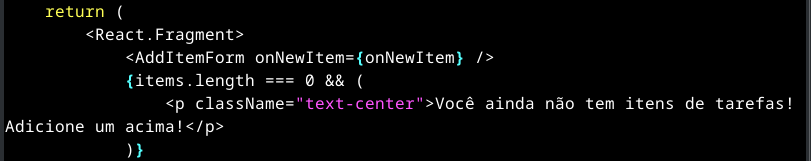
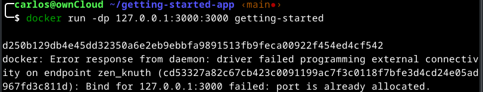
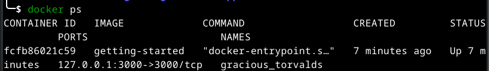
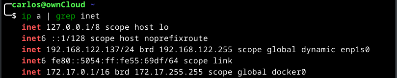
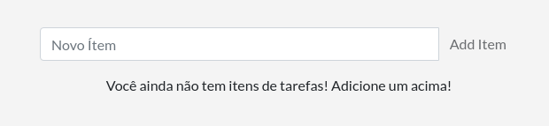

# Atualizar uma imagem

Anteriormente você colocou em contêiner um aplicativo de tarefas pendentes. Nesta parte, você atualizará o aplicativo e a imagem. Você também aprenderá como parar e remover um contêiner.

## Atualizar o código-fonte

Nas etapas a seguir, você alterará o "texto vazio" quando não tiver nenhum item da lista de tarefas para "Você ainda não tem itens de tarefas! Adicione um acima!"

1. No arquivo src/static/js/app.js, atualize a linha 56 para usar o novo texto vazio. Abra o arquivo com vi, como abaixo:

    ```console
    vi ~/getting-started-app/src/static/js/app.js
    ```

2. Troque a linha conforme abaixo:

    ```console
    - <p className="text-center">No items yet! Add one above!</p>
    + <p className="text-center">Você ainda não tem itens de tarefas! Adicione um acima!</p>
    ```

    

    >[!INFO]
    >
    >Caso queira é possível alterar no arquivo app.js, para colocar alguns dados traduzidos para o português, fique a vontade.

3. Construa sua versão atualizada da imagem, usando o comando docker build.

    ```console
    cd ~/getting-started-app
    docker build -t getting-started .
    ```

4. Inicie um novo contêiner usando o código atualizado.

    ```console
    docker run -dp 127.0.0.1:3000:3000 getting-started
    ```

    Você provavelmente viu um erro como este:

    

    O erro ocorreu porque você não consegue iniciar o novo contêiner enquanto o contêiner antigo ainda está em execução. A razão é que o contêiner antigo já está usando a porta 3000 do host e apenas um processo na máquina (contêineres incluídos) pode escutar uma porta específica. Para corrigir isso, você precisa remover o contêiner antigo.

## Remova o contêiner antigo

Para remover um contêiner, primeiro você precisa pará-lo. Depois de parar, você pode removê-lo. Você pode remover o contêiner antigo usando a CLI ou a interface gráfica do Docker Desktop. Escolha a opção com a qual você se sente mais confortável.

1.  Obtenha o ID do contêiner usando o comando docker ps.

    ```console
    docker ps
    ```

    O meu apresentou a seguinte tela:

    

2. Use o comando docker stop para parar o contêiner. Substitua <the-container-id> pelo ID de docker ps.

3. Terei que aplicar o comando docker stop utilizando a variável CONTAINER ID ou a variável NAMES. Qualquer dos 2 comandos funciona bem.

    ```console
    docker stop <the-container-id>
    ```

    Exemplo:

    ```console
    docker stop fcfb86021c59
    ```
    ou
    ```console
    docker stop gracious_torvalds
    ```

4. Depois que o contêiner for interrompido, você poderá removê-lo usando o comando docker rm. Pode-se usar o ID ou o NAME

    ```console
    docker rm <the-container-id>
    ```

    No meu caso:

    ```console
    docker rm fcfb86021c59
    ```

    >[!NOTE]
    >
    >Você pode parar e remover um contêiner em um único comando adicionando a opção force ao comando docker rm. Por exemplo:

    ```console
    docker rm -f <the-container-id>
    ```

    Aproveite para ver se por acaso não tem outras instâncias do mesmo aplicativo já criado, com o comando, e caso tenha elimine todas:

    ```console
    docker ps -a
    ```

## Inicie o contêiner com base no aplicativo atualizado

Agora, inicie seu aplicativo atualizado usando o comando docker run.

```console
docker run -dp 127.0.0.1:3000:3000 getting-started
```

1, Atualize seu navegador em http://localhost:3000 e você deverá ver seu texto de ajuda atualizado.

    Caso tenha uma rede interna, obtenha seu IP e ao invês de utilizar 127.0.0.1, utilize o IP da sua máquina:

    Exemplo:

    Para saber digite:

    ```python
    ip a | grep inet
    ```

    Deverá aparecer para você algo como:



    No meu caso o IP da máquina que está rodando esse contêiner é o 192.168.122.137.

    ```console
    docker run -dp COLOQUE-SEU-IP-AQUI:3000:3000 getting-started
    ```

    Então no meu caso fica assim:

    ```console
    docker run -dp 192.168.122.137:3000:3000 getting-started
    ```

    Ao acessar nosso contêiner pelo navegador: http://192.168.122.137:3000, vaos obter a seguinte tela:



    Caso pare o contêiner com o comando stop, ou reinicie sua máquina o mesmo ficará desligado, então para iniciá-lo novamente utilize o comando start.

    ```console
    docker ps -a
    ```

    Para obter o CONTAINER ID

    ```console
    docker start <CONTAINER ID>
    ```
