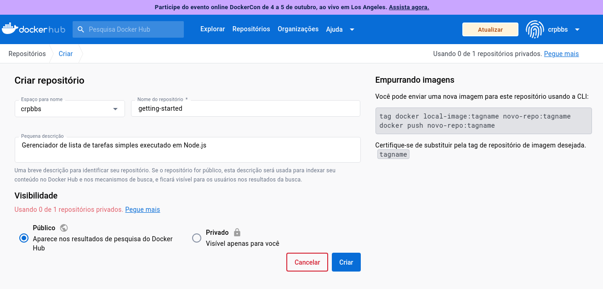
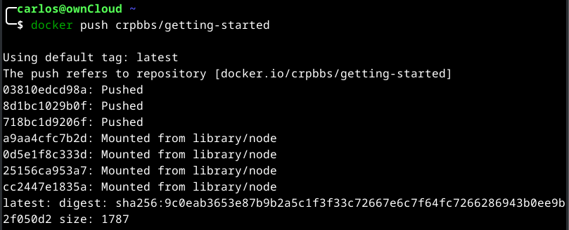
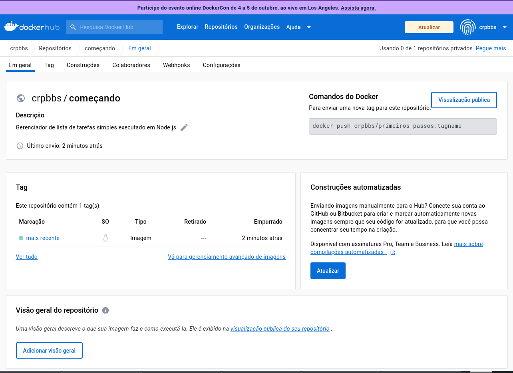
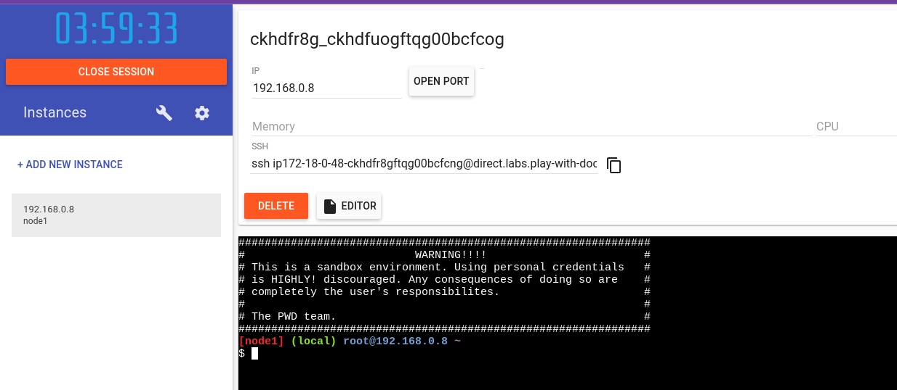
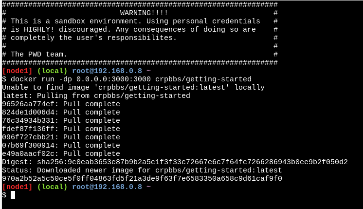
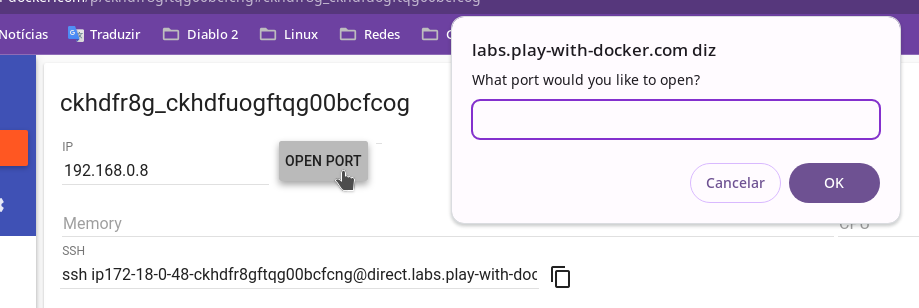
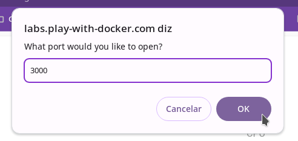

# Compartilhar uma imagem criada por você com outras pessoas

Agora que você construiu uma imagem, você pode compartilhá-la. Para compartilhar imagens Docker, você deve usar um registro Docker. O registro padrão é Docker Hub e é de onde vieram todas as imagens que você usou.

>[!NOTE] ID do Docker
>
>Um Docker ID permite acessar o Docker Hub, que é a maior biblioteca e comunidade do mundo para imagens de contêiner. Crie um ID Docker de graça se você não tiver um.

## Crie um repositório

Para enviar uma imagem, primeiro você precisa criar um repositório no Docker Hub.

* [Inscrever-se](https://www.docker.com/pricing/?utm_source=docker&utm_medium=webreferral&utm_campaign=docs_driven_upgrade&_gl=1*1yt731y*_ga*MTg3NDE2MDQ0Ni4xNjkyNTY5OTM5*_ga_XJWPQMJYHQ*MTY5Njc3OTE4NS4yMi4xLjE2OTY3Nzk1MDcuNjAuMC4w) ou faça [login no Docker Hub](https://login.docker.com/u/login/identifier?state=hKFo2SAtcWFqMnNncll6RENqRU5xRHhYU1J2ZTV2VkZXVEROcaFur3VuaXZlcnNhbC1sb2dpbqN0aWTZIEhnUDZLU2lvMEFwN2dpVGtXekxMZXEzbjhJeExabmhjo2NpZNkgbHZlOUdHbDhKdFNVcm5lUTFFVnVDMGxiakhkaTluYjk).

* Selecione o botão Criar Repositório .
* Para o nome do repositório, use getting-started. Certifique-se de que a Visibilidade seja Public.
* Coloque alguma descrição para saber do que se trata esta imagem.
* Selecione Criar .

Na imagem a seguir, você pode ver um exemplo de comando do Docker do Docker Hub. Este comando será enviado para este repositório.



## Envie a imagem

* Na linha de comando, execute o comando docker push que você vê no Docker Hub. Observe que seu comando terá seu ID Docker, não "docker".

```console
docker push docker/getting-started
```

* Você obterá uma mensagem de erro como esta:

```console
Using default tag: latest
The push refers to repository [docker.io/docker/getting-started]
An image does not exist locally with the tag: docker/getting-started
```

    Por que falhou? O comando push estava procurando uma imagem chamada docker/getting-started, mas não encontrou nenhuma. Se você executar o comando docker image ls, também não verá nenhum.

    Para corrigir isso, você precisa marcar a imagem existente que você construiu para dar outro nome.

* Faça login no Docker Hub usando o comando docker login -u YOUR-USER-NAME. Troque o YOUR-USER-NAME pelo seu username.

```console
docker login -u YOUR-USER-NAME
```

* Use o comando docker tag para dar um novo nome para a imagem getting-started. Substitua YOUR-USER-NAME pelo seu ID do Docker.

```console
docker tag getting-started YOUR-USER-NAME/getting-started
```

* Agora execute o docker pushcomando novamente. Se estiver copiando o valor do Docker Hub, você pode descartar a tagnameparte, pois não adicionou uma tag ao nome da imagem. Se você não especificar uma tag, o Docker usará uma tag chamada latest.

* Agora execute o comando docker push novamente. Se estiver copiando o valor do Docker Hub, você pode descartar a parte do tagname, pois não adicionou uma tag ao nome da imagem. Se você não especificar uma tag, o Docker usará uma tag chamada latest.

```console
docker push YOUR-USER-NAME/getting-started
```

No meu caso obtive o seguinte resultado:





## Execute a imagem em uma nova instância

Agora que sua imagem foi criada e inserida em um registro, tente executar seu aplicativo em uma instância totalmente nova que nunca viu essa imagem de contêiner. Para fazer isso, você usará o Play with Docker.

>[!NOTE]
>
>Play with Docker usa a plataforma amd64. Se estiver usando um Mac baseado em ARM com Apple Silicon, você precisará reconstruir a imagem para ser compatível com o Play with Docker e enviar a nova imagem para o seu repositório.
>
>Para construir uma imagem para a plataforma AMD64, use a opção --platform.
>
>```console
>docker build --platform linux/amd64 -t YOUR-USER-NAME/getting-started .
>```
>
>Docker buildx também oferece suporte à construção de imagens multiplataforma. Para saber mais, consulte [Imagens multiplataforma](https://docs.docker.com/build/building/multi-platform/).

* Abra seu navegador e clique no seguinte link: [brincar com Docker](https://labs.play-with-docker.com/?_gl=1*1vkjrk*_ga*MTg3NDE2MDQ0Ni4xNjkyNTY5OTM5*_ga_XJWPQMJYHQ*MTY5Njc3OTE4NS4yMi4xLjE2OTY3ODE5NjEuNjAuMC4w).

* Selecione Login e selecione docker na lista suspensa.

* Faça login com sua conta Docker Hub e selecione Iniciar .

* Selecione a opção ADICIONAR NOVA INSTÂNCIA na barra lateral esquerda. Após alguns segundos, uma janela de terminal é aberta no seu navegador.



* No terminal, inicie seu aplicativo recém-enviado.

```console
docker run -dp 0.0.0.0:3000:3000 YOUR-USER-NAME/getting-started
```



>[!TIP]
>
>Você deve ter notado que este comando vincula o mapeamento da porta a um endereço IP diferente. Os comandos anteriores do docker run publicaram portas 127.0.0.1:3000 no host. Desta vez, você está usando 0.0.0.0.
>
>A vinculação 127.0.0.1 expõe apenas as portas de um contêiner à interface de loopback. A ligação a 0.0.0.0, entretanto, expõe a porta do contêiner em todas as interfaces do host, tornando-a disponível para o mundo externo.
>
>Para obter mais informações sobre como funciona o mapeamento de portas, [consulte Rede](https://docs.docker.com/network/#published-ports).

* Selecione OPEN PORT e quanto abrir a janela coloque 3000 e clique em OK.





>[!INFO]
>
>Caso tenha baixado a imagem em outro computador que tenha o docker instalado e que esteja na mesma rede, poderá testar com o IP da máquina local no navegador de outra máquina.