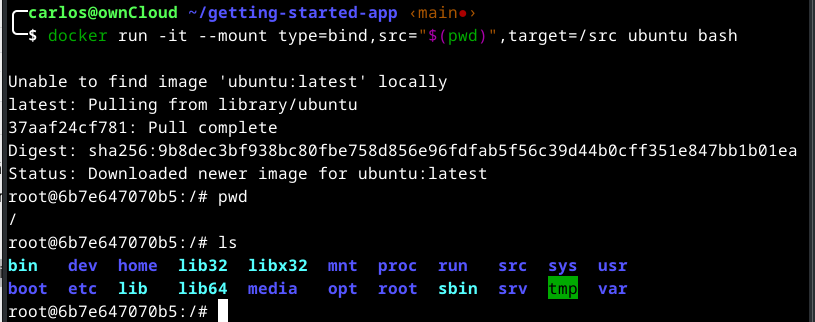
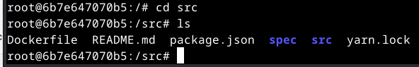
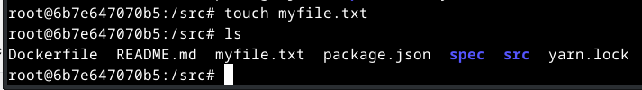
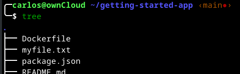
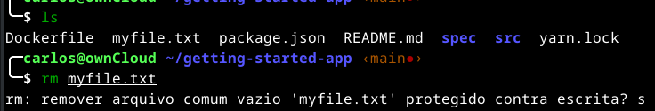
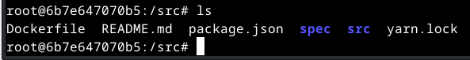

# Use montagens vinculadas

Anteriormente, você usou uma montagem de volume para persistir os dados em seu banco de dados. Uma montagem de volume é uma ótima opção quando você precisa de um local persistente para armazenar os dados do seu aplicativo.

Uma montagem vinculada é outro tipo de montagem, que permite compartilhar um diretório do sistema de arquivos do host no contêiner. Ao trabalhar em um aplicativo, você pode usar uma montagem vinculada para montar o código-fonte no contêiner. O contêiner vê as alterações feitas no código imediatamente, assim que você salva um arquivo. Isso significa que você pode executar processos no contêiner que monitoram alterações no sistema de arquivos e respondem a elas.

Neste momento, você verá como usar montagens de ligação e uma ferramenta chamada [nodemon](https://npmjs.com/package/nodemon) para observar as alterações no arquivo e, em seguida, reiniciar o aplicativo automaticamente. Existem ferramentas equivalentes na maioria das outras linguagens e estruturas.

## Comparações rápidas de tipos de volume

A tabela a seguir descreve as principais diferenças entre montagens de volume e montagens de ligação.

|  | Volumes nomeados | Vincular montagens |
|--- |--- |--- |
| Localização do anfitrião | Docker escolhe | Você decide |
| Exemplo de montagem (usando --mount) | type=volume,src=my-volume,target=/usr/local/data | type=bind,src=/path/to/data,target=/usr/local/data |
| Preenche o novo volume com o conteúdo do contêiner | SIM | NÃO |
| Suporta drivers de volume | SIM | NÃO |

## Experimentando montagens vinculadas

Antes de ver como você pode usar montagens de ligação para desenvolver seu aplicativo, você pode executar um experimento rápido para obter uma compreensão prática de como funcionam as montagens de ligação.

>[!NOTE]
>
>Se você usa o Windows e deseja usar o Git Bash para executar comandos do Docker, consulte [Trabalhando com o Git Bash](https://docs.docker.com/desktop/troubleshoot/topics/#working-with-git-bash) para obter diferenças de sintaxe.

1. Abra um terminal e mude o diretório para o getting-started-app diretório.

    ```console
    cd ~/getting-started-app
    ```

2. Execute o seguinte comando para iniciar o bash em um contêiner ubuntu com uma montagem vinculada.

    ```console
    docker run -it --mount type=bind,src="$(pwd)",target=/src ubuntu bash
    ```

    A opção --mount diz ao Docker para criar uma montagem de ligação, onde o src é o diretório de trabalho atual em sua máquina host (getting-started-app) e target é onde esse diretório deve aparecer dentro do contêiner (/src).

3. Após executar o comando, o Docker inicia uma sessão bash interativa no diretório raiz do sistema de arquivos do contêiner. Aproveite e execute o comando pwd para ver em que diretório está e o comando ls para listar os diretórios.

    

4. Mude o diretório para o diretório src e dê o comando ls.

    Este é o diretório que você montou ao iniciar o contêiner. Listar o conteúdo deste diretório exibe os mesmos arquivos do diretório getting-started-app em sua máquina host.

    

5. Crie um novo arquivo chamado myfile.txt.

    ```console
    touch myfile.txt
    ```

    

6. Abra o diretório getting-started-app no host e observe se o arquivo myfile.txt está no diretório.

    ```console
    cd ~/getting-started-app
    tree
    ```

    

7. No host, exclua o arquivo myfile.txt.

    

    No contêiner, liste o conteúdo do diretório mais uma vez. Observe que o arquivo desapareceu.

    

8. Pare encerrar a sessão do contêiner interativo tecle Ctrl+D.

9.  Para retornar ao container após teclar CTRL+D, você pode utilizar o comando "docker attach <container_name>". Isso irá conectar você de volta ao terminal do container em execução.

10. Caso obtenha uma mensagem de erro é porque provavelmente seu contênier não está em execução, então faça primeiro o start depois o attach.

    ```python
    docker attach <CONTAINER ID>
    ```

    Deverá receber uma mensagem de erro do tipo:

    ```console
    You cannot attach to a stopped container, start it first
    ```

    Neste caso, faça primeiro o start e depois o attach:

    ```console
    docker start <CONTAINER ID>
    docker attach <CONTAINER ID>
    ```

11. A tecla para sair de um contêiner do Docker sem encerrá-lo é CTRL+P+Q. Quando você executa esse atalho, você estará desconectando o terminal atual do contêiner, mas o contêiner continuará em execução em segundo plano. Daí para retornar utilize o attach.

Isso é tudo para uma breve introdução ao bind de montagens. Este procedimento demonstrou como os arquivos são compartilhados entre o host e o contêiner e como as alterações são refletidas imediatamente em ambos os lados. Agora você pode usar montagens de ligação para desenvolver software.

## Contêineres de desenvolvimento

O uso de montagens vinculadas é comum para configurações de desenvolvimento local. A vantagem é que a máquina de desenvolvimento não precisa ter todas as ferramentas e ambientes de construção instalados. Com um único comando docker run, o Docker extrai dependências e ferramentas.

### Execute seu aplicativo em um contêiner de desenvolvimento

As etapas a seguir descrevem como executar um contêiner de desenvolvimento com uma montagem vinculada que faz o seguinte:

* Monta seu código-fonte no contêiner
* Instala todas as dependências
* Começa o nodemo para observar as alterações no sistema de arquivos

Você pode usar a CLI ou o Docker Desktop para executar seu contêiner com uma montagem vinculada.

1. Certifique-se de não ter nenhum contêiner getting-started em execução no momento.
2. Execute o seguinte comando no diretório getting-started-app.

    ```console
    cd ~/getting-started-app
    docker run -dp 0.0.0.0:3000:3000 \
        -w /app --mount type=bind,src="$(pwd)",target=/app \
        node:18-alpine \
        sh -c "yarn install && yarn run dev"
    ```

    A seguir está uma análise do comando:

    1. -dp 0.0.0.0:3000:3000- o mesmo de antes. Execute em modo desanexado (em segundo plano) e crie um mapeamento de porta
    2. -w /app- define o "diretório de trabalho" ou o diretório atual a partir do qual o comando será executado
    3. --mount type=bind,src="$(pwd)",target=/app- O tipo bind monta o diretório atual do host no diretório /app do contêiner
    4. node:18-alpine- a imagem a ser usada. Observe que esta é a imagem base do seu aplicativo no Dockerfile
    5. sh -c "yarn install && yarn run dev"- o comando. Você está iniciando um shell usando sh(alpine não possui bash) e executando yarn install para instalar pacotes e depois executando yarn run dev para iniciar o servidor de desenvolvimento. Se você olhar no arquivo package.json, verá que o dev script inicia nodemon.

3. Você pode assistir os logs usando docker logs <container-id>. Você saberá que está pronto para começar quando vir isto:

    ```console
    docker logs -f <container-id>
    ```

    Deverá obter algo parecido com:

    ```console
    yarn install v1.22.19
    [1/4] Resolving packages...
    [2/4] Fetching packages...
    [3/4] Linking dependencies...
    [4/4] Building fresh packages...
    Done in 16.88s.
    yarn run v1.22.19
    $ nodemon src/index.js
    [nodemon] 2.0.20
    [nodemon] to restart at any time, enter `rs`
    [nodemon] watching path(s): *.*
    [nodemon] watching extensions: js,mjs,json
    [nodemon] starting `node src/index.js`
    Using sqlite database at /etc/todos/todo.db
    Listening on port 3000
    ```

    Quando terminar de assistir os registros, saia pressionando Ctrl+ C.

### Desenvolva seu aplicativo com o contêiner de desenvolvimento

Atualize seu aplicativo na máquina host e veja as alterações refletidas no contêiner.

1. No arquivo src/static/js/app.js, na linha 109, altere o botão “Add Item” para simplesmente dizer “Adicionar”:

    ```console
    vi ~/getting-started-app/src/static/js/app.js
    ```

    ```console
    - {submitting ? 'Adding...' : 'Add Item'}
    + {submitting ? 'Adding...' : 'Adicionar'}
    ```

2. Atualize a página em seu navegador e você verá a alteração refletida quase imediatamente. Pode levar alguns segundos para o servidor Node reiniciar. Se você receber um erro, tente atualizar após alguns segundos.

    

3. Sinta-se à vontade para fazer quaisquer outras alterações que desejar. Cada vez que você faz uma alteração e salva um arquivo, o processo nodemon reinicia automaticamente o aplicativo dentro do contêiner. Quando terminar, pare o contêiner e crie sua nova imagem usando:

    ```console
    vi ~/getting-started-app/src/static/js/app.js
    cd ~/getting-started-app
    docker build -t getting-started .
    ```
