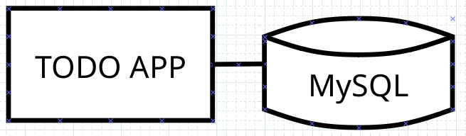
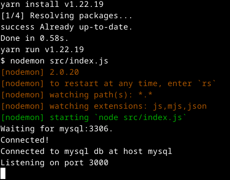
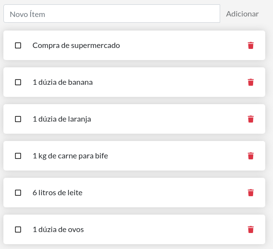
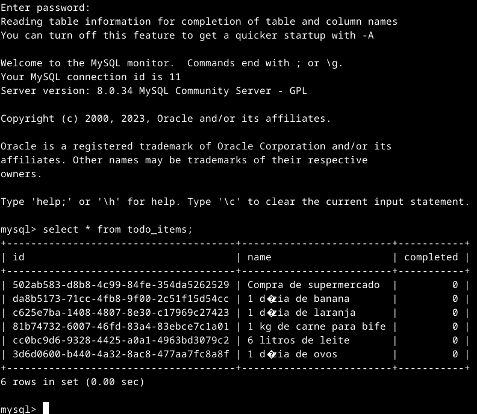

# Aplicativos de vários contêineres

Até agora, você trabalhou com aplicativos de contêiner único. Mas agora você adicionará o MySQL à pilha de aplicativos. Muitas vezes surge a seguinte pergunta - "Onde o MySQL será executado? Instale-o no mesmo contêiner ou execute-o separadamente?" Em geral, cada contêiner deve fazer uma coisa e fazê-la bem. A seguir estão alguns motivos para executar o contêiner separadamente:

* Há uma boa chance de você precisar dimensionar APIs e front-ends de maneira diferente dos bancos de dados.
* Contêineres separados permitem criar versões e atualizar versões isoladamente.
* Embora você possa usar um contêiner para o banco de dados localmente, talvez você queira usar um serviço gerenciado para o banco de dados em produção. Você não deseja enviar seu mecanismo de banco de dados com seu aplicativo.
* A execução de vários processos exigirá um gerenciador de processos (o contêiner inicia apenas um processo), o que adiciona complexidade à inicialização/desligamento do contêiner.

E há mais razões. Assim, como no diagrama a seguir, é melhor executar seu aplicativo em vários contêineres.



## Rede de contêineres

Lembre-se de que os contêineres, por padrão, são executados isoladamente e não sabem nada sobre outros processos ou contêineres na mesma máquina. Então, como você permite que um contêiner se comunique com outro? A resposta é rede. Se você colocar os dois contêineres na mesma rede, eles poderão se comunicar.

## Inicie o MySQL

Existem duas maneiras de colocar um contêiner em uma rede:

* Atribua a rede ao iniciar o contêiner.
* Conecte um contêiner já em execução a uma rede.

Nas etapas a seguir, você criará a rede primeiro e depois anexará o contêiner MySQL na inicialização.

1. Crie a rede.

    ```console
    docker network create todo-app
    ```

2. Inicie um contêiner MySQL e conecte-o à rede. Você também definirá algumas variáveis ​​de ambiente que o banco de dados usará para inicializar o banco de dados. Para saber mais sobre as variáveis ​​de ambiente do MySQL, consulte a seção ["Variáveis ​​de ambiente" na listagem do MySQL Docker Hub](https://hub.docker.com/_/mysql/?_gl=1*1t479ve*_ga*MTg3NDE2MDQ0Ni4xNjkyNTY5OTM5*_ga_XJWPQMJYHQ*MTY5NjgwMzY3My4yNS4xLjE2OTY4MDU4ODIuNTkuMC4w).

    ```console
    docker run -d \
        --network todo-app --network-alias mysql \
        -v todo-mysql-data:/var/lib/mysql \
        -e MYSQL_ROOT_PASSWORD=secret \
        -e MYSQL_DATABASE=todos \
        mysql:8.0
    ```

    No comando anterior, você pode ver a opção --network-alias. Em uma seção posterior, você aprenderá mais sobre essa opção.

    >[!TIP]
    >
    >Você notará um volume nomeado no comando acima como todo-mysql-data que está montado em /var/lib/mysql, que é onde o MySQL armazena seus dados. No entanto, você nunca executou um comando docker volume create. O Docker reconhece que você deseja usar um volume nomeado e cria um automaticamente para você.

3. Para confirmar se o banco de dados está instalado e funcionando, conecte-se ao banco de dados e verifique se ele se conecta.

    ```console
    docker exec -it <mysql-container-id> mysql -u root -p
    ```

    Quando a solicitação de senha aparecer, digite secret. No shell do MySQL, liste os bancos de dados e verifique se você vê o todos os banco de dados.

    ```console
    mysql> SHOW DATABASES;
    ```

    Você deverá ver uma saída semelhante a esta:

    ```console
    Enter password: 
    Welcome to the MySQL monitor.  Commands end with ; or \g.
    Your MySQL connection id is 8
    Server version: 8.0.34 MySQL Community Server - GPL

    Copyright (c) 2000, 2023, Oracle and/or its affiliates.

    Oracle is a registered trademark of Oracle Corporation and/or its
    affiliates. Other names may be trademarks of their respective
    owners.

    Type 'help;' or '\h' for help. Type '\c' to clear the current input statement.

    mysql> SHOW DATABASES;
    +--------------------+
    | Database           |
    +--------------------+
    | information_schema |
    | mysql              |
    | performance_schema |
    | sys                |
    | todos              |
    +--------------------+
    5 rows in set (0.01 sec)

    mysql> 
    ```

    Saia do shell do MySQL para retornar ao shell da sua máquina.

    ```console
    mysql> exit
    ```

    Agora você vê todos os banco de dados e ele está pronto para uso.

## Conecte-se ao MySQL

Agora que você sabe que o MySQL está instalado e funcionando, você pode usá-lo. Mas, como você usa isso? Se você executar outro contêiner na mesma rede, como encontrará o contêiner? Lembre-se de que cada contêiner possui seu próprio endereço IP.

Para responder às perguntas acima e entender melhor a rede de contêineres, você usará o pacote contêiner [nicolaka/netshoot](https://github.com/nicolaka/netshoot), que vem com muitas ferramentas úteis para solucionar problemas ou depurar problemas de rede.

1. Inicie um novo contêiner usando a imagem nicolaka/netshoot. Certifique-se de conectá-lo à mesma rede.

    ```console
    docker run -it --network todo-app nicolaka/netshoot
    ```

2. Dentro do contêiner, você usará o comando dig, que é uma ferramenta DNS útil. Você procurará o endereço IP do hostname mysql.

    ```console
    dig mysql
    ```

    Você deve obter uma saída como a seguinte.

    ```console
    ; <<>> DiG 9.18.13 <<>> mysql
    ;; global options: +cmd
    ;; Got answer:
    ;; ->>HEADER<<- opcode: QUERY, status: NOERROR, id: 56229
    ;; flags: qr rd ra; QUERY: 1, ANSWER: 1, AUTHORITY: 0, ADDITIONAL: 0

    ;; QUESTION SECTION:
    ;mysql.				IN	A

    ;; ANSWER SECTION:
    mysql.			600	IN	A	172.18.0.2

    ;; Query time: 0 msec
    ;; SERVER: 127.0.0.11#53(127.0.0.11) (UDP)
    ;; WHEN: Mon Oct 09 00:09:03 UTC 2023
    ;; MSG SIZE  rcvd: 44
    ```
    Na "ANSWER SECTION", você verá um registro "mysql IN A" que resolve 172.18.0.2 (seu endereço IP provavelmente terá um valor diferente). Embora normalmente o mysql não seja um nome de host válido, o Docker conseguiu resolvê-lo para o endereço IP do contêiner que tinha esse alias de rede. Lembre-se, você usou o anteriormente --network-alias.

    O que isso significa é que seu aplicativo simplesmente precisa se conectar a um host chamado mysql que se comunicará com o banco de dados.

## Execute seu aplicativo com MySQL

O aplicativo de tarefas suporta a configuração de algumas variáveis ​​de ambiente para especificar as configurações de conexão MySQL. Eles são:

* MYSQL_HOST- o nome do host do servidor MySQL em execução
* MYSQL_USER- o nome de usuário a ser usado para a conexão
* MYSQL_PASSWORD- a senha a ser usada para a conexão
* MYSQL_DB- o banco de dados a ser usado depois de conectado

>[!NOTE]
>
>Embora o uso de env vars para definir configurações de conexão seja geralmente aceito para desenvolvimento, é altamente desencorajado ao executar aplicativos em produção. Diogo Monica, ex-líder de segurança da Docker, [escreveu uma postagem fantástica no blog](https://diogomonica.com/2017/03/27/why-you-shouldnt-use-env-variables-for-secret-data/) explicando o porquê.
>
>Um mecanismo mais seguro é usar o suporte secreto fornecido pela sua estrutura de orquestração de contêineres. Na maioria dos casos, esses segredos são montados como arquivos no contêiner em execução. Você verá que muitos aplicativos (incluindo a imagem MySQL e o aplicativo de tarefas) também suportam env vars com um sufixo _FILE para apontar para um arquivo que contém a variável.
>
>Por exemplo, definir var MYSQL_PASSWORD_FILE fará com que o aplicativo use o conteúdo do arquivo referenciado como senha de conexão. O Docker não faz nada para oferecer suporte a esses ambientes. Seu aplicativo precisará saber como procurar a variável e obter o conteúdo do arquivo.

Agora você pode iniciar seu contêiner pronto para desenvolvimento.

1. Se você estiver com seu contêiner em execução, pare ele e remova para iniciarmos juntos novamente. Lembrando os comandos para para e depois remover.

    ```console
    docker stop <CONTAINER ID>
    docker rm -f <CONTAINER ID>
    ```

2. Especifique cada uma das variáveis ​​de ambiente anteriores, bem como conecte o contêiner à sua rede de aplicativos. Certifique-se de estar no diretório getting-started-app ao executar este comando.

    ```console
    cd ~/getting-started-app
    docker run -dp 0.0.0.0:3000:3000 \
    -w /app -v "$(pwd):/app" \
    --network todo-app \
    -e MYSQL_HOST=mysql \
    -e MYSQL_USER=root \
    -e MYSQL_PASSWORD=secret \
    -e MYSQL_DB=todos \
    node:18-alpine \
    sh -c "yarn install && yarn run dev"
    ```

3. Se você observar os logs do contêiner (docker logs -f <container-id>), deverá ver uma mensagem semelhante à seguinte, que indica que ele está usando o banco de dados mysql.

    ```console
    docker logs -f <container-id>
    ```

    

4. Abra o aplicativo em seu navegador e adicione alguns itens à sua lista de tarefas.

    

5. Conecte-se ao banco de dados mysql e prove que os itens estão sendo gravados no banco de dados. Lembre-se, a senha é secret.

    ```console
    docker exec -it <mysql-container-id> mysql -p todos
    ```

    E no shell do mysql, execute o seguinte:

    ```console
    mysql> select * from todo_items;
    ```

    Você deverá obter uma tela semelhante a esta:

    

Há uma boa chance de você estar começando a se sentir um pouco sobrecarregado com tudo o que precisa fazer para iniciar este aplicativo. Você precisa criar uma rede, iniciar contêineres, especificar todas as variáveis ​​de ambiente, expor portas e muito mais. Isso é muito para lembrar e certamente está tornando as coisas mais difíceis de repassar para outra pessoa.

Na próxima aula, você aprenderá sobre o Docker Compose. Com o Docker Compose, você pode compartilhar suas pilhas de aplicativos de uma maneira muito mais fácil e permitir que outras pessoas as gerem com um comando único e simples.