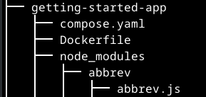
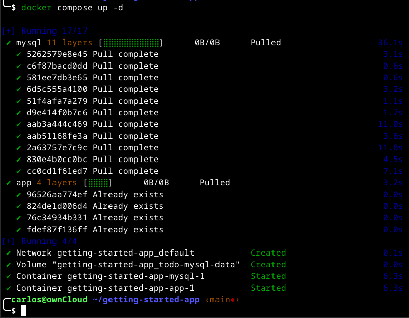
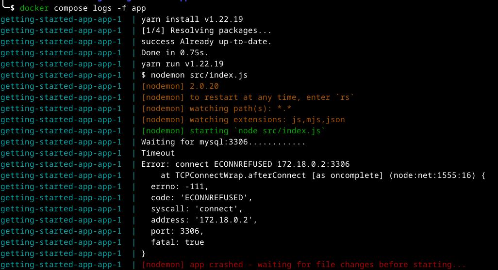
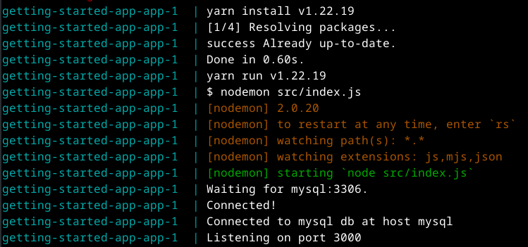
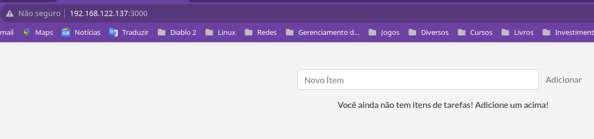
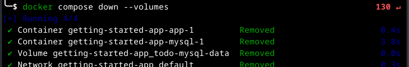

# Como usar o Docker Compose

Docker Compose é uma ferramenta que ajuda a definir e compartilhar aplicativos com vários contêineres. Com o Compose, você pode criar um arquivo YAML para definir os serviços e, com um único comando, pode aumentar ou diminuir tudo.

A grande vantagem de usar o Compose é que você pode definir a pilha de aplicativos em um arquivo, mantê-la na raiz do repositório do projeto (agora com versão controlada) e permitir facilmente que outra pessoa contribua com o seu projeto. Alguém precisaria apenas clonar seu repositório e iniciar o aplicativo usando o Compose. Na verdade, você pode ver alguns projetos no GitHub/GitLab fazendo exatamente isso agora.

## Crie o arquivo Compose

No diretório getting-started-app, crie um arquivo chamado compose.yaml.

```console
cd ~/getting-started-app
touch compose.yaml
tree
```

Observe como ficou seu diretório:



## Definir o serviço de aplicativo

Anteriormente, você criou uma rede chamada todo-app com o comando docker network create todo-app.
Precisamos ver se a rede ainda está criada com comando.

```console
docker network ls # Para listar as redes disponíveis.
```
Obterá algo parecido com:

```console
NETWORK ID     NAME                          DRIVER    SCOPE
cea5a9590e34   bridge                        bridge    local
8027eb00ae77   getting-started-app_default   bridge    local
de7281f83a56   host                          host      local
923cb41cb4fd   none                          null      local
37910892304b   todo-app                      bridge    local
```

Observe que ela está criada ainda.

```console
docker network inspect todo-app # Para inspecionar.
```

Obterá algo parecido com:

```console
[
    {
        "Name": "todo-app",
        "Id": "37910892304b4d0c55fbc933d742f75b39c7d8ecf36e4cdbbe84ba3f5c1e731a",
        "Created": "2023-10-08T20:56:43.413334805-03:00",
        "Scope": "local",
        "Driver": "bridge",
        "EnableIPv6": false,
        "IPAM": {
            "Driver": "default",
            "Options": {},
            "Config": [
                {
                    "Subnet": "172.18.0.0/16",
                    "Gateway": "172.18.0.1"
                }
            ]
        },
        "Internal": false,
        "Attachable": false,
        "Ingress": false,
        "ConfigFrom": {
            "Network": ""
        },
        "ConfigOnly": false,
        "Containers": {},
        "Options": {},
        "Labels": {}
    }
]
```

Observe que nossa rede é a 172.18.0.0 e que o gateway é o 1, portanto as demais máquinas seriam criadas com 172.18.0.2 até 254.

>[!IMPORTANT]
>
>Como o docker compose por padrão já cria uma rede para os contêiners, não vamos precisar mais desta rede, então vamos apagá-la.
>
>```console
>docker network rm todo-app
>```

Anteriormente, você usou o comando a seguir para iniciar o serviço de aplicativo.

```console
docker run -dp 0.0.0.0:3000:3000 \
  -w /app -v "$(pwd):/app" \
  --network todo-app \
  -e MYSQL_HOST=mysql \
  -e MYSQL_USER=root \
  -e MYSQL_PASSWORD=secret \
  -e MYSQL_DB=todos \
  node:18-alpine \
  sh -c "yarn install && yarn run dev"
```

Agora você definirá esse serviço no arquivo compose.yaml.

1. Abra compose.yaml em um editor de texto ou código e comece definindo o nome e a imagem do primeiro serviço (ou contêiner) que deseja executar como parte de sua aplicação. O nome se tornará automaticamente um alias de rede, o que será útil ao definir seu serviço MySQL.

```console
cd ~/getting-started-app
vi compose.yaml
```

```console
services:
  app:
    image: node:18-alpine
```

2. Normalmente, você verá a diretiva command próximo à diretiva image, embora não haja nenhuma exigência sobre isso. Adicione command ao seu arquivo compose.yaml.

```console
services:
  app:
    image: node:18-alpine
    command: sh -c "yarn install && yarn run dev"
```

3. Agora coloque a diretiva ports e informe - 0.0.0.0:3000:3000.

```console
services:
  app:
    image: node:18-alpine
    command: sh -c "yarn install && yarn run dev"
    ports:
      - 0.0.0.0:3000:3000
```

4. Agora coloque a diretiva working_dir com a opção /app e a diretiva volumes com a opção - ./:/app.

    Uma vantagem das definições de volume do Docker Compose é que você pode usar caminhos relativos do diretório atual.

```console
services:
  app:
    image: node:18-alpine
    command: sh -c "yarn install && yarn run dev"
    ports:
      - 0.0.0.0:3000:3000
    working_dir: /app
    volumes:
      - ./:/app
```

5. Finalmente, você precisa migrar as definições de variáveis ​​de ambiente usando a chave environment.

```console
services:
  app:
    image: node:18-alpine
    command: sh -c "yarn install && yarn run dev"
    ports:
      - 0.0.0.0:3000:3000
    working_dir: /app
    volumes:
      - ./:/app
    environment:
      MYSQL_HOST: mysql
      MYSQL_USER: root
      MYSQL_PASSWORD: secret
      MYSQL_DB: todos
```

### Definir o serviço MySQL

Agora é hora de definir o serviço MySQL. O comando que você usou para esse contêiner foi o seguinte:

```console
docker run -d \
  --network todo-app --network-alias mysql \
  -v todo-mysql-data:/var/lib/mysql \
  -e MYSQL_ROOT_PASSWORD=secret \
  -e MYSQL_DATABASE=todos \
  mysql:8.0
```

1. Primeiro defina o novo serviço e nomeie-o para mysql que obtenha automaticamente o alias da rede. Especifique também a imagem a ser usada.

```console
services:
  app:
    # A definição do serviço do app.
  mysql:
    image: mysql:8.0
```

2. A seguir, defina o mapeamento de volume. Quando você executou o contêiner com docker run, o Docker criou o volume nomeado automaticamente. No entanto, isso não acontece ao executar com o Compose. Você precisa definir o volume na seção volumes: de nível superior e depois especificar o ponto de montagem na configuração do serviço. Simplesmente fornecendo apenas o nome do volume, as opções padrão são usadas.

```console
services:
  app:
    # A definição do serviço do app.
  mysql:
    image: mysql:8.0
    volumes:
      - todo-mysql-data:/var/lib/mysql

volumes:
  todo-mysql-data:
```

3. Finalmente, você precisa especificar as variáveis ​​de ambiente.

```console
services:
  app:
    # A definição do serviço do app.
  mysql:
    image: mysql:8.0
    volumes:
      - todo-mysql-data:/var/lib/mysql
    environment:
      MYSQL_ROOT_PASSWORD: secret
      MYSQL_DATABASE: todos

volumes:
  todo-mysql-data:
```

Neste ponto, seu arquivo compose.yaml está completo e deve ficar assim. Muito atenção à identação. O sistema é muito rígido com relação a identação, são 2 espaços conforme descrito abaixo:

```console
services:
  app:
    image: node:18-alpine
    command: sh -c "yarn install && yarn run dev"
    ports:
      - 0.0.0.0:3000:3000
    working_dir: /app
    volumes:
      - ./:/app
    environment:
      MYSQL_HOST: mysql
      MYSQL_USER: root
      MYSQL_PASSWORD: secret
      MYSQL_DB: todos

  mysql:
    image: mysql:8.0
    volumes:
      - todo-mysql-data:/var/lib/mysql
    environment:
      MYSQL_ROOT_PASSWORD: secret
      MYSQL_DATABASE: todos

volumes:
  todo-mysql-data:
```

## Execute a pilha de aplicativos

Agora que você tem seu arquivo compose.yaml, pode iniciar seu aplicativo.

1. Certifique-se de que nenhuma outra cópia dos contêineres esteja em execução primeiro. Use docker ps para listar os contêineres e docker rm -f <ids> para removê-los.

2. Inicie a pilha de aplicativos usando o comando docker compose up. Adicione a opção -d para executar tudo em segundo plano.

    ```console
    cd ~/getting-started-app
    docker compose up -d
    ```

    Ao executar o comando anterior, você deverá ver uma saída semelhante a esta:

    

    Você notará que o Docker Compose criou o volume e também uma rede. Por padrão, o Docker Compose cria automaticamente uma rede especificamente para a pilha de aplicativos (é por isso que você não definiu uma no arquivo Compose).

    O nome do serviço é exibido no início da linha (geralmente colorido) para ajudar a distinguir as mensagens. Se quiser visualizar os logs de um serviço específico, você pode adicionar o nome do serviço ao final do comando logs (por exemplo, docker compose logs -f app ou docker compose logs -f mysql).

3. Veja os logs usando o comando docker compose logs -f. Você verá os logs de cada um dos serviços intercalados em um único fluxo. Isso é extremamente útil quando você deseja observar problemas relacionados ao tempo. A opção -f segue o log, portanto fornecerá uma saída ao vivo à medida que é gerada.

    Caso apresente um erro do tipo abaixo:

    

    Liste o contêiner para ver seu ID e reinicie o contêiner, com o comando docker restart <ID>.

    ```console
    docker ps -a
    ```

    ```console
    docker restart <ID>
    ```

    

4. Neste ponto, você poderá abrir seu aplicativo em seu navegador em http://[SEU-ENDERECO-IP]:3000 e vê-lo funcionando.

    No meu caso foi isso:

    

## Veja a pilha de aplicativos no Docker Dashboard

Se você olhar o Docker Dashboard, verá que existe um grupo chamado Getting-Started-app. Este é o nome do projeto do Docker Compose e usado para agrupar os contêineres. Por padrão, o nome do projeto é simplesmente o nome do diretório compose.yaml em que ele estava localizado.

Se você expandir a pilha, verá os dois contêineres definidos no arquivo Compose. Os nomes também são um pouco mais descritivos, pois seguem o padrão de <service-name>-<replica-number>. Portanto, é muito fácil ver rapidamente qual contêiner é o seu aplicativo e qual contêiner é o banco de dados mysql.

## Destrua tudo

Quando estiver pronto para destruir tudo, basta executar docker compose down ou jogar tudo na lixeira no Docker Dashboard. Os contêineres irão parar e a rede será removida.

>[!NOTE]
>
>Por padrão, os volumes nomeados em seu arquivo de composição não são removidos quando você executa o docker compose down. Se quiser remover os volumes, você precisa adicionar a opção --volumes.
>
>O Docker Dashboard não remove volumes quando você exclui a pilha de aplicativos.

```console
docker compose down --volumes
```

Obterá a seguinte tela:



>[!NOTE]
>
>Quando excluímos o compose com seu volume, não eliminamos as imagens que ainda permanecem disponíveis em nosso computador. Para vê-las execute docker images.
>
>```console
>docker images
>```
>
>Caso queira eliminar as imagens faça isso utilizando os IDs das imagens. Não confunda imagem com contêiner.
>
>```console
>docker rmi <ID>
>```
>
>Pronto, agora você eliminou tudo.
