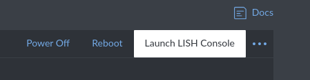
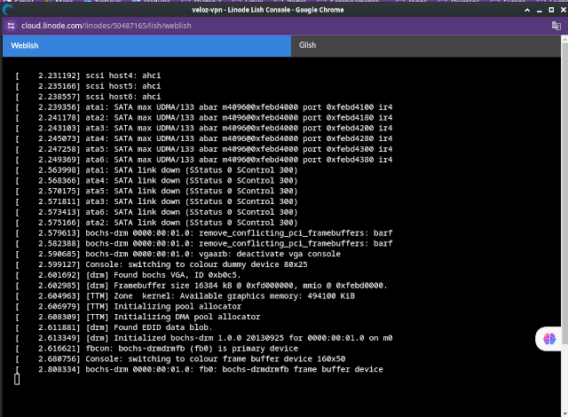

# Fazendo um servidor VPN com a pritunl

Links úteis:

https://www.linode.com/

https://pritunl.com/

https://client.pritunl.com/

https://github.com/pritunl/pritunl-client-electron/releases

O Pritunl VPN é uma solução de código aberto para criar e gerenciar servidores VPN. Ele oferece uma interface web fácil de usar e suporta vários protocolos de VPN, como OpenVPN, IPsec, WireGuard, entre outros.


Vamos utilizar o serviço de hospedagem de máquinas da Linode, assim poderemos acessar nosso vpn de qualquer lugar. Siga os seguintes passos:


# 1 - Criar um servidor através da linode.com/

Entre no site: https://www.linode.com/pt-br/, mas não entre ainda.

Logar no Linode com a conta do GOOGLE ou criar um cadastro.

Para obter um crédito de $100,00, entrar no site da Linode, utilizando a promoção do Diolinux.

Basta chegar na Linode através do Link = https://www.linode.com/diolinux, que você obterá $100,00 válidos por 60 dias.


## 1.1 - Configurando o servidor

Clique na opção Linodes no menu do canto esquerdo.


Depois clique em Create Linode.


Usuário sudo = carlos

Senha do usuário = Apenas um teste


Senha do root = .8rYx?GV#dVePTZ


Agora clique em Create Linode.


Para saber o andamento do criação da máquina clique em Launch LISH Console.



Vai abrir uma nova aba. Aguarde até o término. Demora alguns minutos.
Observe o processamento e a criação.



Durante o período de espera da instalação, é bom instalar o cliente do pritunl no seu computador.

Entre no GitHub da Pritunl pelo site: https://github.com/pritunl/pritunl-client-electron


E escolha a opção releases


Depois clique em Show all 35 assets


Procure na listagem a opção para nosso Debian 12 que é a: pritunl-client-electron_1.3.3637.72-0debian1.bookworm_amd64.deb (ou versão mais nova) e baixe esta versão. Observe que existem client e client-electron. A versão client é só para linha de comando e a versão client-electron é para desktop, então vamos utilizar esta última.


Caso a versão ainda seja a mesma, poderá fazer na linha de comando, ou alterar a versão para a atual, conforme abaixo:

```console
wget https://github.com/pritunl/pritunl-client-electron/releases/download/1.3.3637.72/pritunl-client-electron_1.3.3637.72-0debian1.bookworm_amd64.deb
```

Para instalar o cliente no Debian 12, primeiro localize onde foi baixado o arquivo e faça conforme abaixo, lembrando de alterar o número da versão para a que você baixou.

```console
cd ~/Downloads
sudo apt install ./pritunl-client-electron_1.3.3637.72-0debian1.bookworm_amd64.deb
```

Nosso cliente já está instalado. Provavelmente você o verá no menu Internet como Pritunl Client. Mas não entre nele ainda.

Voltando ao nosso servidor e quando aparecer a mensagem Installation complete! é porque terminou.


Já pode fechar esta janela. Na verdade nem precisava estar aberta. Foi somente para saber quando o processo termina.

Observe os dados de nosso servidor, bem como o IP do mesmo.


Se copiarmos o IP do nosso servidor e colocarmos no navegador vamos entrar em nosso servidor.

A princípio vai dar este erro, então clicamos no botão Avançado.


Depois clique em Ir para IP_DO_SEU_SERVIDOR/(não seguro)


Vai aparecer esta tela:


Entre em nosso servidor utilizando o SSH que aparece na tela onde está o IP do nosso servidor VPN. Altere o nome do usuário e o número do IP abaixo e coloque o seu.

Mas antes de entrar pelo ssh, vamos entrar pelo Launch LISH Console e fazer uma mudança no arquivo /etc/ssh/sshd_config


```console
sudo vi /etc/ssh/sshd_config
```

Mude a variável PasswordAuthentication para yes.

```console
PasswordAuthentication yes
```

Em seguinte faça um reboot no sistema.

```console
sudo reboot
```

Demora um pouco para iniciar. Assim que iniciar poderemos fazer acesso pelo ssh.

```console
ssh carlos@45.33.65.57
```

Vai aparecer a mensagem sobre a chave do SSH. Clique em yes e ENTER.

```console
The authenticity of host '45.33.65.57 (45.33.65.57)' can't be established.
ED25519 key fingerprint is SHA256:tlz/oiTGtbeAr3Z+S/S1dX6gADAUXr2JIoO8G+sth9w.
This key is not known by any other names.
Are you sure you want to continue connecting (yes/no/[fingerprint])? yes
```

Estando no servidor faremos o comando que apareceu no login da página do pritunl.

```console
sudo pritunl setup-key
```

```console
[sudo] password for carlos: 
62a6f2fc849148f5a4dbe5b179e9630c
```

Copie o código gerado e coloque na página da web do nosso Pritunl.


Clique em Save. Em seguida aparece um Login. Você também deverá copiar o comando sugerido por ele e colocar no acesso que temos pelo SSH.

```console
sudo pritunl default-password
```

```console
[local][2023-10-03 01:56:44,295][INFO] Getting default administrator password
Administrator default password:
  username: "pritunl"
  password: "ZRqRRU5PsTem"
```

Colocamos o username e o password acima no login do pritunl e clicamos em Sign in.


Entramos em nosso servidor VPN.


Já podemos trocar o username e a senha que utilzamos para entrar.

Pensar numa senha forte de 10 dígitos, tipo = **Kb[vW8%8S.JB3W)j7=w&**. Clicamos em Save.

Pronto estamos em nosso servidor. Este é o dashboard do servidor.


Caso saia do servidor, para entrar novamente coloque o seguinte endereço no navegador: https://45.33.65.57/login

Coloque seu login e senha, no meu caso são estes:

login = carlos

senha = Kb[vW8%8S.JB3W)j7=w&

Este é o nosso servidor.


Clique na opção Users e em seguida em Add Organizations como abaixo:


Coloque o nome da sua organização, se não tiver uma, invente um nome, e clique em Add.


Agora clique em Add User e coloque um nome de usuário e um PIN com 6 números. A organização mantém a que aparecer. Caso queira poderá colocar um email também.


No nosso caso vamos colocar o usuário Roberto e o PIN 123456 e clique em Add, como abaixo:


Você terá uma tela como esta:


Agora vamos na opção Servers, depois na opção Add Server, como abaixo:


Agora colocamos um nome para nosso servidor VPN e clicamos em Add, como abaixo:


Irá aparecer uma tela como esta:


Agora precisamos anexar a organização que nos criamos anteriormente. Basta clicar em Attach Organization.


E novamente em Attach.


Agora clicamos em Start Server.


Irá aparecer uma tela como esta.


Entre no nosso servidor VPN pelo SSH, conforme anteriormente fizemos:

```console
ssh carlos@45.33.65.57
```

E dê o seguinte comando:

```console
sudo ufw status
```

Deverá aparecer o seguinte:

```console
[sudo] password for carlos: 
Status: active

To                         Action      From
--                         ------      ----
22/tcp                     ALLOW       Anywhere                  
443                        ALLOW       Anywhere                  
80                         ALLOW       Anywhere                  
22/tcp (v6)                ALLOW       Anywhere (v6)             
443 (v6)                   ALLOW       Anywhere (v6)             
80 (v6)                    ALLOW       Anywhere (v6)
```

Observe que precisamos liberar a porta do nosso servidor para que ele funcione corretamente. Então vamos na tela anterior e pegamos a número da porta. No nosso caso é: 14458/udp.


E daremos um comando no servidor para liberar esta porta.

```console
sudo ufw allow 14458/udp
```

Irá aparecer:

```console
Rule added
Rule added (v6)
```

Podemos conferir as portas que estão abertas.

```console
sudo ufw status
```

E iremos obter:

```console
Status: active

To                         Action      From
--                         ------      ----
22/tcp                     ALLOW       Anywhere                  
443                        ALLOW       Anywhere                  
80                         ALLOW       Anywhere                  
14458/udp                  ALLOW       Anywhere                  
22/tcp (v6)                ALLOW       Anywhere (v6)             
443 (v6)                   ALLOW       Anywhere (v6)             
80 (v6)                    ALLOW       Anywhere (v6)             
14458/udp (v6)             ALLOW       Anywhere (v6)
```

Agora já podemos sair do acesso SSH com exit.

```console
exit
```

Clique novamente em Users.


Clique no ícone do clipes, conforme abaixo para obter o profile temporário de acesso que utilizaremos em nosso Pritunl Client.


Vamos obter o seguinte:


Na última informação podemos copiar este dado para incluir em nosso Pritunl Client, como abaixo:

Abra o Pritunl Client e clique em Import, conforme abaixo:


Em seguida cole a última informação de profile e clique em Import.


Agora clique em Connect.


Coloque o número do PIN que criamos anteriormente e clique novamente em Connect.


Você terá a seguinte tela:


A partir de agora está utilizando uma VPN. Pode verificar seu IP antes de conectar na VPN e verificar novamente depois que estiver usando sua VPN.

Segue uma tela usando a VPN:


Segue uma tela sem usar a VPN:


Também é possível clicar no ícone de download para baixar uma arquivo profile. O ícone está ao lado direito do ícone do clipes. Trata-se de um arquivo zip que contém um arquivo ovpn para utilizar em sua rede caso queira.

# FIM