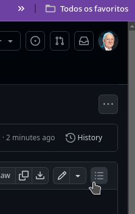
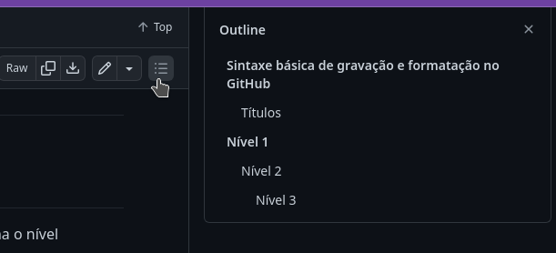
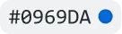
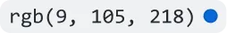
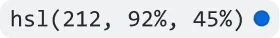

# Sintaxe básica de gravação e formatação no GitHub

Crie formatação sofisticada para narração e código no GitHub com sintaxe simples.
Alguns dizeres para começar.

## Títulos

Para criar um título, adicione de um a seis símbolos # antes do texto do título. O número de # que você usa determina o nível hierárquico e o tamanho da face de tipos do título.

# Nível 1
## Nível 2
### Nível 3

Quando você usa dois ou mais cabeçalhos, o GitHub gera automaticamente um sumário que pode ser acessado clicando no cabeçalho do arquivo. Cada título do cabeçalho está listado na tabela de conteúdo e você pode clicar em um título para acessar a seção selecionada.

Para ver o sumário clique onde está apontando o ponteiro do mouse na imagem abaixo no seu GITHUB.





## Estilo do texto

Você pode indicar ênfase com texto em negrito, itálico, tachado, subscrito ou sobrescrito em campos de comentários e arquivos .md.


| Estilo | Sintaxe | Atalho do teclado | Exemplo |
|--------|---------|-------------------|---------|
| Negrito | ```** ** ou __ __```	| Comando+B (Mac) ou CTRL+B (Windows/Linux) | **Este texto está em negrito** |
| Itálico | ```* * ou _ _```  | Comando+I (Mac) ou CTRL+I (Windows/Linux) | _Este texto está em itálico_ |
| Tachado | ```~~ ~~``` | Nenhum | ~~Este texto está tachado~~ |
| Negrito e itálico aninhado | ```** ** e _ _``` | Nenhum | **Este texto está em negrito e _itálico no final_** |
| Todo em negrito e itálico | ```*** ***``` | Nenhum | ***Texto todo em negrito e itálico*** |
| Subscrito | ```<sub> </sub>``` | Nenhum | Isto está <sub>subscrito</sub> |
| Sobrescrito | ```<sup> </sup>``` |Nenhum | Isto está <sup>sobrescrito</sup> |

## Texto de referência

Você pode citar um texto com ```>```.

Texto que não é uma citação

> Texto que é uma citação

O texto citado é recuado, com uma cor de tipo diferente.

## Citar código

Você pode chamar código ou um comando em uma frase com aspas simples. O texto entre as aspas não será formatado. Você também pode pressionar o atalho de teclado Comando+E (Mac) ou Ctrl+E (Windows/Linux) para inserir os acentos graves para um bloco de código dentro de uma linha de Markdown.

Use `git status` para listar todos os arquivos novos ou modificados que ainda não foram confirmados.

Para formatar código ou texto no próprio bloco distinto, use aspas triplas.

Alguns comandos básicos do Git são:

```
git status
git add
git commit
``

```ruby
require 'redcarpet'
markdown = Redcarpet.new("Hello World!")
puts markdown.to_html
```

## Modelos de cores com suporte

Em problemas, solicitações de pull e discussões, você pode chamar cores dentro de uma frase usando aspas invertidas. Um modelo de cor com suporte em aspas invertidas exibirá uma visualização da cor.

A cor de fundo é `#ffffff` para o modo claro e `#000000` para o modo escuro.

Veja abaixo os modelos de cores com suporte no momento.


| Cor | Sintaxe | Exemplo | Saída |
|-----|---------|---------|-------|
| HEX | `#RRGGBB` | `#0969DA` |  |
| RGB | `rgb(R,G,B)` | `rgb(9, 105, 218)` |  |
| HSL | `hsl(H,S,L)` | `hsl(212, 92%, 45%)` |  |

>[!NOTE]
>
>Um modelo de cor com suporte não pode ter espaços à esquerda ou à direita dentro das aspas invertidas.
A visualização da cor só tem suporte em problemas, solicitações de pull e discussões.

## Ligações

Você pode criar um link embutido colocando o texto do link entre colchetes [ ] e colocando a URL entre parênteses ( ). Também é possível usar o atalho de teclado Command+K para criar um link. Quando você tiver o texto selecionado, poderá colar uma URL da área de transferência para criar automaticamente um link por meio da seleção.

Você também pode criar um hiperlink Markdown realçando o texto e usando o atalho de teclado Command+V. Para substituir o texto pelo link, use o atalho de teclado Command+Shift+V.

Este site foi construído usando [páginas do GitHub](https://pages.github.com/).

## Links de seção

Você pode vincular diretamente a uma seção de um arquivo interpretado, passando o mouse sobre o título da seção para expor o .

## Links relativos

É possível definir links relativos e caminhos de imagens em seus arquivos representados para ajudar os leitores a acessar outros arquivos no repositório.

Um link relativo é um link que é relativo ao arquivo atual. Por exemplo, se você tiver um arquivo LEIAME na raiz do repositório e tiver outro arquivo em AulasLinux/Aula5-1-Instalação-e-Configuração-Docker-Engine.md, o link relativo para esta aula fica:

[Aula5-1-Instalação-e-Configuração-Docker-Engine](AulasLinux/Aula5-1-Instalação-e-Configuração-Docker-Engine.md)


>[!NOTE]
>TESTE COM NOTE

>[!IMPORTANT]
>TESTE COM O IMPORTANT

>[!WARNING]
>TESTE COM O WARNING

<details>
<summary>My top languages</summary>

| Rank | Languages |
|------|-----------|
|     1| Javascript|
|     2| Python    |
|     3| SQL       |

</details>

`#0969DA` Cor

`rgb(9, 105, 218)` Cor

`hsl(212, 92%, 45%)` Cor

[Usar Docker Compose](https://github.com/crpbbs/AulasLinux/blob/main/Aula5-9-Usar%20Docker%20Compose.md#usar-docker-compose)

- [x] #739
- [ ] https://github.com/octo-org/octo-repo/issues/740
- [ ] Add delight to the experience when all tasks are complete :tada:
